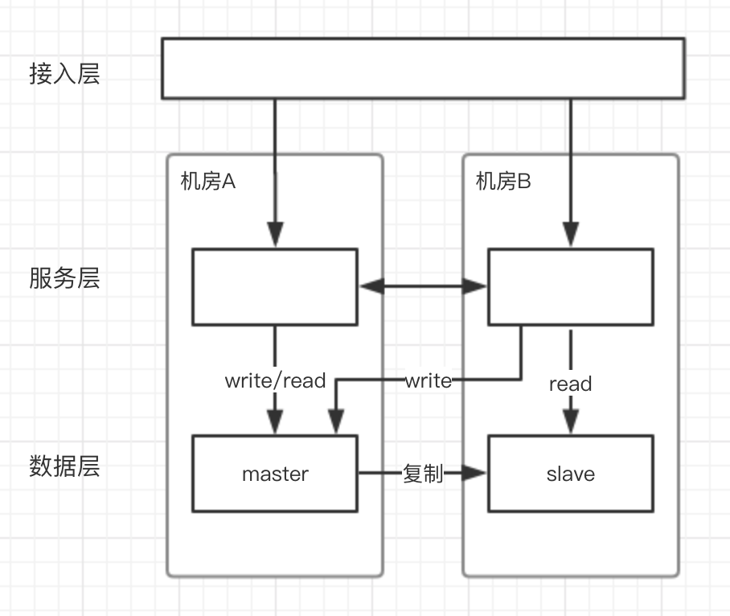
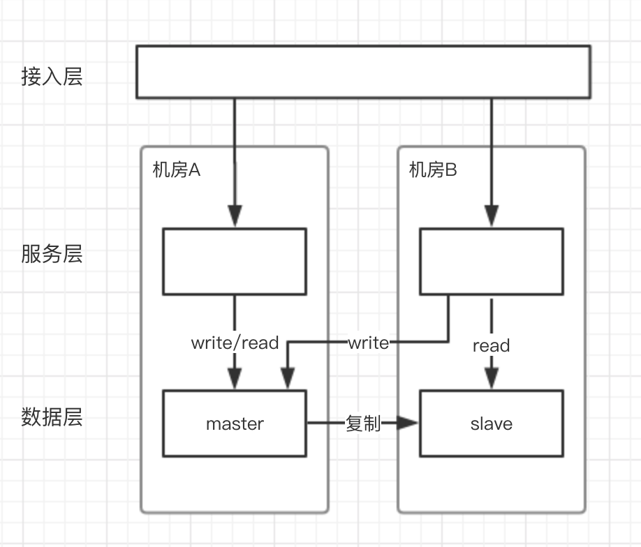
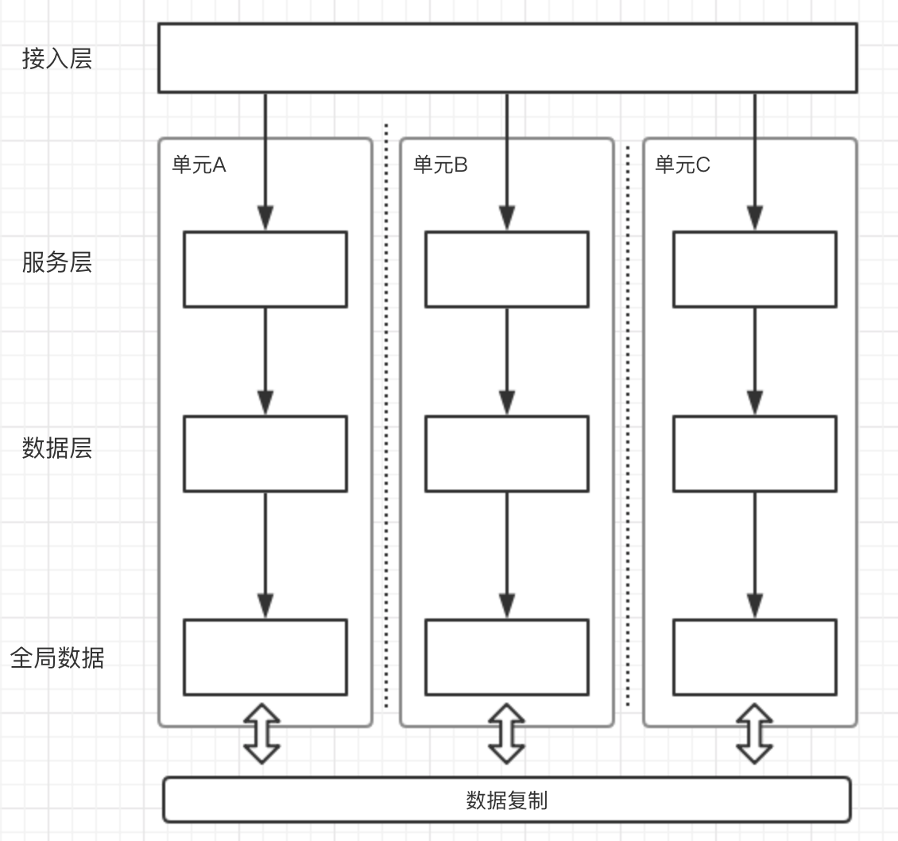

## 为什么要做多活

多活架构主要是为了提升系统的容灾能力，提高系统的可用性，保障业务持续可用。比如单机房的网络故障、地震火灾等不可抗因素，都有可能造成整个机房瘫痪，对业务的可用性造成严重影响。多活架构还可以解决单机房容量问题，提高系统的扩展能力。

## 要不要做多活

随着业务的高速发展，规模越来越大，技术上的投入也越来越高，每次故障造成的损失和影响更是会加速增长，初期故障损失和影响小于技术投入，随着高速发展当故障造成的损失和影响高于技术上的投入时，就需要加大技术上的投入使用更加高可用的技术架构来避免故障，提高系统容灾能力，来减少故障对业务造成的影响，提高系统的可用性，多活架构就是其中最重要的一种。

一般来说，容灾的两个关键技术指标是RTO和RPO：

- RTO：Recovery Time Objective，恢复时间目标。指故障发生后，从系统故障导致业务停顿之刻开始，到系统恢复至可以支持各部门运作，业务恢复运营之时，此两点之间的时间段称为RTO。RTO是反映业务恢复及时性的指标，体现了企业能容忍的系统最长恢复时间。RTO值越小，代表容灾系统的恢复能力越强，但企业投资也越高。

- RPO：Recovery Point Objective，恢复点目标。指灾难发生后，容灾系统进行数据恢复，恢复得来的数据所对应的时间点称为RPO。RPO是反映数据丢失量的指标，体现了企业能容忍的最大数据丢失量的指标。RPO值越小，代表企业数据丢失越少，企业损失越小。

## 多活架构方案

### 两地三中心

主流的灾备技术是两地三中心，两地三中心架构下，一般在同城距离较近的地方有两个数据中心，用户随机访问这两个数据中心，两个数据中心的数据会做同步复制，因为要做同步复制，所以这两个机房距离必须很近，网络延时低，在异地还有一个数据中心，数据异步复制，正常情况下不对外服务，做冷备份。

这种架构下有明显缺点：

1. 冷备需要对全站做备份，故障发生时才能进行切换，这种情况下，冷备机房非故障时完全处于浪费状态，资源利用率低，成本高。

2. 发生故障时，因为服务冷备，切流量过去后不能保证冷备服务能完全正常工作，整个功能是不是都正常，也不能确定切换过程到底要多久，而且因为数据是异步复制，数据的丢失情况也难以预期，所以真的故障时也难以决策是否要切。

3. 单机房资源瓶颈仍然无法解决。

所以实践时往往会先退化为同城多活，先保障具备机房级别容灾能力。

### 同城多活

选择同城做多活主要是因为物理距离带来的网络延时问题，一般北京到上海的网络延迟一般是30ms，一般一次业务请求，后台系统会发生数十次甚至上百次系统调用，每次调用都有30ms的延迟情况下，响应时间无法满足业务需求，同城(或距离很近)可以保障机房之间的网络延时低、可控，各模块之间的调用不会存在过大的网络延时，公司内各系统模块可以自行进行多活架构设计；数据复制也可以更容易做到强一致。

同城双活在发展过程往往会经历以下几个阶段：

1. 两个机房各承担一部分流量，入口流量完全随机，内部RPC调用也会随机选择一个机房进行调度，数据单点写到主机房数据库，然后同步到从机房数据库，从机房数据只读。

	* 优势：

		1. 服务双活，数据同城灾备，机房级别容灾。

		2. 突破了单机房容量瓶颈。

	* 问题：

		1. 跨机房调用频繁（内部RPC，写数据都会跨机房），虽然同城网络延时低，但是积少成多，也是一笔很大的开销。

	

2. 两个机房各承担一部分流量，入口流量完全随机，内部RPC调用闭环在同机房，相当于两个机房镜像部署了两个独立集群，数据仍然是单点写到主机房数据库，然后同步到从机房数据库，从机房数据只读。

	* 优势：

		1. 服务双活，数据同城灾备，机房级别容灾。

		2. 突破了单机房容量瓶颈。

		3. 跨机房调用频繁问题得到缓解。

		4. 流量可以在入口进行控制，可以灵活的进行流量调度，基于此还可以实现服务蓝绿发布，提高系统的故障应对能力，提高了系统稳定性。

	* 问题：

		1. 写数据仍然会进行跨机房，跨机房问题没有完全解决。

	

### 单元化异地多活

单元化是指应用层和数据层按照相同的分片维度进行流量划分，把整个请求链路收敛在一组服务器中，从应用层到数据层组成一个封闭的单元。单元可以作为一个相对独立的整体来挪动，甚至可以把部分单元部署到异地去。单元化的核心思想就是单元内高内聚，单元间低耦合，跨单元调用无法避免，但应该尽量限定在少数的服务层调用，把整体耗时控制在可接受的范围内，包括对直接用户体验和对整体吞吐量的影响。

单元化首先要考虑的问题是如何进行单元化分片，一般来说可以根据用户的UID进行流量和数据的分片，比如可以使用UID的后两位将流量和数据分成100个片，多个分片组成一个单元。使用UID分片时，比如转账操作，会同时操作两个UID下的账户，这种情况不避免的需要进行跨单元调用，这时尽可能通过一定的设计将跨单元的操作进行异步化处理，避免延时问题对用户体验产生直接影响。还有一种情况像是淘宝这类的交易业务，还存在商家和商品等信息，如果使用买家UID进行分片，就意味着非买家维度的信息需要做一定的妥协，一般会将这些全量数据进行全局复制，复制到所有机房内，当买家对非买家维度数据访问时，可以接受“最终一致”的就直接读买家单元所在机房内的非买家非实时数据，不能接受“最终一致”的则需要跨单元访问，比如交易减库存，最终达到买家的所有操作在买家所在的单元内尽可能的读写封闭。

在实施过程中，可以先在同城多机房或同机房内多个逻辑机房中进行单元化改造，改造完成后再根据实际情况将单元挪动到异地，进行异地多活构建。这样做可以防止单元化改造没有彻底完成的情况下，走向异地会带来严重的远程网络延时问题，进而导致服务超时，在同城的话即使没有改造好，也能保证延时是可控的。

单元化架构的优势：

1. 异地多活，具备城市级故障容灾能力。每个单元都分配有一定的真实流量进行业务处理，每个单元都是活的，流量可以灵活的在机房间进行切换调度，单个单元故障后，其他单元可以随时接管故障单元的流量和数据。极大提高了服务可用性，保证了业务的连续性，减少故障发生的时候对于用户的打扰、对于业务的中断。

2. 解决单机房容量问题。核心服务可以分别部署在多个数据中心中，避免单个机房服务器遇到资源瓶颈，单个单元基本只需要使用(1+1)/N数量的机器资源（N代表单元数，加一是为了在机房间流量切换时预留足够资源）。

3. 解决跨机房服务调用和数据库读写问题，减少跨机房网络延时。绝大部分的服务间调用和所有数据库读写操作都在本单元内完成，只有少数场景产生跨机房调用，一般要保证单次用户完整的请求链路上不超过2-3次跨机房处理。

4. 解决DB连接数瓶颈问题。传统关系型数据库的连接数是有限的，因为集群中每个应用节点都会与所有数据库节点保持连接，当应用数量达到一定规模，单台数据库连接数将会达到瓶颈，此时，应用也将因此无法再进行横向扩容。而单元化架构下，每个单元内的应用节点都只会连接本单元内的数据库，极大的节省了数据库连接资源，提高了服务横向扩展能力。

5. 提供极高的服务扩展能力。单元化架构下，可以按单元来对服务进行横向扩展，几乎可以无限扩容。

6. 蓝绿发布。流量可以在入口进行灵活的流量调度，基于此可以实现蓝绿发布，减小发布引起的故障影响面，将发布引起的故障处理时间极大缩短。

## 多活的技术点

多活架构中除了整体架构方案，还有很多细节技术点，比如流量管控以及数据同步的具体方案

### 流量管控

流量管控主要涉及两方面，外部调用的流量和内部调用的流量。

首先，需要有一个全局的流量管控中心，各个应用需要从流量管控中心同步分片规则，流量调整时也需要将规则迅速同步到分布式系统中的各个需要的节点上，在一次请求的整个链路调用过程中，都需要包含分片数据，比如UID，然后计算本次请求需要调用哪个单元的服务。

还需要一个全局服务注册中心，不同单元的注册中心之间互相同步数据，最终所有服务消费者都知道每个单元的服务提供者有哪些，RPC框架就可以根据需要选择调用目标。

#### 外部调用的流量

外部调用的流量指用户发起的流量，在调用时，一般会先经过DNS解析得到反向代理层ip地址，反向代理层处理请求，然后再请求到网关层，然后到服务层，最后是数据层。DNS解析得到反向代理层ip地址的时候，这个时候一般无法得知本次请求应该访问哪个单元的反向代理层，所以请求有可能进入到不属于该请求的单元，这时流量就已经进入了内部服务器，当反向代理层或网关层识别出请求所属单元后，再将请求转发到对应的单元时，这个时候就会产生一次额外的跨机房访问。可以进行一定的优化，比如在PC端，如果知道用户所属单元，可以直接让用户访问对应单元的域名；在移动端时，服务端可以将流量调度规则下发到端上或者端上定时从服务端拉取流量调度规则，端上再根据UID和流量调度规则计算出该用户应该访问的单元，然后直接访问对应单元的ip或者对应单元的域名。反向代理层可以根据请求的cookie等标识，将请求转发到对应的网关层。网关层基本一定可以根据请求信息识别出请求所属的单元，然后调用请求所属单元上的服务，并在cookie中添加单元标记。最后的数据层，作为请求数据的最后一道防线，保证请求一定写入到正确单元的数据库中。

#### 内部调用的流量

内部系统调用一般主要是指RPC调用，在RPC调用的全链路过程中，必须要带上分片数据，比如UID，然后根据流量管控中心同步过来的分片规则，调用到指定的单元上。一些全局数据的修改，比如库存扣减功能，需要在服务接口打标记，明确调度到特定的写单元。

还有一些公司内部的组件，比如消息队列和定时任务，也需要支持单元化的调度，尽量让各自单元只处理各自单元的调用。

### 数据同步

数据是系统中最核心的部分，在多活架构中，为了达到容灾备份的效果，数据往往需要在多个数据中心之间进行同步，同步数据那就涉及到数据一致性的问题了，不同的业务场景下对数据一致性的要求是不同的，对应的具体同步方案也不同，有些业务场景可以接受同步数据时数据不一致导致的少量数据丢失，比如报价缓存类业务，这类业务在多活架构下遇到机房故障时往往可以快速恢复业务；有些业务则对同步数据时的数据一致性要求极高，比如资金类业务，交易类业务，如果无法做到数据的强一致，那么在故障发生时就存在数据丢失的风险，这种情况下的这类业务即使在多活架构下遇到机房故障，是否进行机房容灾切换还是等待机房故障恢复也是难以决策的，往往会因此不敢进行机房切换，真的切换也需要考虑好数据丢失带来的各种风险和问题，并提前针对这种情况做好针对性的预案，所以这类业务往往会考虑使用一些强一致的数据同步手段保证数据一定不丢。

以下是一些常见的数据同步方案：

#### Mysql异步主从同步

#### Mysql半同步

#### Mysql PXC

#### MySQL Group Replication

#### OceanBase

#### 自定义DB-Failover方案

#### 自研数据同步组件

## 学习资料

[从“挖光缆”到“剪网线”|蚂蚁金服异地多活单元化架构下的微服务体系](https://mp.weixin.qq.com/s/0FhXlRGGgtAojXYRrhWcUQ)

[素描单元化](https://mp.weixin.qq.com/s/jfbHvEMSZtgXis3AtSOZyw)

[支付宝架构师眼里的高可用与容灾架构演进
](https://mp.weixin.qq.com/s/j3LI89MW_xk9ufbQ9DThoA)

[阿里异地多活与同城双活的架构演进](https://mp.weixin.qq.com/s/VPkQhJLl_ULwklP1sqF79g)

[专访阿里巴巴毕玄：异地多活数据中心项目的来龙去脉](https://www.infoq.cn/article/interview-alibaba-bixuan)

[绝对干货:解密阿里巴巴“异地多活”技术](https://g.pconline.com.cn/x/721/7215376.html)

[一个理论，三个原则，多个步骤 | 阿里游戏异地多活设计之道](https://mp.weixin.qq.com/s/4oNOkoQFk2LhzwStJ_KoFA)

[在游戏运维实战中摸索前行的“异地双活”架构](https://mp.weixin.qq.com/s/0X6PlpsHU1e0a9PPZhhqQA)

[从传统银行到互联网，异地多活难不难](https://mp.weixin.qq.com/s/Za70G4awqFbx-5pFkejuXA)

[为什么要做多活？饿了么多活技术架构及运维挑战](https://mp.weixin.qq.com/s/0k1iuAlVoaBAjcwyB4Z_sA)

[饿了么异地多活技术实现（一）总体介绍](https://zhuanlan.zhihu.com/p/32009822?utm_source=wechat_session&utm_medium=social&s_r=0)

[饿了么异地多活技术实现（二）API-Router的设计与实现](https://zhuanlan.zhihu.com/p/32587960?utm_source=wechat_session&utm_medium=social&s_r=0)

[饿了么异地多活技术实现（三）GZS&DAL](https://zhuanlan.zhihu.com/p/33430869?utm_source=wechat_session&utm_medium=social&s_r=0)

[饿了么异地多活技术实现（四）- 实时双向复制工具（DRC）](https://zhuanlan.zhihu.com/p/34958596?utm_source=wechat_session&utm_medium=social&s_r=0)

[饿了么MySQL异地多活的数据双向复制经验谈](https://www.ctolib.com/topics-121228.html)

[MT异地多活](https://www.jianshu.com/p/0d2c83272502)

[阿里和微博的异地多活方案](https://blog.csdn.net/u013793650/article/details/49358507)

[分布式系统 - 关于异地多活的一点笔记](http://afghl.github.io/2018/02/11/distributed-system-multi-datacenter-1.html)

