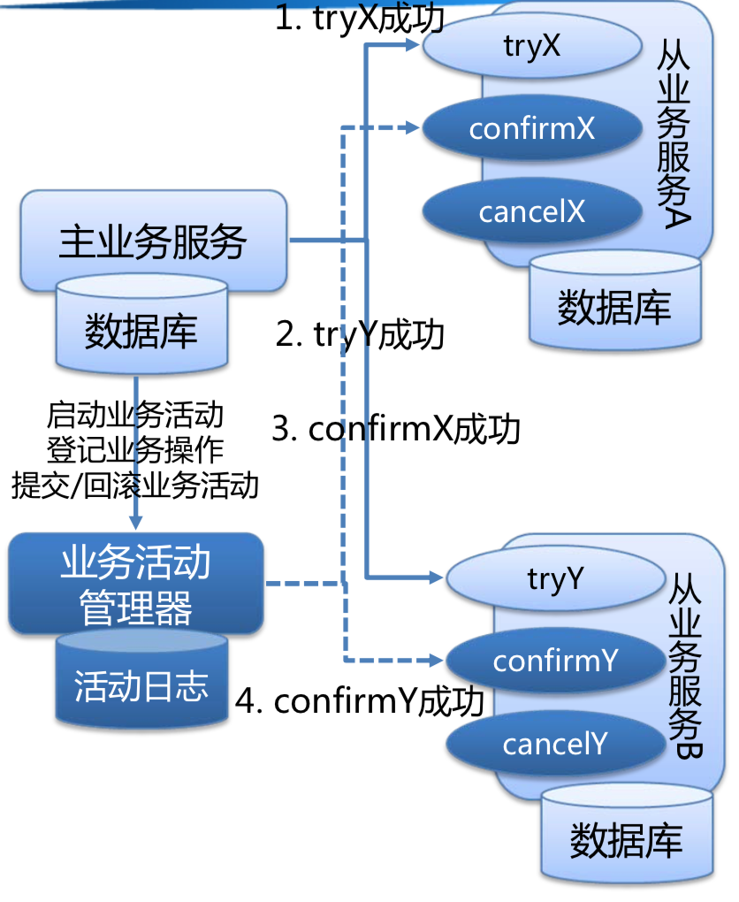
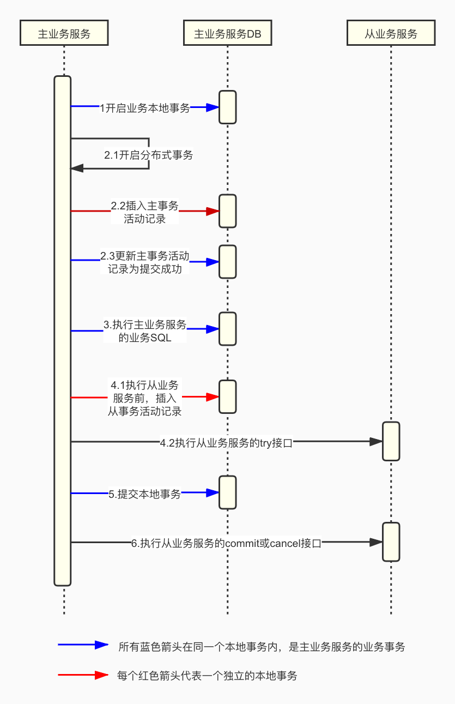

在工作的过程中，经常会遇到一些分布式环境下数据一致性的问题，尤其是在做一些交易、支付、账户等业务的时候，其中不可避免的会涉及到一些分布式事务领域的技术方案，在之前的工作中也曾经使用过分布式事务框架来解决问题，一直对这一领域的问题十分感兴趣，所以就想着自己动手造个轮子，从零开始写一个分布式事务框架，以此加深自己对分布式事务的理解和在系统架构与实现上的经验积累，在这里记录一下自己造轮子过程中的过程和思考。

## 架构设计

### 方案选型

在之前的文章（[分布式事务](http://blogxin.cn/2018/04/23/Distributed-Transaction)）中，对分布式事务相关概念和解决方案做了介绍，又调研了一些当下的分布式事务框架原理，综合考虑后，选择TCC分布式事务模型作为本次的技术实现方案，虽然该方案业务侵入性较高，但是该方案适用场景广泛，隔离性和性能都可以做极致优化，非常灵活。

##### TCC分布式事务模型介绍

TCC分布式事务模型主要解决了分布式应用架构场景下跨服务的事务问题。作为保证分布式一致性的一种解决方案。使用2PC原子提交协议来保证分布式事务原子性。隔离性通过业务逻辑来进行资源隔离，从底层数据库资源层面的加锁过渡为上层业务层面的加锁，提高了业务并发能力。一致性方面实现了最终一致性。TCC分布式事务模型是基于BASE理论的柔性事务，牺牲了强一致性获得了更高的可用性。

TCC分布式事务模型主要包括三部分：

* 主业务服务：主业务服务为整个业务活动的发起方，服务的编排者，负责发起并完成整个业务活动。

* 从业务服务：从业务服务是整个业务活动的参与方，负责提供TCC模型的业务操作，需要实现初步操作（Try）、确认操作（Confirm）、取消操作（Cancel）三个接口来完成业务操作，供主业务服务调用。

  * 初步操作（Try）：完成所有业务检查，预留必须的业务资源，通过业务手段锁定预留资源。比如支付时，从余额中将该笔支付金额置为冻结状态。

  * 确认操作（Confirm）：真正执行的业务逻辑，不作任何业务检查，只使用Try阶段预留的业务资源。因此，只要Try操作成功，Confirm必须能成功。另外，Confirm操作需满足幂等性，保证一笔分布式事务有且只能成功一次。

  * 取消操作（Cancel）：释放Try阶段预留的业务资源。同样的，Cancel操作也需要满足幂等性。

* 业务活动管理器：业务活动管理器管理控制整个业务活动，包括记录维护TCC全局事务的事务状态和每个从业务服务的子事务状态，并在业务活动提交时调用所有从业务服务的Confirm操作，在业务活动取消时调用所有从业务服务的Cancel操作。

### 实现思路及原理

一般来说，做交易支付类业务时，分布式事务的发起方，本地也会有一个本地事务来记录本次的业务活动。比如发起一笔转账操作，交易系统作为分布式事务发起方，本地会记录一笔转账交易单，同时需要协调账户系统作为一个事务参与方，整个分布式事务需要保证交易单的本地事务和账户系统的余额操作在一个分布式事务中。所以我们可以以交易单的本地事务是否提交完成来做为整笔分布式事务是否完成的标志，本地事务提交成功则认为分布式事务提交成功，参与方进行提交操作，本地事务提交失败，则本地事务自动回滚，其他参与方也进行回滚，同时再通过定时任务扫描分布式事务活动的日志，对二阶段操作进行补偿，确保达到最终一致性。整个方案一定程度上将分布式事务转化为本地事务，并基于事务日志提供补偿机制，来实现最终一致性的分布式事务。

基于以上思路，一个完整的TCC分布式事务流程如下：

1.	主业务服务开启一个业务的本地事务；
2.	主业务服务向业务活动管理器申请启动分布式事务。首先挂起业务事务，新起一个本地事务来记录主事务活动记录，记录完成直接提交该新事务，新起一个事务来记录是为了保证无论业务事务是否提交，主事务活动记录一定已经记录了下来，然后回到业务事务使用业务的本地事物来更新主事务活动记录的状态，使用业务是为了保证业务事务的提交和主事务活动的状态更新在一个本地事务中完成，在这个过程中锁定了主事务活动记录，最终通过主事务活动的状态及锁定情况就可以判断整笔分布式事务的执行情况；
3.	执行主业务服务本地事物内的业务SQL操作，此时不提交业务的本地事物；
4.	针对要调用的每一个从业务服务，需要先向业务活动管理器注册从业务活动。首先挂起业务事务，再新起一个本地事务来记录从事务活动记录，记录完成直接提交该新事务，然后再调用从业务服务的Try接口，新起一个事务来记录是为了保证无论是否完成从业务服务的Try接口调用，从事务活动一定已经记录了下来。按该流程依次执行完所有从业务服务的try接口；
5.	当所有从业务服务的Try接口调用成功，主业务服务提交本地事务；若调用失败，主业务服务回滚本地事务；
6.	主业务服务本地事务结束后，根据本地事务的提交或回滚来触发调用所有从业务服务的Confirm接口或Cancel接口，全部调用完成后删除所有事务活动记录。由于Try接口调用完成即可以保证二阶段一定可以Confirm，所以二阶段Confirm在任何时机都可以调用，所以本地事务提交后，二阶段Confirm可以进行一定的异步化，甚至在业务高峰期可以不进行二阶段Confirm，只实时处理Cancel的情况，高峰期过了之后再统一进行二阶段Confirm，可以起到一定的消峰作用；
7.	所有从业务服务的Confirm或Cancel操作完成后，分布式事务结束。如果本地事务提交后主业务服务因为故障等原因没有出发二阶段提交，或二阶段提交失败，那么此时需要一个scan server来扫描本地分布式事务活动表中未提交的事务，根据主事务活动的状态及主事务活动记录的锁定情况可以判断该笔分布式事务如何进行补偿，然后根据从事务记录对所有相应的从业务服务进行Confirm或Cancel补偿。整体通过scan server周期性扫描来进行补偿操作，确保最终一致性。

### 模块设计

基于以上实现思路和原理，设计了以下几个工作模块：

* Transaction Manager：事务管理器。控制分布式事务的边界，负责开启一个分布式事务，并最终发起分布式事务提交或回滚的决议。

* Resource Manager：资源管理器。控制分支事务，负责分支注册、状态汇报，驱动分支事务的提交和回滚。

* Transaction Coordinator：事务协调器。维护分布式事务的状态，负责对分布式事务进行补偿提交或回滚。

### 组件依赖

1. Spring、Spring-Boot

   基于Spring的本地事物能力进行分布式事务能力的扩展；

   通过Spring-Boot进行分布式事物组件的自动装配。

2. Elastic-Job

   通过Elastic-Job分布式定时任务，扫描分布式事务记录，进行补偿能力建设。

3. Zookeeper

   做为Elastic-Job的分布式协调器，同时做为Dubbo的注册中心。

4. Dubbo

   使用Dubbo做为从业务服务接入的RPC组件，进行扩展。