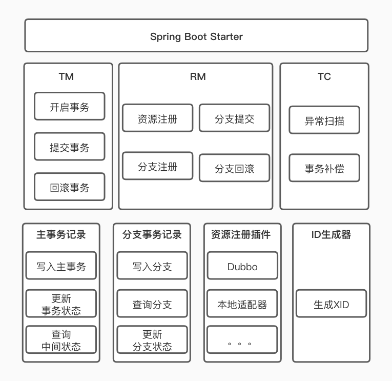

根据[上篇](http://blogxin.cn/2020/02/16/Distributed-Transaction-1/)描述的实现思路和原理，进行功能拆解和组件的划分，梳理出如下整体架构图：




#### 第一层负责项目的接入：

* SpringBoot starter

  使用SpringBoot starter让用户快速接入该框架。


#### 第二层是分布式事务的核心功能组件：

* Transaction Manager：

  事务管理器。控制分布式事务的边界，负责开启一个分布式事务，并最终发起分布式事务提交或回滚的决议。

* Resource Manager：

  资源管理器。控制分支事务，负责分支注册、状态汇报，驱动分支事务的提交和回滚。

* Transaction Coordinator：

  事务协调器。维护分布式事务的状态，负责对分布式事务进行补偿提交或回滚。


#### 第三层是框架底层工具组件：

* 主事务记录

  负责主事务记录的记录，更新，维护整个分布式事务的状态，并提供扫描补偿相关查询处理方法。

* 分支事务记录

  负责分支事务记录的记录和状态维护。

* 资源注册插件

  下游分布事务可以通过Dubbo等RPC或HTTP框架进行调用，项目启动前需要先将各个分布式事务的下游分支资源进行注册。

* ID生成器

  生成分布式事务的ID。


### 组件接口定义

基于架构图中的组件定义，我们先将组件接口定义出来：

* Transaction Manager：

  ```java
  /**
   * 分布式事务管理器。
   * 控制分布式事务的边界，负责开启一个分布式事务，并最终发起分布式事务提交或回滚的决议。
   *
   * @author kris
   */
  public interface TransactionManager {
  
      /**
       * 开始分布式事务
       *
       * @param xidSuffix 事务id后缀。有分库分表需求时使用，用来保证事务记录与业务记录在同一个分库分表中
       */
      void start(String xidSuffix);
  
      /**
       * 提交分布式事务
       *
       * @return 返回true，返回false时需要由TC重试，重试失败需要人工干预
       */
      boolean commit();
  
      /**
       * 回滚分布式事务
       *
       * @return 返回true，返回false时需要由TC重试，重试失败需要人工干预
       */
      boolean rollback();
  
  }
  ```

  

* Resource Manager：

  ```java
  /**
   * 资源管理器。
   * 控制分支事务，负责分支注册、状态汇报，驱动分支事务的提交和回滚。
   *
   * @author kris
   */
  public interface ResourceManager {
  
      /**
       * 启动项目前，预先注册所有ActionResource资源
       *
       * @param resource ActionResource
       */
      void registerResource(ActionResource resource);
  
      /**
       * 注册当前分布式事务的Action
       *
       * @param action Action
       */
      void registerAction(Action action);
  
      /**
       * 提交当前分布式事务
       *
       * @return 返回true，返回false时需要由TC重试，重试失败需要人工干预
       */
      boolean commitAction();
  
      /**
       * 提交当前分布式事务
       *
       * @return 返回true，返回false时需要由TC重试，重试失败需要人工干预
       */
      boolean rollbackAction();
  
  }
  ```

  

* Transaction Coordinator：

  ```java
  /**
   * 事务协调器。
   * 维护分布式事务的状态，负责对分布式事务进行补偿提交或回滚。
   *
   * @author kris
   */
  public interface TransactionCoordinator {
  
      /**
       * 对二阶段提交失败的事务进行批量补偿
       *
       * @param param CoordinatorParam
       */
      void batchReTry(CoordinatorParam param);
  
  }
  ```

  除协调器外还需要使用分布式任务进行补偿任务的调度。

* 主事务记录

  ```java
  /**
   * 主事务记录操作
   *
   * @author kris
   */
  public interface ActivityRepository {
  
      /**
       * 插入主事务记录
       * 需要挂起业务事务，启用一个新事务来独立执行。
       *
       * @param activity Activity
       * @see org.springframework.transaction.annotation.Propagation.REQUIRES_NEW
       */
      void insert(Activity activity);
  
      /**
       * 根据事务ID查询主事务记录
       * 快照读
       *
       * @param xid 事务ID
       * @return Activity
       */
      Activity query(String xid);
  
      /**
       * 根据事务ID查询主事务记录
       * 当前读
       *
       * @param xid 事务ID
       * @return Activity
       */
      Activity queryForUpdate(String xid);
  
      /**
       * 更新主事务记录状态
       * INIT状态更新为COMMIT状态时，需要直接使用业务事务执行，业务事务执行成功则执行成功，失败则回滚
       *
       * @param xid        事务ID
       * @param fromStatus 原状态
       * @param toStatus   新状态
       * @see org.springframework.transaction.annotation.Propagation.REQUIRED
       */
      void updateStatus(String xid, ActivityStatus fromStatus, ActivityStatus toStatus);
  
      /**
       * 查询未完成的事务记录列表
       *
       * @param shardingKey   分片key，分库分表场景使用
       * @param executionTime 执行时间
       * @param limit         分页数量  @return 未完成的事务记录列表
       */
      List<Activity> queryUnfinished(String shardingKey, Date executionTime, int limit);
  
      /**
       * 更新重试次数和重试执行时间
       *
       * @param xid         事务ID
       * @param fromStatus  原状态
       * @param retryCount  重试次数
       * @param executeTime 重试执行时间
       */
      void updateRetry(String xid, int fromStatus, int retryCount, Date executeTime);
  
  }
  ```

* 分支事务记录

  ```java
  /**
   * 分支事务记录操作
   *
   * @author kris
   */
  public interface ActionRepository {
  
      /**
       * 插入分支事务记录
       * 需要挂起业务事务，启用一个新事务来独立执行。
       *
       * @param action Action
       * @see org.springframework.transaction.annotation.Propagation.REQUIRES_NEW
       */
      void insert(Action action);
  
      /**
       * 根据事务ID查询分支事务记录列表
       *
       * @param xid 事务ID
       * @return Action
       */
      List<Action> query(String xid);
  
      /**
       * 根据事务ID和分支事务名更新分支事务记录状态
       *
       * @param xid        事务ID
       * @param name       分支事务名称
       * @param fromStatus 原状态
       * @param toStatus   新状态
       */
      void updateStatus(String xid, String name, ActionStatus fromStatus, ActionStatus toStatus);
  
  }
  ```

* 资源注册插件

  资源注册插件需要根据接入的RPC或HTTP框架进行具体实现，最终调用`ResourceManager.registerResource(ActionResource resource);`注册分支事务资源。

* ID生成器

  ```java
  /**
   * 事务ID生成器
   *
   * @author kris
   */
  public interface IdGenerator {
  
      /**
       * 生成事务ID
       *
       * @return
       */
      String getId();
  
      /**
       * 生成带后缀的事务ID
       *
       * @param suffix 事务ID后缀，一般需要匹配分库分表规则时使用
       * @return
       */
      default String getId(String suffix) {
          if (StringUtils.isNotBlank(suffix)) {
              return getId() + Constant.UNDERSCORE + suffix;
          } else {
              return getId();
          }
      }
  
  }
  ```


基于定义出的组件接口，然后进行具体组件的开发。

