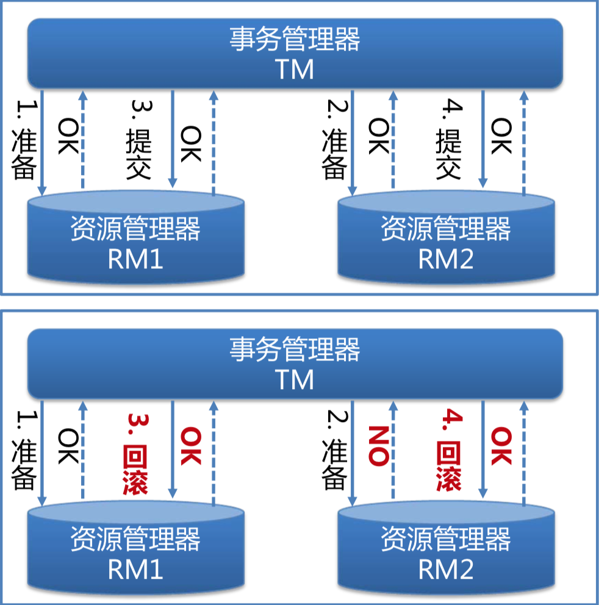
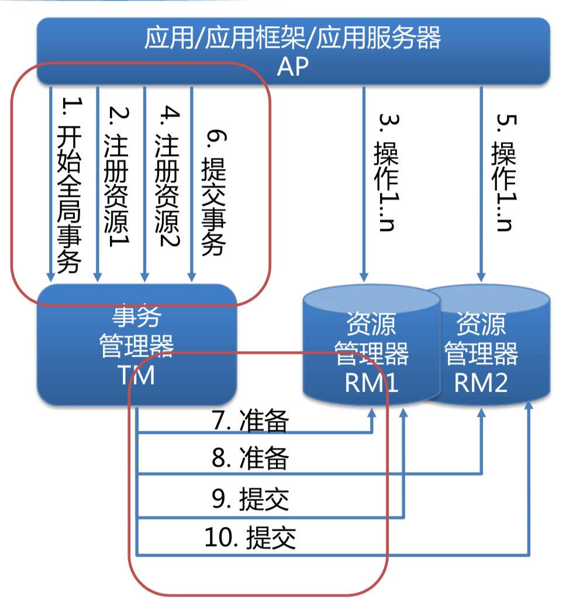
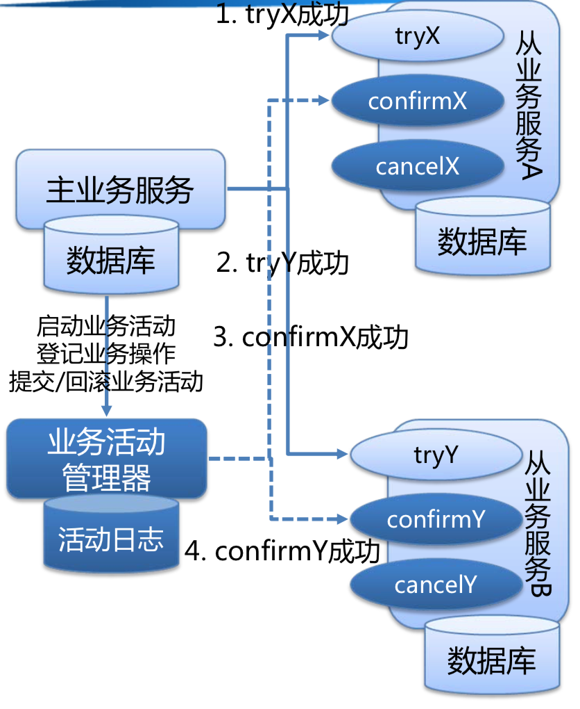

## 事务

事务通常是指数据库事务，一般也叫本地事物。数据库事务是指数据库管理系统执行过程中的一个逻辑单元，由一个有限的数据库操作序列构成，事物必须保证ACID四个特性。事务是恢复和并发控制的基本单位。

#### 事务的ACID特性

* 原子性（Atomicity）：事物作为一个不可分割的工作单元，整个事物中的所有数据库操作要么全部提交成功，要么全部失败回滚。

* 一致性（Consistency）：数据库从一个一致性的状态转变为另一个一致性的状态。

* 隔离性（Isolation）：多个事务并发执行时，一个事务的执行不应影响其他事务的执行。

* 持久性（Durability）：一旦事务提交，对数据库的修改就会永久保存在数据库中。

## 分布式事务

传统的数据库事务应用在单个会话內，对单个数据库资源进行操作。随着业务的发展，系统逐渐发展为面向服务的分布式系统架构，数据库资源也随之拆分。越来越多的场景需要将多个数据库操作，甚至是多个RPC接口操作，汇聚在一个业务操作內，并要求该操作整体具有事物的特性，所以产生了分布式事务的概念。

分布式事务一般是指涉及到操作多个数据库，甚至是操作多个分布式服务的事务，可以看做是多个分布式的操作序列组成的一个逻辑单元。分布式事务的目的是为了保证分布式系统中的数据一致性，作为保证分布式一致性的一种解决方案。

### 分布式系统相关概念

#### CAP定律

* 一致性（C）：在分布式系统中的所有数据备份，在同一时刻是否是同样的值。

* 可用性（A）：在集群中一部分节点故障后，集群整体是否还能响应客户端的读写请求，对于用户的每一个操作请求总是能够在有限的时间内返回结果。

* 分区容错性（P）：以实际效果而言，分区相当于对通信的时限要求。系统如果不能在时限内达成数据一致性，就意味着发生了分区的情况，必须就当前操作在C和A之间做出选择。

CAP定律指的是，CAP的三个要素最多只能同时实现两点，不可能三者兼顾。因此在进行分布式架构设计时，必须做出取舍。由于在分布式系统中经常发生丢包、网络故障，分区容忍性是必须要满足的，同时为了兼顾高可用性，绝大部分系统都将强一致性需求转化成最终一致性的需求。

#### BASE理论

* 基本可用（Basically Available）：基本可用是指分布式系统在出现故障的时候，允许损失部分可用性，保证核心功能可用。
   
* 软状态（ Soft State）：软状态是指允许系统存在中间状态，而该中间状态不会影响系统整体可用性。

* 最终一致性（ Eventual Consistency）：最终一致性是指系统中的所有数据副本经过一定时间后，最终能够达到一致的状态。弱一致性和强一致性相反，最终一致性是弱一致性的一种特殊情况。

BASE理论是对CAP中一致性和可用性权衡的结果，其来源于对大规模互联网系统分布式实践的总结，是基于CAP定理逐步演化而来的。BASE理论的核心思想是：即使无法做到强一致性，但每个应用都可以根据自身业务特点，采用适当的方式来使系统达到最终一致性。在互联网领域的绝大多数的场景，往往都需要牺牲强一致性来换取系统的高可用性。

#### 一致性模型

* 强一致性：当更新操作完成之后，任何多个后续进程或者线程的访问都会返回最新的更新过的值。这种是对用户最友好的，就是用户上一次写什么，下一次就保证能读到什么。但是这种实现对性能影响较大。

* 弱一致性：系统并不保证续进程或者线程的访问都会返回最新的更新过的值。系统在数据写入成功之后，不承诺立即可以读到最新写入的值，也不会具体的承诺多久之后可以读到。但会尽可能保证在某个时间级别（比如秒级别）之后，可以让数据达到一致性状态。

* 最终一致性：最终一致性是弱一致性的一个特例，最终一致性是指系统中的所有数据副本经过一定时间后，最终能够达到一致的状态。

#### 柔性事务与刚性事务

* 刚性事务是指严格遵循ACID原则的事务, 追求强一致性模型。例如单机环境下的数据库事务，通常对本地事务采用刚性事务。

* 柔性事务是指遵循BASE理论的事务, 通常用在分布式环境中, 通过牺牲强一致性获得高可用性。常见的实现方式有: 两阶段提交(2PC), TCC补偿型提交, 基于消息的异步确保型, 最大努力通知型。分布式事务使用柔性事务。

## 分布式事务解决方案

### 本地事件表

本地事件表方法的主要思路是将分布式事务转化为本地事务，并使用额外的补偿机制来保证一致性：

事件产生方需要额外建一个消息表，用于记录消息发送状态，业务处理和消息表存储需要在同一个本地事务中完成，本地事务完成后通过MQ等方式通知消费方，并通过定时任务轮询扫描消息表保证事件的发送。

事件消费方，处理自己的业务逻辑，如果最终无法处理，则通知事件产生方进行回滚之类的操作。

* 优点：

	1. 该方法避免了分布式事务，实现了最终一致性；

	2. 适用于产生方不需要依赖消费方处理结果的情况；

* 缺点：

	1. 引入额外的消息表，会给DB造成额外压力；

	2. 消息表和业务耦合在一起，需要合理的封装成通用组件；

	3. 当消息消费方无法处理业务，需要回滚事件产生方的业务时，复杂度高，尤其是当出现多个消费方时。

### 事务消息

事务消息方法的主要思路是使用支持事务功能的MQ消息，将业务的处理和消息的发送作为一个事务操作，业务处理完成即保证消息最终会可靠送达消费方。

* 优点：

	1. 实现了最终一致性；

	2. 适用于产生方不需要依赖消费方处理结果的情况；

* 缺点：

	1. 主流的MQ消息组件均未支持事务功能，所以需二次开发或者新造轮子；

	2. 当消息消费方无法处理业务，需要回滚事件产生方的业务时，复杂度高，尤其是当出现多个消费方时。

### 2PC 二阶段提交

> 二阶段提交(Two-phaseCommit)是指，在计算机网络以及数据库领域内，为了使基于分布式系统架构下的所有节点在进行事务提交时保持一致性而设计的一种算法(Algorithm)。通常，二阶段提交也被称为是一种协议(Protocol))。在分布式系统中，每个节点虽然可以知晓自己的操作时成功或者失败，却无法知道其他节点的操作的成功或失败。当一个事务跨越多个节点时，为了保持事务的ACID特性，需要引入一个作为协调者的组件来统一掌控所有节点(称作参与者)的操作结果并最终指示这些节点是否要把操作结果进行真正的提交(比如将更新后的数据写入磁盘等等)。因此，二阶段提交的算法思路可以概括为：参与者将操作成败通知协调者，再由协调者根据所有参与者的反馈情报决定各参与者是否要提交操作还是中止操作。

二阶段提交，将事务的提交过程分为两个阶段：第一阶段：准备阶段(投票阶段)；第二阶段：提交阶段（执行阶段）。

* 第一阶段：准备阶段(投票阶段)：

	1. 协调者向所有参与者询问是否可以执行提交操作，等待参与者的响应。

	2. 参与者执行事务操作，并记录Undo和Redo到日志中。这开始参与者会一直锁定事务相关的资源。

	3. 参与者向协调者返回执行成功失败的结果。

* 第二阶段：提交阶段（执行阶段）：

	* 协调者根据参与者的返回情况决定是否进行事务提交，如果所有的参与者都返回成功, 则执行事务提交的操作过程：

		1. 协调者向所有的参与者发送提交事务的请求。

		2. 参与者正式提交事务，完成后释放锁资源。

		3. 参与者向协调者发送ack。

		4. 协调者收到所有的ack后，事务完成提交。

	* 如果有的参与者在第一阶段返回了失败或者超时，则进行回滚事务的操作过程：

		1. 协调者向所有的参与者发送事务回滚请求。

		2. 参与者收到回滚请求后，利用Undo信息回滚，结束后释放资源。

		3. 参与者向协调者发送ack。

		4. 协调者收到所有的ack后，事务完成回滚。

传统的分布式事务模型X/Open DTP模型就是使用2PC协议来保证分布式事务的原子性的，通过XA协议定义事务管理器和资源管理器之间的接口规范。XA分布式事务通常实现在数据库资源层，往往作用于单个服务内部使用多资源场景，对业务入侵性小，对上层业务屏蔽了底层实现细节；但是由于二阶段长时间锁定资源，导致热点数据并发性差，而且在如今面向服务的架构下，往往各个业务数据库由各自的微服务单元来操作，并不会由单个服务来直接操作多个业务的数据库，所以传统的XA事务并不能很好的适用于面向服务的架构。

* 优点：

	1. 实现了事务的原子性，可以根据执行情况进行整体提交或者回滚；

	2. 适用于执行时间确定的短事务；

	3. 实现在数据库资源层，对业务入侵性小，对上层业务屏蔽了底层实现细节；

* 缺点：

	1. 同步阻塞问题，事务处理过程参与者需要一直持有资源直到分布式事务结束，此时其他节点访问该资源将会被锁阻塞，热点数据并发性差；

	2. 单点问题：协调者为单点，一旦协调者发生故障，参与者会一直阻塞下去，即使重新选举一个协调者，也无法解决因为协调者故障导致的参与者处于阻塞状态的问题；

	3. 数据不一致性问题：第二阶段中，假设协调者发出了事务commit的通知后发生了故障，但是因为网络问题该通知仅被一部分参与者收到并执行了commit操作，其余的参与者则因为没有收到commit通知而无法执行事务的commit操作，这时候就产生了数据的不一致；

### 3PC 三阶段提交

三阶段提交其实是在二阶段提交基础上面针对二阶段提交的缺点进行了改进，将原本的一阶段一分为二，并引入了超时机制。

* 第一阶段: CanCommit

	1. 协调者向所有参与者询问是否可以执行提交操作，等待各参与者的响应。

	2. 参与者判断是否具备提交事务的条件，是否可以进行事务操作。

	3. 参与者向协调者返回判断成功失败的结果。
	

* 第二阶段：PreCommit

	* 如过协调者从所有的参与者CanCommit获得的都是可以提交的响应，那么将执行事务预提交。

		1. 协调者向所有参与者发送预提交请求。

		2. 参与者执行事务操作，并记录Undo和Redo到日志中。这开始参与者会一直锁定事务相关的资源。

		3. 参与者向协调者返回执行成功失败的结果。

	* 如果任何一个参与者CanCommit向协调者返回不可以提交反应，或者等待超时之后，那么将执行事务的中断。

		1. 协调者向所有参与者发出中断请求。

		2. 参与者中断事务。

* 第三阶段：doCommit

	* 协调者根据参与者的二阶段返回情况决定是否进行事务提交，如果所有的参与者都返回成功, 则执行事务提交的操作过程；如果参与者超时仍没收到第三阶段的请求，那么只要参与者完成了PreCommit操作，仍会直接提交事务，因为PreCommit操作的前提是所有参与者的CanCommit都返回了可以完成事务操作，所以此时认为应该大概率可以提交成功：

		1. 协调者向所有的参与者发送提交事务的请求。

		2. 参与者正式提交事务，完成后释放锁资源。

		3. 参与者向协调者发送ack。

		4. 协调者收到所有的ack后，事务完成提交。

	* 如果有的参与者在第二阶段返回了失败或者超时，则进行回滚事务的操作过程：

		1. 协调者向所有的参与者发送事务回滚请求。

		2. 参与者收到回滚请求后，利用Undo信息回滚，结束后释放资源。

		3. 参与者向协调者发送ack。

		4. 协调者收到所有的ack后，事务完成回滚。

* 优点：

	1. 相对于2PC，一阶段一分为二，又引入了超时机制，解决了单点故障问题，并减少了资源阻塞，如果参与者无法及时收到协调者信息，会默认提交commit操作，而不会长期持有锁资源，处于阻塞状态；

* 缺点：

	1. 数据不一致问题，三阶段超时的情况下会默认提交commit操作，如果其他参与者实际收到的是回滚请求，那么就会造成参与者之间数据不一致；

	2. 同步阻塞问题依然存在，事务处理过程的二三阶段参与者需要一直持有资源直到分布式事务结束，此时其他节点访问该资源将会被锁阻塞，热点数据并发性差；

### TCC（Try-Confirm-Cancel）分布式事务模型

TCC分布式事务模型主要解决了分布式应用架构场景下跨服务的事务问题。作为保证分布式一致性的一种解决方案。

TCC分布式事务模型主要包括三部分：

* 主业务服务：主业务服务为整个业务活动的发起方，服务的编排者，负责发起并完成整个业务活动。

* 从业务服务：从业务服务是整个业务活动的参与方，负责提供TCC模型的业务操作，需要实现初步操作（Try）、确认操作（Confirm）、取消操作（Cancel）三个接口来完成业务操作，供主业务服务调用。

	* 初步操作（Try）：完成所有业务检查，预留必须的业务资源，通过业务手段锁定预留资源。比如支付时，从余额中将该笔支付金额置为冻结状态。

	* 确认操作（Confirm）：真正执行的业务逻辑，不作任何业务检查，只使用Try阶段预留的业务资源。因此，只要Try操作成功，Confirm必须能成功。另外，Confirm操作需满足幂等性，保证一笔分布式事务有且只能成功一次。

	* 取消操作（Cancel）：释放Try阶段预留的业务资源。同样的，Cancel操作也需要满足幂等性。
	
* 业务活动管理器：业务活动管理器管理控制整个业务活动，包括记录维护TCC全局事务的事务状态和每个从业务服务的子事务状态，并在业务活动提交时调用所有从业务服务的Confirm操作，在业务活动取消时调用所有从业务服务的Cancel操作。

TCC分布式事务是通过主业务服务的本地事物的提交来决定整体分布式事务是否提交的，并在调用从业务服务前记录事物日志，一定程度上将分布式事务转化为本地事务，并基于事物日志提供一定的补偿机制，来实现分布式事务的最终一致性。一个完整的TCC分布式事务流程如下：

1.	主业务服务首先开启一个业务本地事务；

2.	主业务服务向业务活动管理器申请启动分布式事务主业务活动，挂起业务事物，新起一个本地事物来记录主事物活动（保证无论业务事物是否提交，主事物活动一定记录下来），然后回到业务事物来更新主事物活动的状态（主要是保证业务事务的提交和主事物活动的状态更新在一个本地事物中完成，在这个过程中锁定了主事物活动记录，最终通过主事物活动的状态及锁定情况可以判断分布式事物的执行情况）；

3.	针对要调用的从业务服务，主业务活动先向业务活动管理器注册从业务活动，然后挂起业务事物，新起一个本地事物来记录从事务活动，然后再调用从业务服务的Try接口（保证无论是否完成调用从业务Try接口，从事务活动一定已被记录）；

4.	当所有从业务服务的Try接口调用成功，主业务服务提交本地事务；若调用失败，主业务服务回滚本地事务；

5.	主业务服务本地事物结束后，根据本地事物的提交或回滚来触发调用所有从业务服务的Confirm接口或Cancel接口，全部调用完成后删除所有事务活动记录。由于Try接口调用完成即可以保证二阶段一定可以Confirm，所以二阶段Confirm在任何时机都可以调用，所以本地事物提交后，二阶段Confirm可以进行一定的异步化，甚至在业务高峰期可以不进行二阶段Confirm，只实时处理Cancel的情况，高峰期过了之后再统一进行二阶段Confirm，可以起到一定的消峰作用；

6.	所有从业务服务的Confirm或Cancel操作完成后，全局事务结束。如果本地事物提交后主业务服务因为故障等原因没有出发二阶段提交，或二阶段提交失败，那么此时需要一个scan server来扫描本地分布式事物活动表中未提交的事物，根据主事物活动的状态及主事物活动记录的锁定情况可以判断主分布式事物的执行情况是否需要进行补偿提交，然后根据从事务记录对所有相应的从业务服务进行Confirm或Cancel，整体通过scan server周期性扫描来进行补偿操作。

TCC模型使用2PC原子提交协议来保证分布式事务原子性。隔离性通过业务逻辑来进行资源隔离，从底层数据库资源层面的加锁过渡为上层业务层面的加锁，提高了业务并发能力。一致性方面实现了最终一致性，TCC分布式事务模型是基于BASE理论的柔性事物，牺牲了强一致性获得了更高的可用性。

* 优点：

	1. 解决了分布式应用架构场景下跨服务的事务问题，实现了面向服务的最终一致性的分布式事务；
	
	2. 不限于同类资源的分布式事务（比如分布式事务中的各服务都使用Mysql处理业务事务），异构的存储资源同样可以适用；

	3. 通过使用业务逻辑对资源进行锁定解决了2PC情况下的2PL带来的长时间资源阻塞锁定问题，提高了业务并发能力；

	4. TCC的机制只要Try操作成功，Confirm必须能成功，从而可以允许二阶段进行一定的异步化处理，起到消峰填谷的作用，可以提高业务在峰值时期的处理能力；

	5. 适用场景上适合Try操作执行时间确定且较短的业务，一般内部服务都可以适用；

* 缺点：
	
	1. TCC的一个从业务操作需要提供Try、Confirm和Cancel三个接口来共同完成，开发成本高；

	2. 引入额外的分布式事务活动表，会给DB造成额外压力；

	3. 主业务服务在本地事物中需要RPC调用从业务服务的Try接口，远程调用时间开销会导致长时间占用DB连接，严重时DB连接池占满将导致应用无法访问DB。所以需要应用合理配置DB连接数，并控制Try接口时间和超时时间设置；

	4. 分布式事务的悬挂问题：当网络问题导致二阶段Cancel先于一阶段Try时，会导致一阶段Try预留的资源一直被锁定无法自动回滚，所以需要业务来处理分布式事务的悬挂问题。一般通过拒绝一定时间内的空回滚，等待重试再来回滚；或者通过从业务服务在Try、Confirm和Cancel三个接口第一次调用时插入一条事务活动记录，用来获知三个接口的调用情况，从而防止事务悬挂发生；

	5. 一般不适用在涉及到第三方外部接口交互的业务上，因为外部调用时间不可控，而且外部系统往往无法提供Try、Confirm和Cancel三种能力的接口；

## 参考

[分布式事务综述](https://mp.weixin.qq.com/s/sy_PKHc_km6uZ3TgJYfRnw)

[干货 | 一篇文章带你学习分布式事务](https://mp.weixin.qq.com/s/RDnf637MY0IVgv2NpNVByw)

[分布式事务解决方案与适用场景分析](https://mp.weixin.qq.com/s/Okvgn5beGy5aJypfu6mKcg)

[分布式事务：蚂蚁金服核心金融场景下的演进](https://mp.weixin.qq.com/s/-pXa9nm6szmyi1a5s9eABA)

[蚂蚁金服黑科技：SOFA DTX分布式事务，保障亿级资金操作一致性](https://mp.weixin.qq.com/s/5IdUAMF3ws-DQt46pgwUyQ)

[深度 | 为你解读 SOFA-DTX 分布式事务的设计演进路线上篇](https://mp.weixin.qq.com/s/vj3i3Eu50FZk68j7RoW_ZA)

[深度 | 为你解读 SOFA-DTX 分布式事务的设计演进路线下篇](https://mp.weixin.qq.com/s/TEMtJoN4CU6bpc7epEFI7g)

[蚂蚁金服分布式事务开源以及实践](https://mp.weixin.qq.com/s/S283Hs6tOXH30qyQowkYuQ)

[搞不懂分布式事务？看这篇就够了](https://mp.weixin.qq.com/s/VEx36VLW4UfEFo8ZiGs5cg)

[说说数据库事务和开发（下）—— 分布式事务](https://mp.weixin.qq.com/s/2yKBqeoBcHAYqeynoQC4Xw)

[关于分布式事务、两阶段提交协议、三阶提交协议](https://www.hollischuang.com/archives/681)

