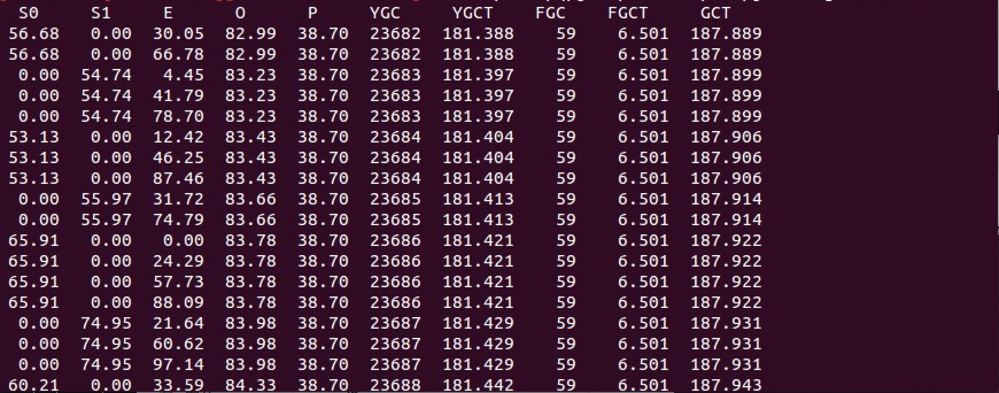
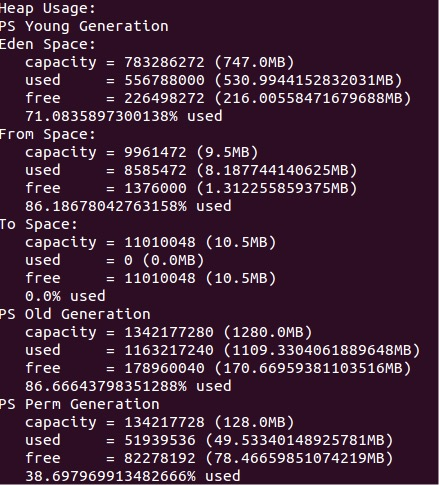
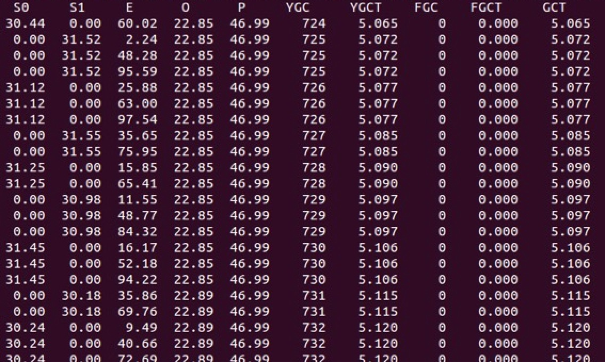
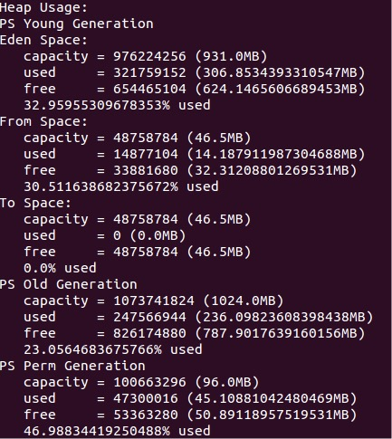

# 背景

最近正在上线一个新系统，系统主要功能是通过接受报价MQ，MQ内部带着的一个缓存Key，通过Key可以从redis里获取对应的一组报价信息，根据一定业务维度提取出最低价，缓存在我们系统自己内部的redis中做一个低价缓存，从而提供低价数据。消息QPS在10K左右，服务响应时间在毫秒级。

系统上线后发现FullGC频率十分频繁，由于当前服务接口处理速度很快，大多数对象朝生夕死，生命周期很短，预计这些短命对象很快会在youngGC的复制过程中被回收，不应该有过多对象晋升到老年带引起FullGC，所以进行了一次排查优化。


# 排查优化

主要通过观察JVM的各个内存区域使用情况和GC情况，分析目前JVM的运行情况

## GC回收策略选择

- 并发收集组合（吞吐量优先）：Parallel（复制）+ ParallelOld（标记整理） 

- 并行收集组合（响应时间优先）：ParNew（复制）+ CMS（标记清除）

系统属于后台应用，不对客户端响应，GC停顿不影响用户端响应时间，系统属于吞吐量优先类型，选择Parallel+ParallelOld。


## 优化前分析排查过程：

### jvm启动参数配置：

```java
export JAVA_OPTS="-Xms2048m -Xmx2048m -XX:NewSize=768m -XX:PermSize=128m -server -XX:+DisableExplicitGC -Dxxx.logs=$CATALINA_BASE/logs -Dxxx.cache=$CATALINA_BASE/cache -verbose:gc -XX:+PrintGCDateStamps -XX:+PrintGCDetails -Xloggc:$CATALINA_BASE/logs/gc.log"
```

### 分析GC日志

```java
2015-12-08T11:12:03.636+0800: 49670.046: [GC [PSYoungGen: 770336K->8320K(775168K)] 845069K->84605K(2085888K), 0.0047280 secs] [Times: user=0.01 sys=0.00, real=0.01 secs] 
```

年轻代减少： 770336K - 8320K = 762016k       
堆减少： 845069K - 84605K = 760464k      
old区增长： 762016k - 760464k = 1552k 

计算得出每次youngGC晋升到old区的对象大小大约在1.5M-2M左右。

### 查看堆中各个内存区域的使用率和GC基本情况 `jstat -gcutil pid 1000` 



O列代表老年代空间使用率，可以看出老年代增长频率明显，有过多的对象晋升到老年代造成频繁的FullGC

### 查看堆中各个内存区域大小 `jmap -heap pid` 



Eden区和S区默认比例为8:1，当前应用默认使用UseAdaptiveSizePolicy自动调整后使得S区只有10M

### 结论

Eden区和S区默认比例为8:1，当前应用默认使用UseAdaptiveSizePolicy自动调整后使得S区只有10M，运行过程中S区使用比率近90%，每次年轻代晋升到old区的对象大小有1.5M-2M，S区剩余空间小于每次晋升到old区大小，也就是说每次youngGC后年轻代仍然存活的对象大于S区大小，导致部分对象在Eden区到S区复制的过程中因为S区空间不够被强制晋升到old区。

通过JVM启动参数 `-XX:-UseAdaptiveSizePolicy` `-XX:SurvivorRatio=20`  禁用自动调整策略，来增大S区大小，并手动调整S区和E区比例，保证Young区调大的时候也不至于S区过大造成空间浪费。


## 优化后情况：

### jvm启动参数配置：

```java
export JAVA_OPTS="-Xms2048m -Xmx2048m -XX:NewSize=1024m -XX:PermSize=96m -server -XX:-UseAdaptiveSizePolicy -XX:SurvivorRatio=20 -XX:+DisableExplicitGC -Dxxx.logs=$CATALINA_BASE/logs -Dxxx.cache=$CATALINA_BASE/cache -verbose:gc -XX:+PrintGCDateStamps -XX:+PrintGCDetails -Xloggc:$CATALINA_BASE/logs/gc.log"
```
增大了年轻代大小，减小youngGC频率。

### 分析GC日志

```java
2015-12-08T19:04:22.069+0800: 571.355: [GC [PSYoungGen: 968545K->15360K(1000960K)] 1171975K->218806K(2049536K), 0.0045470 secs] [Times: user=0.01 sys=0.00, real=0.00 secs]
```

年轻代减少： 968545K - 15360K = 953185k      
堆减少： 1171975K - 218806K = 953169k    
old区增长： 953185k - 953169k = 16k         

每次YoungGC晋升到old区的对象减少了100倍。极大的减少了FullGC的发生频率。


### 查看堆中各个内存区域的使用率和GC基本情况 `jstat -gcutil pid 1000` 



### 查看堆中各个内存区域大小 `jmap -heap pid` 




# 总结

当FullGC频率十分频繁的时候，可以通过GClog，jstat，jmap等相关手段排查优化，一般来说可以通过合理的调整JVM各个内存区域的大小，减少对象过度向老年代晋升，来减少FullGC频率，或者排查常驻内存的使用情况，从应用上进行排查优化；当需要考虑GC时间的时候，可以减小JVM相关区域大小或者改变GC回收策略使用CMS或者G1来减少GC停顿时间。

