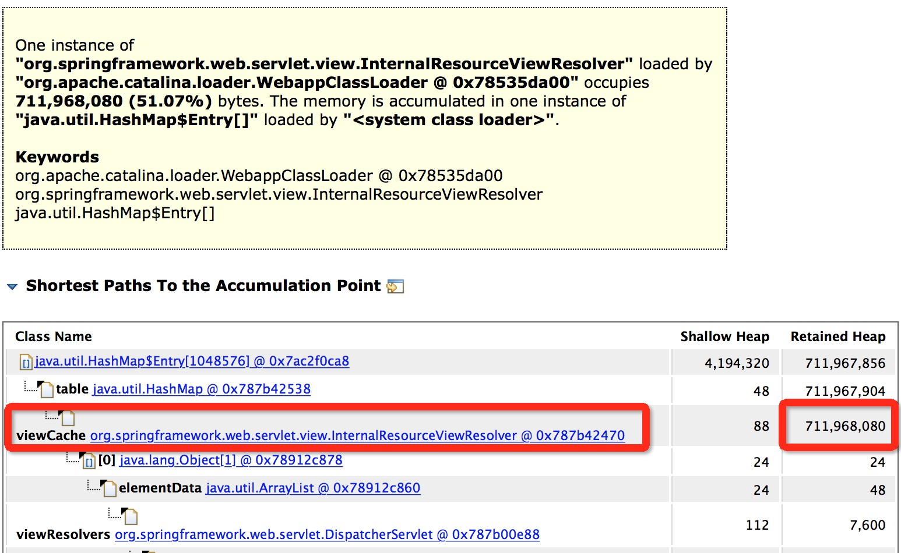
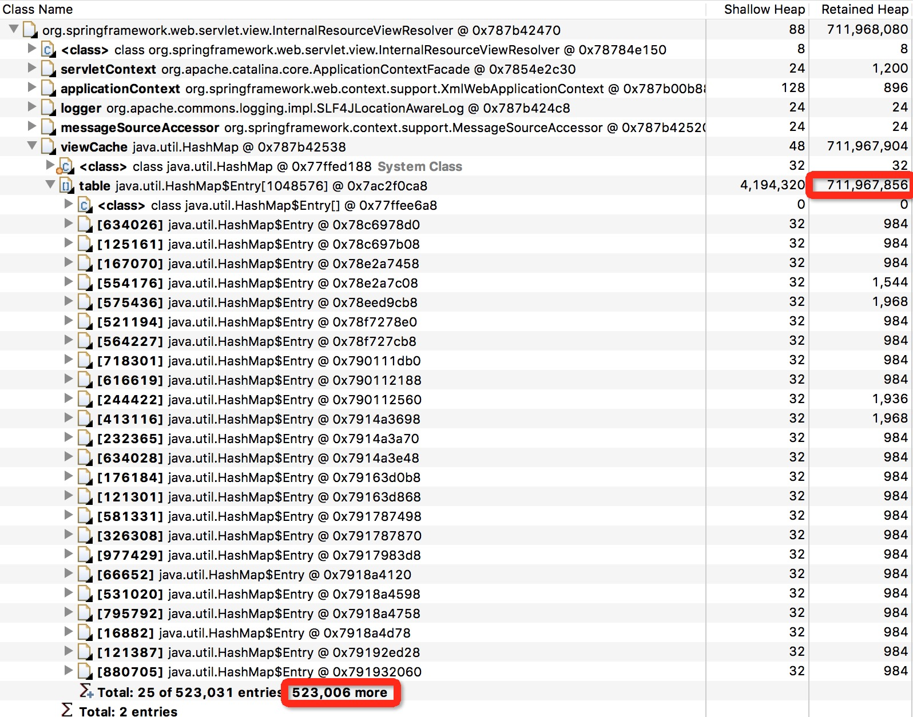

上午突然收到某项目服务器load，GC报警，通过监控发现FullGC频繁，遂登录服务器排查问题。

首先看到GC日志如下：

```java
2017-06-27T11:32:04.208+0800: 517665.833: [Full GC [PSYoungGen: 647168K->8382K(672256K)] [ParOldGen: 1398268K->1398141K(1398272K)] 2045436K->1406524K(2070528K) [PSPermGen: 118009K->118009K(118272K)], 1.6281840 secs] [Times: user=5.83 sys=0.00, real=1.63 secs]
2017-06-27T11:32:12.038+0800: 517673.664: [Full GC [PSYoungGen: 647168K->7685K(672256K)] [ParOldGen: 1398141K->1397889K(1398272K)] 2045309K->1405575K(2070528K) [PSPermGen: 118009K->118009K(118272K)], 1.6880830 secs] [Times: user=5.73 sys=0.00, real=1.69 secs]
2017-06-27T11:32:20.318+0800: 517681.943: [Full GC [PSYoungGen: 647168K->7419K(672256K)] [ParOldGen: 1397889K->1398270K(1398272K)] 2045057K->1405690K(2070528K) [PSPermGen: 118009K->118009K(118272K)], 1.7475230 secs] [Times: user=6.38 sys=0.00, real=1.75 secs]
2017-06-27T11:32:28.477+0800: 517690.103: [Full GC [PSYoungGen: 647168K->7429K(672256K)] [ParOldGen: 1398270K->1397884K(1398272K)] 2045438K->1405314K(2070528K) [PSPermGen: 118009K->118009K(118272K)], 1.5409620 secs] [Times: user=5.34 sys=0.00, real=1.54 secs]
```

分析GC日志可以看到，每次FullGC时，年轻代Eden区得到有效释放，然而old区始终无法释放出足够的空间，剩余空间很小，一直接近满的空间。

可以得出结论，年轻代Eden区满触发GC，此时old区剩余内存空间小于历次youngGC晋升到old区大小，直接触发FullGC，FullGC后，内存并没有得到有效释放，所以判断此时发生内存泄漏，怀疑有资源未能释放。

然后通过 `jmap -dump:format=b,file=core.bin pid` 命令dump内存快照，下载到本地通过mat工具分析内存泄漏及相关引用链得到如下图：





发现org.springframework.web.servlet.view.InternalResourceViewResolver中的viewCache这个HashMap有50万个entries，占了700多M内存，从而导致内存泄漏。查看项目使用的spring版本3.1.2版本中的InternalResourceViewResolver源码，发现其继承自AbstractCachingViewResolver，这个类内部使用了一个HashMap做为缓存，但并没有有效的缓存释放操作，导致程序在返回ModelAndView的时候，会不断的新增这个HashMap，导致内存泄漏。

3.1.2版本源代码如下：

```java
public abstract class AbstractCachingViewResolver extends WebApplicationObjectSupport implements ViewResolver {

	private boolean cache = true;

	private boolean cacheUnresolved = true;

	private final Map<Object, View> viewCache = new HashMap<Object, View>();

	public View resolveViewName(String viewName, Locale locale) throws Exception {
		if (!isCache()) {
			return createView(viewName, locale);
		}
		else {
			Object cacheKey = getCacheKey(viewName, locale);
			synchronized (this.viewCache) {
				View view = this.viewCache.get(cacheKey);
				if (view == null && (!this.cacheUnresolved || !this.viewCache.containsKey(cacheKey))) {
					// Ask the subclass to create the View object.
					view = createView(viewName, locale);
					if (view != null || this.cacheUnresolved) {
						this.viewCache.put(cacheKey, view);
						if (logger.isTraceEnabled()) {
							logger.trace("Cached view [" + cacheKey + "]");
						}
					}
				}
				return view;
			}
		}
	}
}
```
只要返回的viewName不同那么每次都创建一个新的View对象然后添加到viewCache中。


3.1.4版本做出了修复，源代码如下：

```java
public abstract class AbstractCachingViewResolver extends WebApplicationObjectSupport implements ViewResolver {

	public static final int DEFAULT_CACHE_LIMIT = 1024;


	private volatile int cacheLimit = DEFAULT_CACHE_LIMIT;

	private boolean cacheUnresolved = true;

	private final Map<Object, View> viewCache =
			new LinkedHashMap<Object, View>(DEFAULT_CACHE_LIMIT, 0.75f, true) {
				@Override
				protected boolean removeEldestEntry(Map.Entry<Object, View> eldest) {
					return size() > getCacheLimit();
				}
			};

	public View resolveViewName(String viewName, Locale locale) throws Exception {
		if (!isCache()) {
			return createView(viewName, locale);
		}
		else {
			Object cacheKey = getCacheKey(viewName, locale);
			synchronized (this.viewCache) {
				View view = this.viewCache.get(cacheKey);
				if (view == null && (!this.cacheUnresolved || !this.viewCache.containsKey(cacheKey))) {
					// Ask the subclass to create the View object.
					view = createView(viewName, locale);
					if (view != null || this.cacheUnresolved) {
						this.viewCache.put(cacheKey, view);
						if (logger.isTraceEnabled()) {
							logger.trace("Cached view [" + cacheKey + "]");
						}
					}
				}
				return view;
			}
		}
	}
}
```

新版本将HashMap换成了LinkedHashMap，通过LinkedHashMap实现一个LRU缓存，提供了缓存清理方式，防止内存泄漏。

我们可以通过升级spring版本到3.1.4及以上，或者关闭InternalResourceViewResolver的cache功能，修复该问题。


