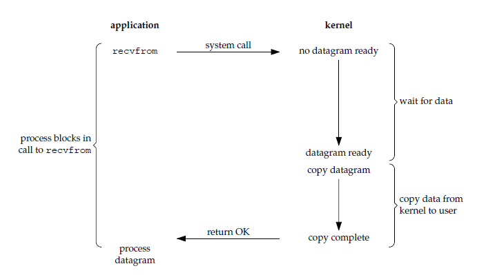
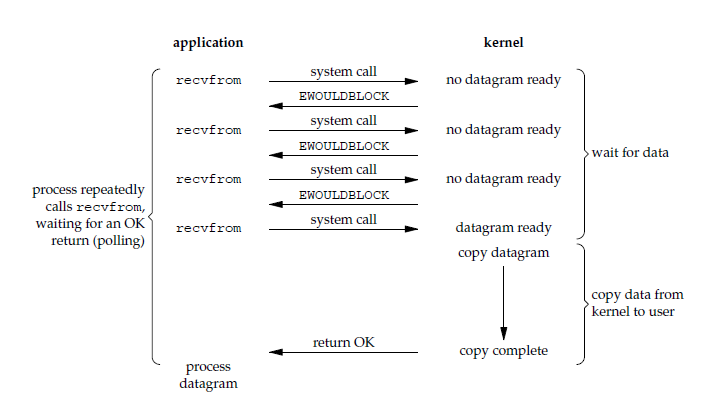
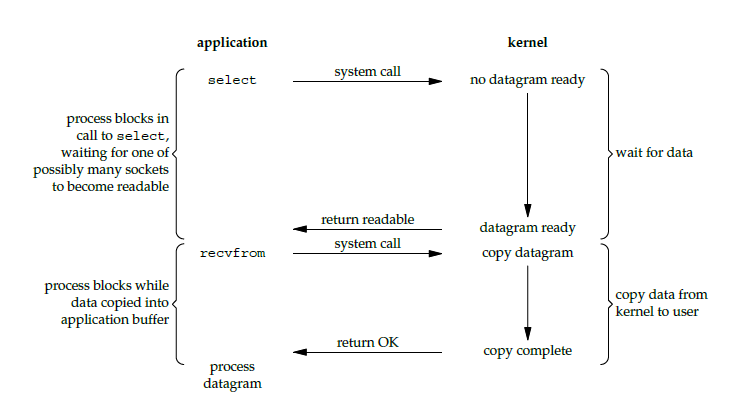
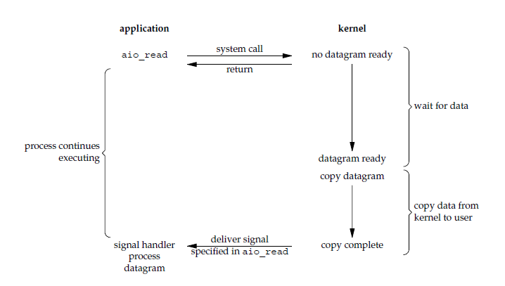

目前常用的IO通信模型主要有以下四种：

- 阻塞同步I/O（blocking IO）
- 非阻塞同步I/O（nonblocking IO）
- 多路复用I/O（IO multiplexing）
- 异步I/O（asynchronous IO）

这些IO模型都是要靠底层操作系统进行支持，应用程序只是提供相应的实现，对操作系统进行调用。本文将介绍这四种IO模型及Java对这四种IO模型的支持。

<!--more-->

对于一次IO访问（以read举例），数据会先被拷贝到操作系统内核的缓冲区中，然后才会从操作系统内核的缓冲区拷贝到应用程序的地址空间。所以说，当一个read操作发生时，它会经历两个阶段：

1. 等待内核数据就绪。网络I/O的情况就是等待远端数据陆续抵达；磁盘I/O的情况就是等待磁盘数据从磁盘上读取到内核态内存中。

2. 数据从内核拷贝到进程。出于系统安全,用户态的程序没有权限直接读取内核态内存,因此内核负责把内核态内存中的数据拷贝一份到用户态内存中。


## 阻塞同步I/O（blocking IO）



默认情况下所有的socket都是blocking，一个典型的读操作流程大概是这样：当用户线程调用了recvfrom这个系统调用，kernel就开始了IO的第一个阶段：准备数据（对于网络IO来说，很多时候数据在一开始还没有到达。比如，还没有收到一个完整的UDP包。这个时候kernel就要等待足够的数据到来）。这个过程需要等待，也就是说数据被拷贝到操作系统内核的缓冲区中是需要一个过程的。而在用户线程这边，整个线程会被阻塞（当然，是线程自己选择的阻塞）。当kernel一直等到数据准备好了，它就会将数据从kernel中拷贝到用户内存，然后kernel返回结果，用户线程才解除block的状态，重新运行起来。这意味着应用程序在调用时会一直阻塞，直到系统调用完成为止（数据传输完成或发生错误）。调用应用程序处于一种不再消费 CPU 而只是简单等待响应的状态，因此从处理的角度来看，这是非常有效的。

blocking IO的特点就是在IO执行的两个阶段都被block了。

### 阻塞同步IO Java实现

```
package com.kris.ioModel;

import org.slf4j.Logger;
import org.slf4j.LoggerFactory;

import java.io.IOException;
import java.io.InputStream;
import java.io.OutputStream;
import java.net.ServerSocket;
import java.net.Socket;

/**
 * 阻塞同步IO Java实现
 *
 * @author xin.liu
 */
public class SocketServer1 {

    private static final Logger LOGGER = LoggerFactory.getLogger(SocketServer1.class);

    public static void main(String[] args) throws IOException {
        ServerSocket serverSocket = null;
        try {
            serverSocket = new ServerSocket(10001);
            while (true) {
                //这里JAVA通过JNI请求操作系统，并一直等待操作系统返回结果（或者出错）
                Socket socket = serverSocket.accept();

                //下面我们收取信息（这里还是阻塞式的,一直等待，直到有数据可以接受）
                InputStream in = socket.getInputStream();
                OutputStream out = socket.getOutputStream();
                Integer sourcePort = socket.getPort();
                int maxLen = 2048;
                byte[] contextBytes = new byte[maxLen];
                int realLen;
                StringBuilder message = new StringBuilder();
                //read的时候，程序也会被阻塞，直到操作系统把网络传来的数据准备好。
                while ((realLen = in.read(contextBytes, 0, maxLen)) != -1) {
                    message.append(new String(contextBytes, 0, realLen));
                    /*
                     * 我们假设读取到“over”关键字，
                     * 表示客户端的所有信息在经过若干次传送后，完成
                     * */
                    if (message.indexOf("over") != -1) {
                        break;
                    }
                }
                //下面打印信息
                LOGGER.info("服务器收到来自于端口：" + sourcePort + "的信息：" + message);

                //下面开始发送信息
                out.write("回发响应信息！".getBytes());

                //关闭
                socket.close();
            }
        } catch (Exception e) {
            LOGGER.error(e.getMessage(), e);
        } finally {
            serverSocket.close();
        }
    }

}

```

## 非阻塞同步I/O（nonblocking IO）



可以通过设置socket使其变为non-blocking。当对一个non-blocking socket执行读操作时，流程是这个样子：当用户线程发出read操作时，如果kernel中的数据还没有准备好，那么它并不会block用户线程，而是立刻返回一个error。从用户线程角度讲 ，它发起一个read操作后，并不需要等待，而是马上就得到了一个结果。用户线程判断结果是一个error时，它就知道数据还没有准备好，于是它可以再次发送read操作。一旦kernel中的数据准备好了，并且又再次收到了用户线程的system call，那么它马上就将数据拷贝到了用户内存，然后返回。整个I/O请求的过程中，虽然用户线程每次发起I/O请求后可以立即返回，但是为了等到数据，仍需要不断地轮询、重复请求，消耗了大量的CPU资源。

nonblocking IO的特点是用户线程需要不断的主动询问kernel数据好了没有。

### 非阻塞同步IO Java实现

```
package com.kris.ioModel;

import org.slf4j.Logger;
import org.slf4j.LoggerFactory;

import java.io.IOException;
import java.io.InputStream;
import java.io.OutputStream;
import java.net.ServerSocket;
import java.net.Socket;
import java.net.SocketTimeoutException;

/**
 * 非阻塞同步IO Java实现
 *
 * @author xin.liu
 */
public class SocketServer2 {

    private static final Logger LOGGER = LoggerFactory.getLogger(SocketServer2.class);

    private static final Object xWait = new Object();

    public static void main(String[] args) throws IOException {
        ServerSocket serverSocket = null;
        try {
            serverSocket = new ServerSocket(10002);
            serverSocket.setSoTimeout(100);
            while (true) {
                Socket socket;
                try {
                    socket = serverSocket.accept();
                } catch (SocketTimeoutException e1) {
                    //===========================================================
                    //      执行到这里，说明本次accept没有接收到任何TCP连接
                    //      主线程在这里就可以做一些事情，记为X
                    //===========================================================
                    synchronized (xWait) {
                        LOGGER.info("这次没有从底层接收到任何TCP连接，等待10毫秒，模拟事件X的处理时间");
                        xWait.wait(10);
                    }
                    continue;
                }

                InputStream in = socket.getInputStream();
                OutputStream out = socket.getOutputStream();
                Integer sourcePort = socket.getPort();
                int maxLen = 2048;
                byte[] contextBytes = new byte[maxLen];
                int realLen;
                StringBuilder message = new StringBuilder();
                //下面我们收取信息（设置成非阻塞方式，这样read信息的时候，又可以做一些其他事情）
                socket.setSoTimeout(10);
                BIORead:
                while (true) {
                    try {
                        while ((realLen = in.read(contextBytes, 0, maxLen)) != -1) {
                            message.append(new String(contextBytes, 0, realLen));
                            /*
                             * 我们假设读取到“over”关键字，
                             * 表示客户端的所有信息在经过若干次传送后，完成
                             * */
                            if (message.indexOf("over") != -1) {
                                break BIORead;
                            }
                        }
                    } catch (SocketTimeoutException e2) {
                        //===========================================================
                        //      执行到这里，说明本次read没有接收到任何数据流
                        //      主线程在这里又可以做一些事情，记为Y
                        //===========================================================
                        LOGGER.info("这次没有从底层接收到任务数据报文，等待10毫秒，模拟事件Y的处理时间");
                    }
                }
                //下面打印信息
                LOGGER.info("服务器收到来自于端口：" + sourcePort + "的信息：" + message);

                //下面开始发送信息
                out.write("回发响应信息！".getBytes());

                //关闭
                socket.close();
            }
        } catch (Exception e) {
            LOGGER.error(e.getMessage(), e);
        } finally {
            if (serverSocket != null) {
                serverSocket.close();
            }
        }
    }
}
```

## 多路复用I/O（IO multiplexing）



IO multiplexing就是我们说的select，poll，epoll。IO多路复用模型从流程上和同步阻塞IO的区别不大，主要区别在于操作系统为用户提供了同时轮询多个IO句柄来查看是否有IO事件的接口（如select/epoll），这从根本上允许用户可以使用单个线程来管理多个IO句柄的问题。

当用户线程调用了select，那么整个线程会被block，而同时，kernel会“监视”所有select负责的socket，当任何一个socket中的数据准备好了，select就会返回。这个时候用户线程再调用read操作，直接把数据从kernel拷贝到用户线程。

在IO multiplexing Model中，实际中，对于每一个socket，一般都设置成为non-blocking，但是，如上图所示，整个用户的线程其实是一直被block的。只不过线程是被select这个函数block，而不是被socket IO给block。

I/O多路复用的特点是通过一种机制使一个线程能同时等待多个文件描述符，而这些文件描述符（套接字描述符）其中的任意一个进入就绪状态，select()函数就可以返回。
这个图和blocking IO的图其实并没有太大的不同，事实上，还更差一些。因为这里需要使用两个system call (select 和 recvfrom)，而blocking IO只调用了一个system call (recvfrom)。但是，用select的优势在于它可以同时处理多个socket。所以，如果处理的连接数不是很高的话，使用select/epoll的web server不一定比使用multi-threading + blocking IO的web server性能更好，可能延迟还更大。select/epoll的优势并不是对于单个连接能处理得更快，而是在于能处理更多的连接。

### 多路复用IO Java实现

```
package com.kris.ioModel;

import org.slf4j.Logger;
import org.slf4j.LoggerFactory;

import java.net.InetSocketAddress;
import java.nio.ByteBuffer;
import java.nio.channels.*;
import java.util.Iterator;

/**
 * 多路复用IO Java实现
 *
 * @author xin.liu
 */
public class SocketServer3 {

    private static final Logger LOGGER = LoggerFactory.getLogger(SocketServer3.class);


    private static final int PORT_NUMBER = 10003;
    private static ByteBuffer buffer = ByteBuffer.allocateDirect(1024);

    public static void main(String[] args) throws Exception {
        int port = PORT_NUMBER;
        LOGGER.info("Listening on port " + port);

        Selector selector = Selector.open();

        ServerSocketChannel serverChannel = ServerSocketChannel.open();
        serverChannel.bind(new InetSocketAddress(port));
        serverChannel.configureBlocking(false);
        serverChannel.register(selector, SelectionKey.OP_ACCEPT);

        while (true) {

            //查看是否有注册的IO事件发生
            int n = selector.select();
            if (n == 0) {
                continue; // nothing to do
            }

            //获取已准备好IO事件的通道集合
            Iterator it = selector.selectedKeys().iterator();
            while (it.hasNext()) {
                SelectionKey key = (SelectionKey) it.next();

                //通道有accept事件发生
                if (key.isValid() && key.isAcceptable()) {
                    ServerSocketChannel server = (ServerSocketChannel) key.channel();
                    SocketChannel channel = server.accept();
                    registerChannel(selector, channel, SelectionKey.OP_READ);
                }

                //通道有read事件发生
                if (key.isValid() && key.isReadable()) {
                    readDataFromSocket(key);
                }

                //通道有write事件发生
                if (key.isValid() && key.isWritable()) {
                    LOGGER.info("isWritable = true");
                }

                //通道有connect事件发生
                if (key.isValid() && key.isConnectable()) {
                    LOGGER.info("isConnectable = true");
                }

                //移除已处理IO事件的通道
                it.remove();
            }
        }
    }

    /**
     * 处理监听IO操作，将接收到通道注册到Selector上
     * @param selector
     * @param channel
     * @param ops
     * @throws Exception
     */
    private static void registerChannel(Selector selector, SelectableChannel channel, int ops) throws Exception {
        if (channel == null) {
            return;
        }
        channel.configureBlocking(false);
        channel.register(selector, ops);
    }

    /**
     * 处理读取IO操作，将服务端接收到的数据发送回客户端
     * @param key
     * @throws Exception
     */
    private static void readDataFromSocket(SelectionKey key) throws Exception {
        SocketChannel socketChannel = (SocketChannel) key.channel();
        int count;
        buffer.clear();

        while ((count = socketChannel.read(buffer)) > 0) {
            buffer.flip();
            while (buffer.hasRemaining()) {
                socketChannel.write(buffer);
            }
            buffer.clear();
            key.interestOps(SelectionKey.OP_READ | SelectionKey.OP_WRITE);
        }

        if (count < 0) {
            // Close channel on EOF, invalidates the key
            socketChannel.close();
        }
    }
}
```

## 异步I/O（asynchronous IO）



用户线程发起read操作之后，立刻就可以开始去做其它的事。而另一方面，从kernel的角度，当它受到一个asynchronous read之后，首先它会立刻返回，所以不会对用户线程产生任何block。然后，kernel会等待数据准备完成，然后将数据拷贝到用户内存，当这一切都完成之后，kernel会给用户线程发送一个signal，告诉它read操作完成了。

采用“订阅-通知”模式：即应用程序向操作系统注册IO监听，然后继续做自己的事情。当操作系统发生IO事件，并且准备好数据后，再主动通知应用程序，触发相应的函数去处理。

### 异步IO Java实现

```
package com.kris.ioModel;

import org.slf4j.Logger;
import org.slf4j.LoggerFactory;

import java.io.IOException;
import java.io.UnsupportedEncodingException;
import java.net.InetSocketAddress;
import java.nio.ByteBuffer;
import java.nio.channels.AsynchronousChannelGroup;
import java.nio.channels.AsynchronousServerSocketChannel;
import java.nio.channels.AsynchronousSocketChannel;
import java.nio.channels.CompletionHandler;
import java.util.concurrent.ExecutorService;
import java.util.concurrent.Executors;

/**
 * 异步IO Java实现
 *
 * @author xin.liu
 */
public class SocketServer4 {

    private static final Object waitObject = new Object();

    /**
     * @param args
     * @throws Exception
     */
    public static void main(String[] args) throws Exception {
        /*
         * 这个线程池是用来得到操作系统的“IO事件通知”的，不是用来进行“得到IO数据后的业务处理的”。要进行后者的操作，您可以再使用一个池（最好不要混用）
         */
        ExecutorService threadPool = Executors.newFixedThreadPool(20);
        AsynchronousChannelGroup group = AsynchronousChannelGroup.withThreadPool(threadPool);
        final AsynchronousServerSocketChannel serverSocket = AsynchronousServerSocketChannel.open(group);

        serverSocket.bind(new InetSocketAddress("0.0.0.0", 10004));
        //为AsynchronousServerSocketChannel注册监听，注意只是为AsynchronousServerSocketChannel通道注册监听
        serverSocket.accept(null, new ServerSocketChannelHandle(serverSocket));

        //等待，只是为了保证守护线程不会退出
        synchronized (waitObject) {
            waitObject.wait();
        }
    }
}

/**
 * 这个处理器类，专门用来响应 ServerSocketChannel 的事件。
 * ServerSocketChannel只有一种事件：接受客户端的连接
 */
class ServerSocketChannelHandle implements CompletionHandler<AsynchronousSocketChannel, Void> {
    /**
     * 日志
     */
    private static final Logger LOGGER = LoggerFactory.getLogger(ServerSocketChannelHandle.class);

    private AsynchronousServerSocketChannel serverSocketChannel;

    /**
     * @param serverSocketChannel
     */
    public ServerSocketChannelHandle(AsynchronousServerSocketChannel serverSocketChannel) {
        this.serverSocketChannel = serverSocketChannel;
    }

    /**
     * 注意，我们分别观察 this、socketChannel、attachment三个对象的id。
     * 来观察不同客户端连接到达时，这三个对象的变化，以说明ServerSocketChannelHandle的监听模式
     */
    @Override
    public void completed(AsynchronousSocketChannel socketChannel, Void attachment) {
        LOGGER.info("completed(AsynchronousSocketChannel result, ByteBuffer attachment)");
        //每次都要重新注册监听（一次注册，一次响应），但是由于“文件状态标示符”是独享的，所以不需要担心有“漏掉的”事件
        this.serverSocketChannel.accept(attachment, this);

        //为这个新的socketChannel注册“read”事件，以便操作系统在收到数据并准备好后，主动通知应用程序
        //在这里，由于我们要将这个客户端多次传输的数据累加起来一起处理，所以我们将一个stringBuffer对象作为一个“附件”依附在这个channel上
        //
        ByteBuffer readBuffer = ByteBuffer.allocate(50);
        socketChannel.read(readBuffer, new StringBuffer(), new SocketChannelReadHandle(socketChannel, readBuffer));
    }

    @Override
    public void failed(Throwable exc, Void attachment) {
        LOGGER.error("failed(Throwable exc, ByteBuffer attachment)");
    }
}

/**
 * 负责对每一个socketChannel的数据获取事件进行监听。<p>
 * <p>
 * 重要的说明：一个socketChannel都会有一个独立工作的SocketChannelReadHandle对象（CompletionHandler接口的实现），
 * 其中又都将独享一个“文件状态标示”对象FileDescriptor、
 * 一个独立的由程序员定义的Buffer缓存（这里我们使用的是ByteBuffer）、
 * 所以不用担心在服务器端会出现“窜对象”这种情况，因为JAVA AIO框架已经帮您组织好了。<p>
 * <p>
 * 但是最重要的，用于生成channel的对象：AsynchronousChannelProvider是单例模式，无论在哪组socketChannel，
 * 对是一个对象引用（但这没关系，因为您不会直接操作这个AsynchronousChannelProvider对象）。
 */
class SocketChannelReadHandle implements CompletionHandler<Integer, StringBuffer> {

    private static final Logger LOGGER = LoggerFactory.getLogger(SocketChannelReadHandle.class);

    private AsynchronousSocketChannel socketChannel;

    /**
     * 专门用于进行这个通道数据缓存操作的ByteBuffer<br>
     * 当然，您也可以作为CompletionHandler的attachment形式传入。<br>
     * 这是，在这段示例代码中，attachment被我们用来记录所有传送过来的StringBuffer了。
     */
    private ByteBuffer byteBuffer;

    public SocketChannelReadHandle(AsynchronousSocketChannel socketChannel, ByteBuffer byteBuffer) {
        this.socketChannel = socketChannel;
        this.byteBuffer = byteBuffer;
    }

    @Override
    public void completed(Integer result, StringBuffer historyContext) {
        //如果条件成立，说明客户端主动终止了TCP套接字，这时服务端终止就可以了
        if (result == -1) {
            try {
                this.socketChannel.close();
            } catch (IOException e) {
                LOGGER.error(e.getMessage(), e);
            }
            return;
        }

        LOGGER.info("completed(Integer result, Void attachment) : 然后我们来取出通道中准备好的值");
        /*
         * 实际上，由于我们从Integer result知道了本次channel从操作系统获取数据总长度
         * 所以实际上，我们不需要切换成“读模式”的，但是为了保证编码的规范性，还是建议进行切换。
         *
         * 另外，无论是JAVA AIO框架还是JAVA NIO框架，都会出现“buffer的总容量”小于“当前从操作系统获取到的总数据量”，
         * 但区别是，JAVA AIO框架中，我们不需要专门考虑处理这样的情况，因为JAVA AIO框架已经帮我们做了处理（做成了多次通知）
         * */
        this.byteBuffer.flip();
        byte[] contexts = new byte[1024];
        this.byteBuffer.get(contexts, 0, result);
        this.byteBuffer.clear();
        try {
            String nowContent = new String(contexts, 0, result, "UTF-8");
            historyContext.append(nowContent);
            LOGGER.info("================目前的传输结果：" + historyContext);
        } catch (UnsupportedEncodingException e) {
            LOGGER.error(e.getMessage(), e);
        }

        //如果条件成立，说明还没有接收到“结束标记”
        if (historyContext.indexOf("over") == -1) {
            return;
        }

        LOGGER.info("=======收到完整信息，开始处理业务=========");
        historyContext = new StringBuffer();

        //还要继续监听（一次监听一次通知）
        this.socketChannel.read(this.byteBuffer, historyContext, this);
    }

    @Override
    public void failed(Throwable exc, StringBuffer historyContext) {
        LOGGER.error("=====发现客户端异常关闭，服务器将关闭TCP通道");
        try {
            this.socketChannel.close();
        } catch (IOException e) {
            LOGGER.error(e.getMessage(), e);
        }
    }

}
```


## IO模型总结

### IO模型分类

首先，一次IO操作发生时，它会经历两个阶段：

1. 等待内核数据就绪。网络I/O的情况就是等待远端数据陆续抵达；磁盘I/O的情况就是等待磁盘数据从磁盘上读取到内核态内存中。

2. 数据从内核拷贝到进程。出于系统安全,用户态的程序没有权限直接读取内核态内存,因此内核负责把内核态内存中的数据拷贝一份到用户态内存中。

#### 阻塞非阻塞的区别分类

这个概念是针对应用程序而言，是指应用程序中的线程在向操作系统发送IO请求后，是否一直等待操作系统的IO响应。如果是，那么就是阻塞式的；如果不是，那么应用程序一般会以轮询的方式以一定周期询问操作系统，直到某次获得了IO响应为止（轮序间隔应用程序线程可以做一些其他工作）。调用blocking IO会一直block住对应的线程直到操作完成，而non-blocking IO在kernel还没准备好数据的情况下会立刻返回。

**主要区别就是内核还没准备好数据的时候是否block用户，阻塞IO整个IO操作阶段会一直block住用户直到全部完成；非阻塞IO在内核没有准备好数据时不会阻塞而是返回错误，需要用户主动轮询操作。**

- 阻塞IO： blocking IO

- 非阻塞IO： non-blocking IO； IO multiplexing； asynchronous IO

#### 同步异步的区别分类

POSIX的定义是这样子的：

- A synchronous I/O operation causes the requesting process to be blocked until that I/O operation completes;

- An asynchronous I/O operation does not cause the requesting process to be blocked;

两者的区别就在于synchronous IO做”IO operation”的时候会将process阻塞。按照这个定义，之前所述的blocking IO，non-blocking IO，IO multiplexing都属于synchronous IO。

定义中所指的”IO operation”是指真实的IO操作，即把数据从内核拷贝到进程这步操作，就是例子中的recvfrom这个system call。non-blocking IO在执行recvfrom这个system call的时候，如果kernel的数据没有准备好，这时候不会block线程。但是，当kernel中数据准备好的时候，recvfrom会将数据从kernel拷贝到用户内存中，这个时候线程是被block了，在这段时间内，线程是被block的。

而asynchronous IO则不一样，当线程发起IO 操作之后，就直接返回再也不理睬了，直到kernel发送一个信号，告诉线程说IO完成。在这整个过程中，线程完全没有被block。

**主要区别就是做真实IO操作即把数据从内核拷贝到进程时是否block用户，同步IO在把数据从内核拷贝到进程时会block用户；异步IO通过回调主动将数据拷贝到用户内存，整个过程不会block用户。**

- 同步IO： blocking IO； non-blocking IO； IO multiplexing
- 异步IO： asynchronous IO


### Java实现

以上这些IO工作模型，在JAVA中都能够找到对应的支持：传统的JAVA Socket套接字支持阻塞/非阻塞模式下的同步IO；JAVA NIO框架在不同操作系统下支持不同种类的多路复用IO技术（windows下的select模型、Linux下的poll/epoll模型）；JAVA AIO框架支持异步IO（windows下的IOCP和Linux使用epoll的模拟AIO）。

### 注意：

**上文中的示例代码只是针对各种IO模型下的Java实现示例展示，并没有使用线程池技术去处理业务逻辑。实际应用中推荐也应当使用线程池技术，用线程池去处理业务逻辑部分。**

**客户端使用何种IO技术，对整个系统架构的性能提升相关性并不大。**

**非阻塞IO模型中，报文的解析，粘包拆包的处理，连接状态的管理维护都需要额外去处理，增加了编程复杂度，一般可以借助Netty，Mina等成型的封装好的NIO类库。**


## 参考资料

[Linux IO模式及 select、poll、epoll详解](https://segmentfault.com/a/1190000003063859)

[架构设计：系统间通信 —— IO通信模型和JAVA实践](http://blog.csdn.net/yinwenjie/article/details/48472237)