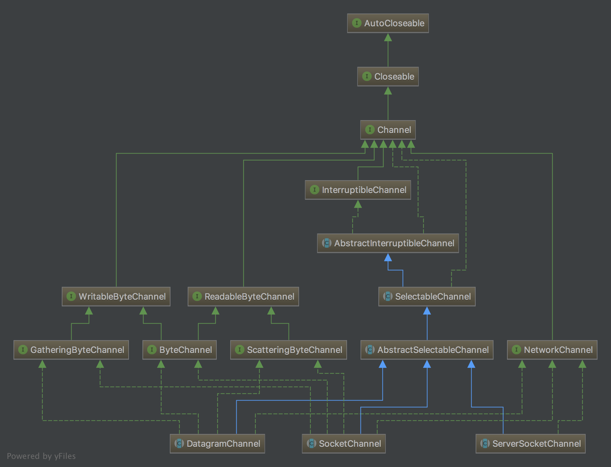

## Channel通道

在JAVA NIO中，基本上所有的IO都是从Channel开始的，读取操作即从Channel读到Buffer，写操作即从Buffer写入Channel。

在网络IO方面，Channel的主要实现是DatagramChannel、SocketChannel和ServerSocketChannel，

- DatagramChannel 能通过UDP读写网络中的数据。

- SocketChannel 能通过TCP读写网络中的数据。

- ServerSocketChannel可以监听新进来的TCP连接，像Web服务器那样。对每一个新进来的连接都会创建一个SocketChannel。

<!--more-->

其整体继承结构如下图：



通道API主要由接口指定。不同的操作系统上通道实现会有根本性的差异，所以通道API仅仅描述了可以做什么。通道实现使用操作系统的本地代码。通道接口允许您以一种受控且可移植的方式来访问底层的I/O服务。

可以从顶层的Channel接口看到，对所有通道来说只有两种共同的操作：检查一个通道是否打开(IsOpen())和关闭一个打开的通道(close())。所有其他的行为都是那些实现Channel接口以及它的子接口的类。

InterruptibleChannel是一个标记接口，当被通道使用时可以标示该通道是可以中断的。中断行为将导致通道在使用时被关闭。

SelectableChannel该接口表示通道是一个可选择的通道，可以改变通道的阻塞模式，并且通道可以被注册到选择器上工作。将非阻塞I/O和选择器组合起来可以使您的程序利用多路复用I/O。

AbstractInterruptibleChannel和AbstractSelectableChannel，它们分别为可中断的(interruptible)和可选择的(selectable)的通道实现提供所需的常用方法实现。

WritableByteChannel和ReadableByteChannel，分别提供的读操作和写操作的API。通道只能在字节缓冲区上操作。

ScatteringByteChannel和GatheringByteChannel，分别提供分散和聚集的读操作和写操作的API。可将数据从一个Channel分散读到多个缓冲区或者将多个的缓冲区的数据一起写入一个Channel。

DatagramChannel、SocketChannel和ServerSocketChannel分别代表UDP，TCP客户端和服务端。

## Channel API

### 打开通道

```java
SocketChannel sc = SocketChannel.open();
sc.connect (new InetSocketAddress ("somehost", someport));

ServerSocketChannel ssc = ServerSocketChannel.open();
ssc.bind (new InetSocketAddress (somelocalport));

DatagramChannel dc = DatagramChannel.open();
```

```
    public static SocketChannel open() throws IOException {
        return SelectorProvider.provider().openSocketChannel();
    }
    
    public static ServerSocketChannel open() throws IOException {
        return SelectorProvider.provider().openServerSocketChannel();
    }
    
    public static DatagramChannel open() throws IOException {
        return SelectorProvider.provider().openDatagramChannel();
    }
```
通过通道类的open()方法可以获取一个通道实例，底层通过SelectorProvider创建一个相应的通道实例。SelectorProvider实例根据JVM运行的操作系统不同会有相应的不同的实现，上层API无需关心底层操作系统的变化。

### 使用通道

道将数据传输给ByteBuffer对象或者从ByteBuffer对象获取数据进行传输。ByteChannel 的read()和write()方法使用ByteBuffer对象作为参数。两种方法均返回已传输的字节数，可能比缓冲区的字节数少甚至可能为零。缓冲区的位置也会发生与已传输字节相同数量的移动。如果只进行了部分传输，缓冲区可以被重新提交给通道并从上次中断的地方继续传输。该过 程重复进行直到缓冲区的 hasRemaining()方法返回false值。

```java
	public static void testChannel() throws IOException {
        ReadableByteChannel source = Channels.newChannel(System.in);
        WritableByteChannel dest = Channels.newChannel(System.out);
        ByteBuffer buffer = ByteBuffer.allocateDirect(16 * 1024);
        while (src.read(buffer) != -1) {
            buffer.flip();
            while (buffer.hasRemaining()) {
                dest.write(buffer);
            }
            buffer.clear();
        }
        source.close();
        dest.close();
    }
```


### 关闭通道

与缓冲区不同，通道不能被重复使用。一个打开的通道即代表与一个特定 I/O 服务的特定连接并封装该连接的状态。当通道关闭时，那个连接会丢失，然后通道将不再连接任何东西。

如果一个通道实现InterruptibleChannel接口。如果一个线程在这个通道上被阻塞并且同时被中断(由调用该被阻塞线程的interrupt()方法的另一个线程中断)，那么该通道将被关闭，该被阻塞线程也会产生一个ClosedByInterruptException异常。如果一个线程的中断状态被设置并且该线程试图访问一个通道，那么这个通道将立即被关闭，同时将抛出相同的ClosedByInterruptException异常。我们可以使用isInterrupted()来测试某个线程当前的中断状态。当前线程的中断状态可以通过调用静态的Thread.interrupted()方法清除。

可中断的通道也是可以异步关闭的。实现InterruptibleChannel接口的通道可以在任何时候被关闭，即使有另一个被阻塞的线程在等待该通道上的一个I/O操作完成。当一个通道被关闭时，休眠在该通道上的所有线程都将被唤醒并接收到一个AsynchronousCloseException异常。接着通道就被关闭并将不再可用。

## Socket通道

### 非阻塞模式

Socket通道可以在非阻塞模式下运行。非阻塞I/O是许多复杂的、高性能的程序构建的基础。
要把一个socket通道置于非阻塞模式，我们要依靠所有socket通道类的父类类：SelectableChannel。下面的方法就是关于通道的阻塞模式的:

```java
public abstract class AbstractSelectableChannel
    extends SelectableChannel {
    private final Object regLock = new Object();

    boolean blocking = true;
    
    public final boolean isBlocking() {
        synchronized (regLock) {
            return blocking;
        }
    }

    public final Object blockingLock() {
        return regLock;
    }
    
    public final SelectableChannel configureBlocking(boolean block)
        throws IOException
    {
        synchronized (regLock) {
            if (!isOpen())
                throw new ClosedChannelException();
            if (blocking == block)
                return this;
            if (block && haveValidKeys())
                throw new IllegalBlockingModeException();
            implConfigureBlocking(block);
            blocking = block;
        }
        return this;
    }
}

    protected void implConfigureBlocking(boolean var1) throws IOException {
        IOUtil.configureBlocking(this.fd, var1);
    }
    
    static native void configureBlocking(FileDescriptor var0, boolean var1) throws IOException;

```

设置或重新设置一个通道的阻塞模式是很简单的，只要调用configureBlocking()方法即可，传递参数值为true则设为阻塞模式，参数值为false值设为非阻塞模式。可以通过调用isBlocking()方法来判断某个socket通道当前处于哪种模式。

### ServerSocketChannel

ServerSocketChannel可以监听新进来的TCP连接, 就像标准IO中的ServerSocket一样。

```java
    public class ServerSocketChannelTest {
        public static final String HELLO = "Hello";

        public static void main(String[] argv)
                throws Exception {
            int port = 10000;
            ByteBuffer buffer = ByteBuffer.wrap(HELLO.getBytes());
            ServerSocketChannel ssc = ServerSocketChannel.open();
            ssc.bind(new InetSocketAddress(port));
            ssc.configureBlocking(false);
            while (true) {
                System.out.println("Waiting for connections");
                SocketChannel sc = ssc.accept();
                if (sc == null) {
                    // no connections, snooze a while
                    Thread.sleep(2000);
                } else {
                    System.out.println("Incoming connection from: "
                            + sc.socket().getRemoteSocketAddress());
                    buffer.rewind();
                    sc.write(buffer);
                    sc.close();
                }
            }
        }
    }
```

首先open打开一个ServerSocketChannel，然后bind到一个本地可用端口。如果以非阻塞模式被调用，当没有传入连接在等待时，ServerSocketChannel.accept()会立即返回null。下一节结合非阻塞通道和Selector选择器给出代码示例。

### SocketChannel

SocketChannel是一个连接到TCP网络套接字的通道。可以通过两种方式创建SocketChannel：1.打开一个SocketChannel并连接到某台服务器；2.一个新连接到达ServerSocketChannel时，会创建一个SocketChannel。

```java
	InetSocketAddress addr = new InetSocketAddress(host, port);
	SocketChannel sc = SocketChannel.open();
	sc.configureBlocking(false);
	sc.connect(addr);
	while (!sc.finishConnect()) {
		doSomethingElse();
	}
	doSomething(sc);
	sc.close();
```

首首先open打开一个SocketChannel，如果设置非阻塞，在connect一个远程地址时将非阻塞的进行连接，连接成功后finishConnect将返回true，正在连接返回false。连接成功后就可以进行读写操作了。

- write()

	非阻塞模式下，write()方法在尚未写出任何内容时可能就返回了。所以需要在循环中调用write()，直到缓存区写完。

- read()

	非阻塞模式下,read()方法在尚未读取到任何数据时可能就返回了。所以需要关注它的int返回值，它会告诉你读取了多少字节。

### DatagramChannel

DatagramChannel是一个能收发UDP包的通道。因为UDP是无连接的网络协议，所以不能像其它通道那样读取和写入。它发送和接收的是数据包。

- 打开 DatagramChannel

	```java
DatagramChannel channel = DatagramChannel.open();
channel.socket().bind(new InetSocketAddress(9999));
	```

- 接收数据：通过receive()方法从DatagramChannel接收数据，receive()方法会将接收到的数据包内容复制到指定的Buffer. 如果Buffer容不下收到的数据，多出的数据将被丢弃。

	```java
ByteBuffer buf = ByteBuffer.allocate(48);
channel.receive(buf);
	```

- 发送数据：通过send()方法从DatagramChannel发送数据，这里发送一串字符到host服务器的UDP端口80。因为服务端并没有监控这个端口，所以什么也不会发生。也不会通知你发出的数据包是否已收到，因为UDP在数据传送方面没有任何保证。

	```java
String hello = "Hello";
ByteBuffer buf = ByteBuffer.allocate(48);
buf.clear();
buf.put(hello.getBytes());
buf.flip();
int bytesSent = channel.send(buf, new InetSocketAddress(host, 80));
	```

- 连接到特定的地址：可以将DatagramChannel“连接”到网络中的特定地址的。由于UDP是无连接的，连接到特定地址并不会像TCP通道那样创建一个真正的连接。而是锁住DatagramChannel，让其只能从特定地址收发数据。当连接后，也可以使用read()和write()方法，就像在用传统的通道一样。只是在数据传送方面没有任何保证。

	```java
channel.connect(new InetSocketAddress(host, 80));
int bytesRead = channel.read(buf);
int bytesWrite = channel.write(but);
	```


