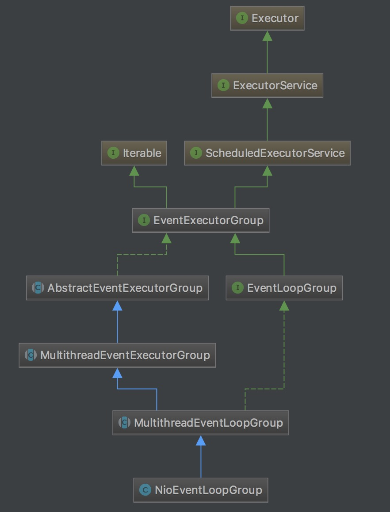
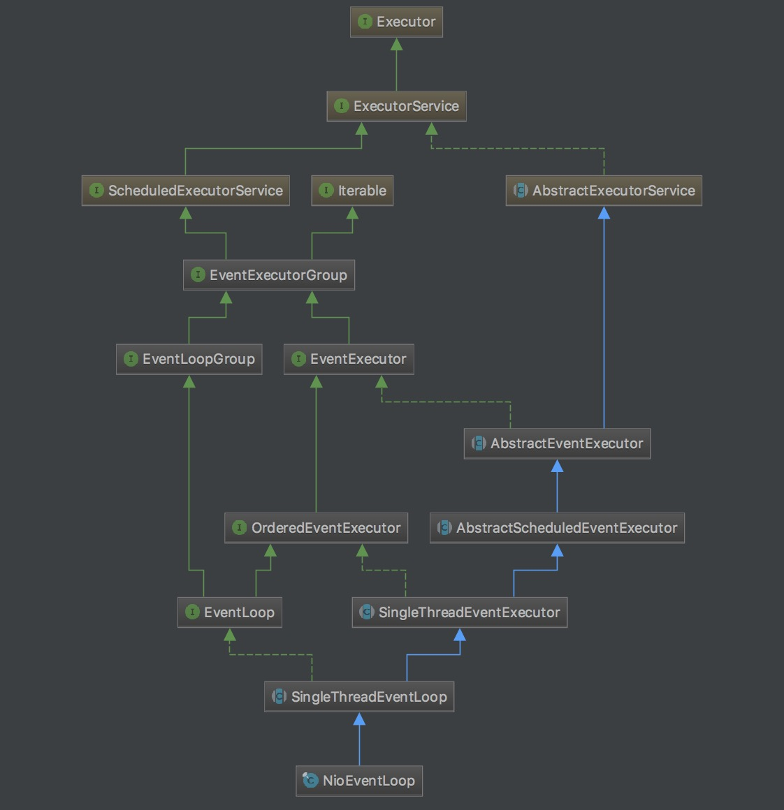

> 本文使用`netty-4.1.5.Final`版本源码进行分析

NioEvnetLoop作为Netty的I/O线程，主要负责轮询多路复用器，获取就绪的通道，执行网络的连接、客户端请求接入、读和写相关操作。EventLoop的职责不仅仅是处理网络I/O事件，用户自定义的Task和定时任务Task也统一由EventLoop负责处理，这样所有I/O操作都在I/O线程内部串行操作，从而实现了线程模型的统一，避免了多线程并发操作和锁竞争，提升了I/O线程的处理和调度性能。 

<!--more-->

### NioEventLoopGroup

NioEvnetLoop通过NioEventLoopGroup创建，NioEventLoopGroup就是Netty的I/O线程池，首先看一下NioEventLoopGroup的继承关系：



创建Netty线程池NioEventLoopGroup

```java
    public NioEventLoopGroup(int nThreads) {
        this(nThreads, (Executor) null);
    }
    
    public NioEventLoopGroup(int nThreads, Executor executor) {
        this(nThreads, executor, SelectorProvider.provider());
    }
    
    public NioEventLoopGroup(
            int nThreads, Executor executor, final SelectorProvider selectorProvider) {
        this(nThreads, executor, selectorProvider, DefaultSelectStrategyFactory.INSTANCE);
    }
    
    public NioEventLoopGroup(int nThreads, Executor executor, final SelectorProvider selectorProvider,
                             final SelectStrategyFactory selectStrategyFactory) {
        super(nThreads, executor, selectorProvider, selectStrategyFactory, RejectedExecutionHandlers.reject());
    }
```

主要用来设置各种线程池参数，如线程数量，创建Thread的线程池，NIO的selectorProvider，拒绝策略等参数。

通过多层构造函数最终调用到父类MultithreadEventExecutorGroup构造函数中

```java
    protected MultithreadEventLoopGroup(int nThreads, Executor executor, Object... args) {
        super(nThreads == 0 ? DEFAULT_EVENT_LOOP_THREADS : nThreads, executor, args);
    }
    
    protected MultithreadEventExecutorGroup(int nThreads, Executor executor, Object... args) {
        this(nThreads, executor, DefaultEventExecutorChooserFactory.INSTANCE, args);
    }

    protected MultithreadEventExecutorGroup(int nThreads, Executor executor,
                                            EventExecutorChooserFactory chooserFactory, Object... args) {
        if (nThreads <= 0) {
            throw new IllegalArgumentException(String.format("nThreads: %d (expected: > 0)", nThreads));
        }

        if (executor == null) {
            executor = new ThreadPerTaskExecutor(newDefaultThreadFactory());//创建线程池，定义ThreadFactory用来设置线程相关参数，例如线程名称，便于排查问题。
        }

        children = new EventExecutor[nThreads];//定义netty的I/O处理线程

        for (int i = 0; i < nThreads; i ++) {
            boolean success = false;
            try {
                children[i] = newChild(executor, args);//创建NioEventLoop
                success = true;
            } catch (Exception e) {
                // TODO: Think about if this is a good exception type
                throw new IllegalStateException("failed to create a child event loop", e);//创建失败则抛出异常终止创建
            } finally {
                if (!success) {//创建失败则关闭所有已经创建的NioEventLoop
                    for (int j = 0; j < i; j ++) {
                        children[j].shutdownGracefully();
                    }

                    for (int j = 0; j < i; j ++) {
                        EventExecutor e = children[j];
                        try {
                            while (!e.isTerminated()) {
                                e.awaitTermination(Integer.MAX_VALUE, TimeUnit.SECONDS);
                            }
                        } catch (InterruptedException interrupted) {
                            // Let the caller handle the interruption.
                            Thread.currentThread().interrupt();
                            break;
                        }
                    }
                }
            }
        }

        chooser = chooserFactory.newChooser(children);//netty线程池选择器，用于创建channelSocket的时候选择一个netty线程用于注册

        final FutureListener<Object> terminationListener = new FutureListener<Object>() {
            @Override
            public void operationComplete(Future<Object> future) throws Exception {
                if (terminatedChildren.incrementAndGet() == children.length) {
                    terminationFuture.setSuccess(null);
                }
            }
        };

        for (EventExecutor e: children) {
            e.terminationFuture().addListener(terminationListener);
        }//创建FutureListener用于关闭时回调

        Set<EventExecutor> childrenSet = new LinkedHashSet<EventExecutor>(children.length);
        Collections.addAll(childrenSet, children);
        readonlyChildren = Collections.unmodifiableSet(childrenSet);//将children转化为一个只读的Set，防止外部操作修改netty线程池
    }
```

```java
    protected EventLoop newChild(Executor executor, Object... args) throws Exception {
        return new NioEventLoop(this, executor, (SelectorProvider) args[0],
            ((SelectStrategyFactory) args[1]).newSelectStrategy(), (RejectedExecutionHandler) args[2]);
    }//创建netty线程池
```
该段主要是设置线程池相关参数，初始化netty线程池中的所有NioEventLoop线程，便于后续的注册监听。


### NioEventLoop

NioEvnetLoop作为netty的I/O线程，内部绑定了一个通过线程池创建的Thread，该Thread在一个无线循环中监听处理I/O相关的操作。

* Netty用于接收客户端请求的线程池职责如下。

	1. 接收客户端TCP连接，初始化Channel参数；

	2. 将链路状态变更事件通知给ChannelPipeline。

* Netty处理I/O操作的Reactor线程池职责如下。

	1. 异步读取通信对端的数据报，发送读事件到ChannelPipeline；

	2. 异步发送消息到通信对端，调用ChannelPipeline的消息发送接口；

	3. 执行系统调用Task；

	4. 执行定时任务Task，例如链路空闲状态监测定时任务。


NioEventLoop的继承关系：



创建Netty线程NioEventLoop

```java
    NioEventLoop(NioEventLoopGroup parent, Executor executor, SelectorProvider selectorProvider,
                 SelectStrategy strategy, RejectedExecutionHandler rejectedExecutionHandler) {
        super(parent, executor, false, DEFAULT_MAX_PENDING_TASKS, rejectedExecutionHandler);
        if (selectorProvider == null) {
            throw new NullPointerException("selectorProvider");
        }
        if (strategy == null) {
            throw new NullPointerException("selectStrategy");
        }
        provider = selectorProvider;
        selector = openSelector();//创建一个选择器绑定在该NioEventLoop上
        selectStrategy = strategy;
    }
    
    protected SingleThreadEventLoop(EventLoopGroup parent, Executor executor,
                                    boolean addTaskWakesUp, int maxPendingTasks,
                                    RejectedExecutionHandler rejectedExecutionHandler) {
        super(parent, executor, addTaskWakesUp, maxPendingTasks, rejectedExecutionHandler);
        tailTasks = newTaskQueue(maxPendingTasks);
    }
    
    protected SingleThreadEventExecutor(EventExecutorGroup parent, Executor executor,
                                        boolean addTaskWakesUp, int maxPendingTasks,
                                        RejectedExecutionHandler rejectedHandler) {
        super(parent);
        this.addTaskWakesUp = addTaskWakesUp;
        this.maxPendingTasks = Math.max(16, maxPendingTasks);
        this.executor = ObjectUtil.checkNotNull(executor, "executor");
        taskQueue = newTaskQueue(this.maxPendingTasks);//task任务队列
        rejectedExecutionHandler = ObjectUtil.checkNotNull(rejectedHandler, "rejectedHandler");
    }
    
    
    
    private static final boolean DISABLE_KEYSET_OPTIMIZATION = SystemPropertyUtil.getBoolean("io.netty.noKeySetOptimization", false);//是否关闭selectedKeys优化，默认为false，代表需要优化

    private Selector openSelector() {
        final Selector selector;
        try {
            selector = provider.openSelector();//创建NIO的Selector
        } catch (IOException e) {
            throw new ChannelException("failed to open a new selector", e);
        }

        if (DISABLE_KEYSET_OPTIMIZATION) {//如果没有开启selectedKeys优化开关，就立即返回
            return selector;
        }

        final SelectedSelectionKeySet selectedKeySet = new SelectedSelectionKeySet();

        Object maybeSelectorImplClass = AccessController.doPrivileged(new PrivilegedAction<Object>() {
            @Override
            public Object run() {
                try {
                    return Class.forName(
                            "sun.nio.ch.SelectorImpl",
                            false,
                            PlatformDependent.getSystemClassLoader());
                } catch (ClassNotFoundException e) {
                    return e;
                } catch (SecurityException e) {
                    return e;
                }
            }
        });//通过反射获取Selector类

        if (!(maybeSelectorImplClass instanceof Class) ||
                // ensure the current selector implementation is what we can instrument.
                !((Class<?>) maybeSelectorImplClass).isAssignableFrom(selector.getClass())) {
            if (maybeSelectorImplClass instanceof Exception) {
                Exception e = (Exception) maybeSelectorImplClass;
                logger.trace("failed to instrument a special java.util.Set into: {}", selector, e);
            }
            return selector;
        }

        final Class<?> selectorImplClass = (Class<?>) maybeSelectorImplClass;

        Object maybeException = AccessController.doPrivileged(new PrivilegedAction<Object>() {
            @Override
            public Object run() {
                try {//通过反射将selector中的selectedKeys和publicSelectedKeys替换成netty优化后的selectedKeySet
                    Field selectedKeysField = selectorImplClass.getDeclaredField("selectedKeys");
                    Field publicSelectedKeysField = selectorImplClass.getDeclaredField("publicSelectedKeys");

                    selectedKeysField.setAccessible(true);
                    publicSelectedKeysField.setAccessible(true);

                    selectedKeysField.set(selector, selectedKeySet);
                    publicSelectedKeysField.set(selector, selectedKeySet);
                    return null;
                } catch (NoSuchFieldException e) {
                    return e;
                } catch (IllegalAccessException e) {
                    return e;
                }
            }
        });

        if (maybeException instanceof Exception) {
            selectedKeys = null;
            Exception e = (Exception) maybeException;
            logger.trace("failed to instrument a special java.util.Set into: {}", selector, e);
        } else {
            selectedKeys = selectedKeySet;
            logger.trace("instrumented a special java.util.Set into: {}", selector);
        }

        return selector;
    }
```

通过创建netty线程池的相关参数，初始化NioEventLoop，在NioEventLoop上打开一个NIO的选择器Selector，用于处理注册在当前的NioEventLoop上的channel，每个NioEventLoop上的Selector相互独立互不影响。通过参数`io.netty.noKeySetOptimization`可以设置是否开启selectedKeys优化策略，通过反射替换掉Selector内部原生的selectedKeys，替换为netty优化后的SelectedSelectionKeySet，默认开启。

NioEventLoop与线程绑定

```java 
    private void startThread() {
        if (STATE_UPDATER.get(this) == ST_NOT_STARTED) {
            if (STATE_UPDATER.compareAndSet(this, ST_NOT_STARTED, ST_STARTED)) {//通过原子变量CAS保证只有一个线程执行
                doStartThread();//开启线程
            }
        }
    }

    private void doStartThread() {
        assert thread == null;
        executor.execute(new Runnable() {
            @Override
            public void run() {
                thread = Thread.currentThread();//将线程池中的当前线程与NioEventLoop绑定
                if (interrupted) {
                    thread.interrupt();
                }

                boolean success = false;
                updateLastExecutionTime();
                try {
                    SingleThreadEventExecutor.this.run();//执行NioEventLoop的run方法。
                    success = true;
                } catch (Throwable t) {
                    logger.warn("Unexpected exception from an event executor: ", t);
                } finally {
                    for (;;) {
                        int oldState = STATE_UPDATER.get(SingleThreadEventExecutor.this);
                        if (oldState >= ST_SHUTTING_DOWN || STATE_UPDATER.compareAndSet(
                                SingleThreadEventExecutor.this, oldState, ST_SHUTTING_DOWN)) {
                            break;//关闭并退出
                        }
                    }

                    // Check if confirmShutdown() was called at the end of the loop.
                    if (success && gracefulShutdownStartTime == 0) {
                        logger.error("Buggy " + EventExecutor.class.getSimpleName() + " implementation; " +
                                SingleThreadEventExecutor.class.getSimpleName() + ".confirmShutdown() must be called " +
                                "before run() implementation terminates.");
                    }

                    try {
                        // Run all remaining tasks and shutdown hooks.
                        for (;;) {
                            if (confirmShutdown()) {//执行关闭相关的收尾动作，比如执行完一些task任务
                                break;
                            }
                        }
                    } finally {
                        try {
                            cleanup();//关闭selector
                        } finally {
                            STATE_UPDATER.set(SingleThreadEventExecutor.this, ST_TERMINATED);
                            threadLock.release();
                            if (!taskQueue.isEmpty()) {
                                logger.warn(
                                        "An event executor terminated with " +
                                                "non-empty task queue (" + taskQueue.size() + ')');
                            }

                            terminationFuture.setSuccess(null);
                        }
                    }
                }
            }
        });
    }

```

当NioEventLoop执行时，会创建一个线程并将线程绑定在该NioEventLoop上，创建过程通过原子变量STATE_UPDATER做并发保护。该线程将会执行SingleThreadEventExecutor的run方法。

SingleThreadEventExecutor的run方法将在一个无线循环中处理I/O相关操作和task任务，直到退出。

```java
    @Override
    protected void run() {
        for (;;) {
            try {
                switch (selectStrategy.calculateStrategy(selectNowSupplier, hasTasks())) {//有task任务则立刻selectNow选择出selectKeys，没有task任务则返回SelectStrategy.SELECT然后执行select进行选择。
                    case SelectStrategy.CONTINUE:
                        continue;
                    case SelectStrategy.SELECT:
                        select(wakenUp.getAndSet(false));//执行select操作，由Selector多路复用器轮询，看是否有准备就绪的Channel，直到监听到有需要执行的selectKeys或者有task任务需要执行则返回。这里有可能触发NIO的epoll bug，它会导致Selector的空轮询，使I/O线程一直处于100%状态，这里通过重新创建一个新的Selector并将老的Selector上的channel注册到新的Selector上处理了该bug

                        // 'wakenUp.compareAndSet(false, true)' is always evaluated
                        // before calling 'selector.wakeup()' to reduce the wake-up
                        // overhead. (Selector.wakeup() is an expensive operation.)
                        //
                        // However, there is a race condition in this approach.
                        // The race condition is triggered when 'wakenUp' is set to
                        // true too early.
                        //
                        // 'wakenUp' is set to true too early if:
                        // 1) Selector is waken up between 'wakenUp.set(false)' and
                        //    'selector.select(...)'. (BAD)
                        // 2) Selector is waken up between 'selector.select(...)' and
                        //    'if (wakenUp.get()) { ... }'. (OK)
                        //
                        // In the first case, 'wakenUp' is set to true and the
                        // following 'selector.select(...)' will wake up immediately.
                        // Until 'wakenUp' is set to false again in the next round,
                        // 'wakenUp.compareAndSet(false, true)' will fail, and therefore
                        // any attempt to wake up the Selector will fail, too, causing
                        // the following 'selector.select(...)' call to block
                        // unnecessarily.
                        //
                        // To fix this problem, we wake up the selector again if wakenUp
                        // is true immediately after selector.select(...).
                        // It is inefficient in that it wakes up the selector for both
                        // the first case (BAD - wake-up required) and the second case
                        // (OK - no wake-up required).

                        if (wakenUp.get()) {//如果有将wakenUp设置为true，则调用selector的wakeup方法唤醒Selector
                            selector.wakeup();
                        }
                    default://通过selectStrategy方法中的selectNow选择出了selectKeys，则继续执行下面的操作
                        // fallthrough
                }

                cancelledKeys = 0;
                needsToSelectAgain = false;
                final int ioRatio = this.ioRatio;//I/O操作和task任务执行时间比例，用于控制防止task过度执行导致I/O操作被长时间阻塞
                if (ioRatio == 100) {
                    processSelectedKeys();//处理通过选择器选择出来的selectedKeys的I/O操作
                    runAllTasks();//处理task任务
                } else {
                    final long ioStartTime = System.nanoTime();

                    processSelectedKeys();//处理通过选择器选择出来的selectedKeys的I/O操作
                    final long ioTime = System.nanoTime() - ioStartTime;
                    runAllTasks(ioTime * (100 - ioRatio) / ioRatio);//带超时时间的runAllTasks，执行超过该时间则直接返回不再继续执行task任务，防止I/O操作被阻塞
                }

                if (isShuttingDown()) {
                    closeAll();
                    if (confirmShutdown()) {
                        break;
                    }
                }
            } catch (Throwable t) {
                logger.warn("Unexpected exception in the selector loop.", t);

                // Prevent possible consecutive immediate failures that lead to
                // excessive CPU consumption.
                try {
                    Thread.sleep(1000);
                } catch (InterruptedException e) {
                    // Ignore.
                }
            }
        }
    }
```

处理netty的I/O操作，根据selectedKeys判断selectedKeys是否是netty优化过的selectedKeys来决定走不同的处理逻辑，遍历并执行就绪的selectKeys上的操作。 

```java
    private void processSelectedKeys() {//处理通过选择器选择出来的selectedKeys的I/O操作
        if (selectedKeys != null) {
            processSelectedKeysOptimized(selectedKeys.flip());//netty优化后的selectedKeys处理逻辑
        } else {
            processSelectedKeysPlain(selector.selectedKeys());//netty优化前的selectedKeys处理逻辑

        }
    }
    
    private void processSelectedKeysOptimized(SelectionKey[] selectedKeys) {//netty优化后的selectedKeys处理逻辑
        for (int i = 0;; i ++) {//循环处理所有的selectedKeys
            final SelectionKey k = selectedKeys[i];
            if (k == null) {
                break;
            }
            // null out entry in the array to allow to have it GC'ed once the Channel close
            // See https://github.com/netty/netty/issues/2363
            selectedKeys[i] = null;//将处理完的SelectionKey置空

            final Object a = k.attachment();

            if (a instanceof AbstractNioChannel) {//Channel处理
                processSelectedKey(k, (AbstractNioChannel) a);
            } else {
                @SuppressWarnings("unchecked")
                NioTask<SelectableChannel> task = (NioTask<SelectableChannel>) a;
                processSelectedKey(k, task);
            }

            if (needsToSelectAgain) {
                // null out entries in the array to allow to have it GC'ed once the Channel close
                // See https://github.com/netty/netty/issues/2363
                for (;;) {
                    i++;
                    if (selectedKeys[i] == null) {
                        break;
                    }
                    selectedKeys[i] = null;
                }

                selectAgain();
                // Need to flip the optimized selectedKeys to get the right reference to the array
                // and reset the index to -1 which will then set to 0 on the for loop
                // to start over again.
                //
                // See https://github.com/netty/netty/issues/1523
                selectedKeys = this.selectedKeys.flip();
                i = -1;
            }
        }
    }

    private void processSelectedKeysPlain(Set<SelectionKey> selectedKeys) {////netty优化前的selectedKeys处理逻辑
        // check if the set is empty and if so just return to not create garbage by
        // creating a new Iterator every time even if there is nothing to process.
        // See https://github.com/netty/netty/issues/597
        if (selectedKeys.isEmpty()) {
            return;
        }

        Iterator<SelectionKey> i = selectedKeys.iterator();
        for (;;) {//循环处理所有的selectedKeys
            final SelectionKey k = i.next();
            final Object a = k.attachment();
            i.remove();//移除处理完的SelectionKey，防止重复处理

            if (a instanceof AbstractNioChannel) {//Channel处理
                processSelectedKey(k, (AbstractNioChannel) a);
            } else {
                @SuppressWarnings("unchecked")
                NioTask<SelectableChannel> task = (NioTask<SelectableChannel>) a;
                processSelectedKey(k, task);
            }

            if (!i.hasNext()) {
                break;
            }

            if (needsToSelectAgain) {
                selectAgain();
                selectedKeys = selector.selectedKeys();

                // Create the iterator again to avoid ConcurrentModificationException
                if (selectedKeys.isEmpty()) {
                    break;
                } else {
                    i = selectedKeys.iterator();
                }
            }
        }
    }
    
    
    private void processSelectedKey(SelectionKey k, AbstractNioChannel ch) {//处理Channel
        final AbstractNioChannel.NioUnsafe unsafe = ch.unsafe();
        if (!k.isValid()) {//如果SelectionKey无效
            final EventLoop eventLoop;
            try {
                eventLoop = ch.eventLoop();//获取当前channel所在的NioEventLoop
            } catch (Throwable ignored) {
                // If the channel implementation throws an exception because there is no event loop, we ignore this
                // because we are only trying to determine if ch is registered to this event loop and thus has authority
                // to close ch.
                return;
            }
            // Only close ch if ch is still registerd to this EventLoop. ch could have deregistered from the event loop
            // and thus the SelectionKey could be cancelled as part of the deregistration process, but the channel is
            // still healthy and should not be closed.
            // See https://github.com/netty/netty/issues/5125
            if (eventLoop != this || eventLoop == null) {
                return;
            }
            // close the channel if the key is not valid anymore
            unsafe.close(unsafe.voidPromise());//关闭当前channel
            return;
        }

        try {
            int readyOps = k.readyOps();//获取就绪的I/O操作
            // Also check for readOps of 0 to workaround possible JDK bug which may otherwise lead
            // to a spin loop
            if ((readyOps & (SelectionKey.OP_READ | SelectionKey.OP_ACCEPT)) != 0 || readyOps == 0) {//如果就绪操作是READ或者ACCEPT，或者等于0，则通过netty的unsafe做读相关操作。主要是接收处理客户端的TCP连接
                unsafe.read();
                if (!ch.isOpen()) {
                    // Connection already closed - no need to handle write.
                    return;
                }
            }
            if ((readyOps & SelectionKey.OP_WRITE) != 0) {//如果就绪操作是WRITE，说明有半包消息未发送完成，则通过netty的unsafe继续Flush
                // Call forceFlush which will also take care of clear the OP_WRITE once there is nothing left to write
                ch.unsafe().forceFlush();
            }
            if ((readyOps & SelectionKey.OP_CONNECT) != 0) {//如果就绪操作是CONNECT，则移除CONNECT的监听位，并完成连接操作。

                // remove OP_CONNECT as otherwise Selector.select(..) will always return without blocking
                // See https://github.com/netty/netty/issues/924
                int ops = k.interestOps();
                ops &= ~SelectionKey.OP_CONNECT;
                k.interestOps(ops);

                unsafe.finishConnect();
            }
        } catch (CancelledKeyException ignored) {
            unsafe.close(unsafe.voidPromise());
        }
    }
    
```

处理task任务和定时task任务

```java
    protected boolean runAllTasks() {//执行所有的task
        assert inEventLoop();
        boolean fetchedAll;
        boolean ranAtLeastOne = false;

        do {
            fetchedAll = fetchFromScheduledTaskQueue();//将到达定时任务执行时间的定时任务从定时任务列表转移到普通task任务列表中
            if (runAllTasksFrom(taskQueue)) {//执行所有的task任务
                ranAtLeastOne = true;
            }
        } while (!fetchedAll); //循环直到应该执行的定时任务都执行完
        
        if (ranAtLeastOne) {
            lastExecutionTime = ScheduledFutureTask.nanoTime();
        }
        afterRunningAllTasks();
        return ranAtLeastOne;
    }
    
    protected boolean runAllTasks(long timeoutNanos) {//带超时时间的执行task
        fetchFromScheduledTaskQueue();//将到达定时任务执行时间的定时任务从定时任务列表转移到普通task任务列表中
        Runnable task = pollTask();//获取一个task
        if (task == null) {
            afterRunningAllTasks();
            return false;
        }

        final long deadline = ScheduledFutureTask.nanoTime() + timeoutNanos;//该轮非I/O操作的deadline
        long runTasks = 0;//执行的task任务个数
        long lastExecutionTime;
        for (;;) {//循环执行task列表
            safeExecute(task);//安全的执行task

            runTasks ++;

            // Check timeout every 64 tasks because nanoTime() is relatively expensive.
            // XXX: Hard-coded value - will make it configurable if it is really a problem.
            if ((runTasks & 0x3F) == 0) {//为了提升性能，防止每次都调用nanoTime方法，这里每执行64次循环判断一次，校验如果当前时间超出分配给非I/O操作的超时时间点，则退出循环。
                lastExecutionTime = ScheduledFutureTask.nanoTime();
                if (lastExecutionTime >= deadline) {
                    break;
                }
            }

            task = pollTask();//获取一个task
            if (task == null) {
                lastExecutionTime = ScheduledFutureTask.nanoTime();
                break;
            }
        }

        afterRunningAllTasks();
        this.lastExecutionTime = lastExecutionTime;
        return true;
    }
```

一般会将I/O相关的操作封装成task来执行，比如write操作，会将write操作封装成task，从而使用当前channel所在的I/O线程来处理该操作。这样所有I/O操作都在I/O线程内部串行操作，从而实现了线程模型的统一，避免了多线程并发操作和锁竞争，提升了I/O线程的处理和调度性能。表面上看，串行化设计似乎CPU利用率不高，并发程度不够。但是，通过调整netty线程池的数量，可以同时启动多个串行化的线程并行运行，这种局部无锁化的串行线程设计相比一个队列多个工作线程模型性能更优。
