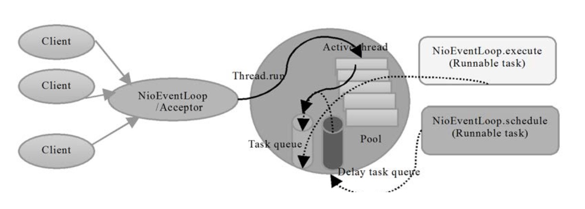

### Reactor模型

Reactor模式：是一个事件驱动模型，有一个或多个并发输入源，有一个Service Handler，有多个Request Handlers；这个Service Handler会同步的将输入的请求（Event）多路复用的分发给相应的Request Handler。

Reactor模式使用的是异步非阻塞模式，对应到Java的NIO上，通过Selector接收客户端的TCP连接请求消息，当链路建立成功或者消息到达后，通过Dispatcher将对应的请求派发到指定的Handler上进行处理。

<!--more-->

Reactor模式的优点：解耦，请求的处理、调度和业务逻辑的处理分离；提供模块化、可重用性、可配置性和事件驱动的应用程序；提高程序的可移植性；提供粗粒度并发控制。


### Netty线程模型

Netty可以通过服务端启动参数来设置它的Reactor线程模型。服务端启动的时候，创建了两个NioEventLoopGroup，它们实际是两个独立的Reactor线程池。一个用于接收客户端的TCP连接，另一个用于处理I/O相关的读写操作，或者执行系统Task、定时任务Task等。



```java
	EventLoopGroup bossGroup = new NioEventLoopGroup(1);  
	EventLoopGroup workerGroup = new NioEventLoopGroup();  
	ServerBootstrap serverBootstrap = new ServerBootstrap();  
	serverBootstrap.group(bossGroup, workerGroup)  
		.channel(NioServerSocketChannel.class)  
		.option(ChannelOption.SO_BACKLOG, 1024) 
		.childHandler(new ChildChannelHandler());  
```

bossGroup线程池实际就是Acceptor线程池，负责绑定监听端口，处理客户端的TCP连接请求，创建对应连接的SocketChannel，如果系统只有一个服务端端口需要监听，则建议bossGroup线程组线程数设置为1。bossGroup线程池职责如下：

1. 接收客户端TCP连接，初始化Channel，将Channel注册到workerGroup用于处理I/O的读写操作。
2. 将链路状态变更事件通知给ChannelPipeline。


workerGroup线程池是真正负责I/O读写操作的线程池。1个NIO线程可以同时处理N条链路，但是1个链路只对应1个NIO线程，防止发生并发操作问题。使用workerGroup线程池时，需要根据实际情况合理设置I/O线程池的线程数量，防止单个I/O线程造成系统瓶颈。因为一个NIO线程同时处理成百上千的链路时，性能上无法支撑，无法满足海量消息的编码、解码、读取和发送；NIO线程负载过重之后，处理速度将变慢，将会导致大量客户端连接超时，最终会导致大量消息积压和处理超时，成为系统的性能瓶颈；NIO线程epoll死循环bug，会导致整个系统通信模块暂时不可用，不能接收和处理外部消息，造成节点故障。所以使用多个I/O线程来保证系统的性能和可靠性稳定性。workerGroup线程池职责如下：

1. 异步读取通信对端的数据报，发送读事件到ChannelPipeline;
2. 异步发送消息到通信对端，调用ChannelPipeline的消息发送接口; 
3. 执行系统调用Task;
4. 执行定时任务Task，例如链路空闲状态监测定时任务。


### 实践

1. 时间可控的简单业务直接在IO线程上处理，避免线程切换。比如心跳检测，比如编解码的逻辑处理，编解码一般可以使用编解码相关的ChannelHandler，直接在I/O线程上进行编解码处理，如果编解码的逻辑处理对I/O线程的性能造成影响，那么也可以将编解码放到后端业务线程池来处理，需要根据实际情况来进行适当的选择。
2. 复杂和时间不可控业务建议投递到后端业务线程池统一处理，业务处理放到后端线程池，防止业务逻辑阻塞造成I/O线程阻塞，会导致大量消息积压和处理超时，成为系统瓶颈。
3. 业务线程避免直接操作Channel，主要为了避免多线程并发问题，一般会将对Channel的操作封装成task任务，提交给I/O线程来执行。比如write操作，netty4中对Channel的write操作会封装一个task任务，最终由I/O线程来执行write的task任务。
4. netty的线程模型不适合大数据的读写，Channel如果出现一个长时间的数据读写，会影响这个Reactor线程中其他Channel的响应，比如在大文件传输时，IO操作就会影响其他请求的响应时间，因而对这种情况下，应该使用传统的Thread-Per-Connection


### 参考资料:

《Netty权威指南 第二版》 李林锋
