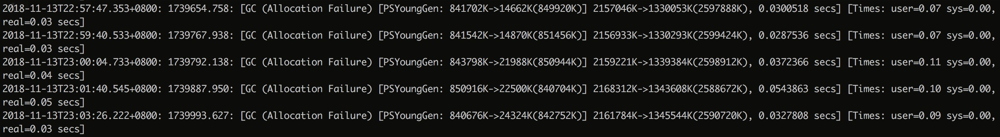
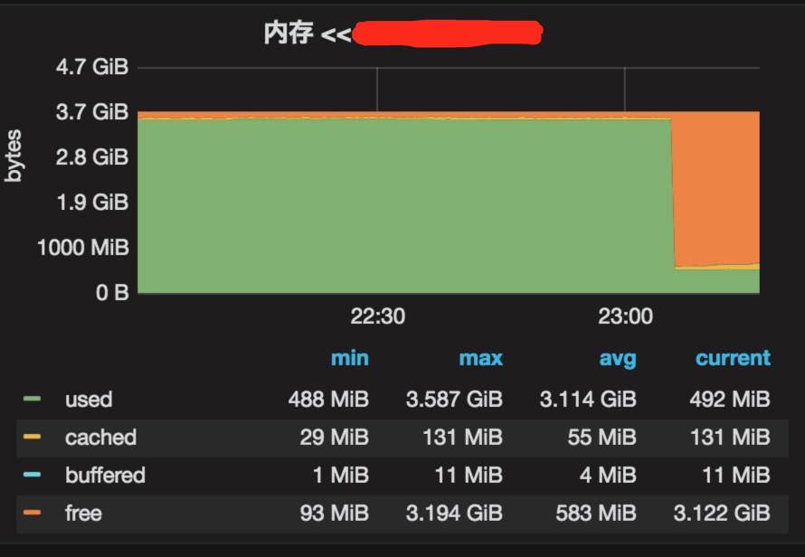
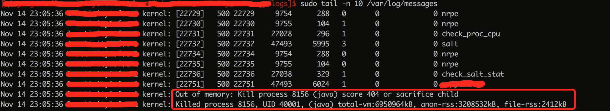
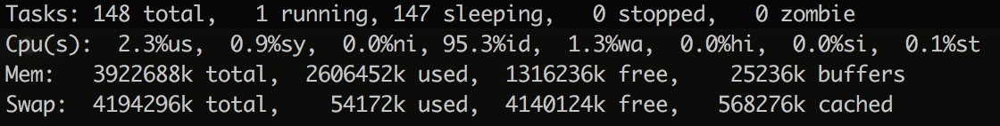
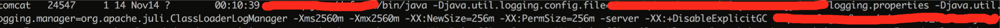
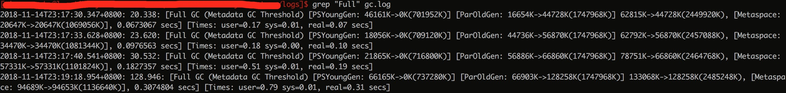
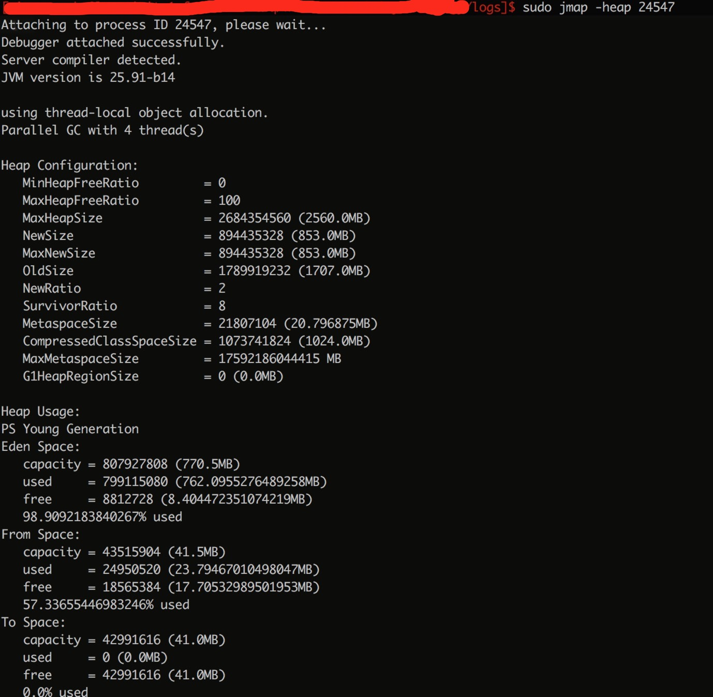
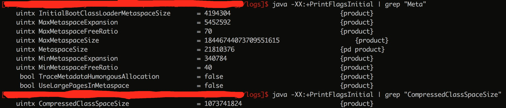
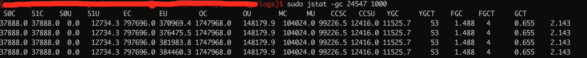
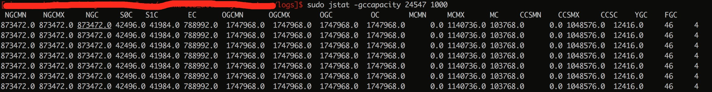

## 问题背景

线上突然收到某应用端口报警，登陆服务器后，发现机器上的Java应用进程莫名其妙的消失了，便进行了一番排查，并把排查分析的过程做了下总结记录。

## 排查分析过程

### 排查

首先Java进程已经消失了，最真实的现场已经不存在了(无法获取故障时的线程dump或堆内存dump)，那么就尽可能找寻一些蛛丝马迹，比如通过服务挂掉之前的日志、监控等信息，来尽可能还原服务消失前的一些经过：

#### 日志

* 应用日志

	Java应用日志，无明显报错，没有出现OOM异常。

* dump日志

	系统配置了当JVM发生OOM时，自动生成dump文件，但是并没有出现dump文件。

	相关配置：
	
	`-XX:+HeapDumpOnOutOfMemoryError -XX:HeapDumpPath=/path/heapdump.hprof`

* Crash日志

	系统配置JVM崩溃日志，但是并没有出现Crash日志。

	相关配置：
	
	`-XX:ErrorFile=/path/hs_error%p.log`

* gc日志

	

	可以看出gc频率正常，死亡前并没有出现频繁FullGC等异常现象。

#### 监控

从业务监控以及系统指标监控来看并无明显问题，在一个时间点上因为应用进程死亡各项指标全掉了，只是在进程死亡前内存占用率一直非常高。

### 分析

根据以上日志和监控信息，基本可以排除应用自身崩溃等原因死亡的，所以怀疑是有‘人’杀了它，线上环境并不会有什么机制会主动杀死应用，服务器也没有做什么重启等操作，所以可能是操作系统主动杀死的它，根据以往经验结合刚才的内存占用率高的监控，怀疑是系统的OOM-Killer机制杀死的它呢，查看`cat var/log/messages`，果然确认了是OOM-Killer杀死的它：

#### OOM-Killer是什么

Linux内核有个机制叫OOM killer（Out-Of-Memory killer），该机制会监控那些占用内存过大，尤其是瞬间很快消耗大量内存的进程，为了防止内存耗尽而内核会把该进程杀掉。查看系统日志/var/log/messages会发现Out of Memory: Kill process 1865（sshd）类似的错误信息。

### 继续排查

已经确认了是OOM-Killer杀死它，也了解了OOM-Killer机制，那么我们该怎么解决呢，先看下我们的内存使用情况：

#### top命令：

虚拟机内存总大小4G。

#### Java内存使用

* 启动参数

	

	堆内存设置了2.5G，应用程序运行在java8的环境上，所以PermSize配置无效。

* gc日志

	

	查看系统FullGC的记录，因为FullGC一般会记录比较全的各区域内存信息，以此来看MateSpaceSize大小，惊讶的发现居然MateSpaceSize有1G大小，仅仅堆+MateSpaceSize的空间就已经是3.5G了，另外看GC原因居然是因为`MetaData GC Threshold`，也就是MateSpaceSize空间不足导致的FullGC，但是GC日志里同样显示MateSpaceSize空间在GC前仍是充足的，便通过其他命令继续观察空间大小。

* jmap

	

	通过`jmap -heap pid`命令查看各区域空间大小，看到MateSpaceSize大小只有20M，但是有一个CompressedClassSpaceSize居然占用了1G。

	相关区域及参数介绍：

	* Metaspace（元空间）并不在虚拟机中，而是使用本地内存。Metaspace组成：

		* Klass Metaspace:Klass Metaspace就是用来存klass的，klass是我们熟知的class文件在jvm里的运行时数据结构，不过有点要提的是我们看到的类似A.class其实是存在heap里的，是java.lang.Class的一个对象实例。这块内存是紧接着Heap的，和我们之前的perm一样，这块内存大小可通过-XX:CompressedClassSpaceSize参数来控制，这个参数前面提到了默认是1G，但是这块内存也可以没有，假如没有开启压缩指针就不会有这块内存，这种情况下klass都会存在NoKlass Metaspace里，另外如果我们把-Xmx设置大于32G的话，其实也是没有这块内存的，因为会这么大内存会关闭压缩指针开关。还有就是这块内存最多只会存在一块。

		* NoKlass Metaspace:NoKlass Metaspace专门来存klass相关的其他的内容，比如method，constantPool等，这块内存是由多块内存组合起来的，所以可以认为是不连续的内存块组成的。这块内存是必须的，虽然叫做NoKlass Metaspace，但是也其实可以存klass的内容，上面已经提到了对应场景。

	* `-XX:MetaspaceSize`：Metaspace初始空间大小，达到该值就会触发垃圾收集进行类型卸载，同时GC会对该值进行调整：如果释放了大量的空间，就适当降低该值；如果释放了很少的空间，那么在不超过MaxMetaspaceSize时，适当提高该值。 

	* `-XX:MaxMetaspaceSize`：Metaspace最大空间，默认是没有限制的。 

	* `-XX:+UseCompressedOops`：使用压缩对象指针，"oops"指的是普通对象指针("ordinary" object pointers)。64位平台上默认打开，Java堆中对象指针会被压缩成32位。使用堆基地址（如果堆在低26G内存中的话，基地址为0）。

	* `-XX:+UseCompressedClassPointers`：使用压缩类指针，64位平台上默认打开，对象中指向类元数据的指针会被压缩成32位，类指针压缩空间会有一个基地址。

	* `-XX:CompressedClassSpaceSize`：类指针压缩空间，只有64位平台上启用了类指针压缩才会存在这个区域。对于64位平台，为了压缩JVM对象中的_klass指针的大小，引入了类指针压缩空间，默认固定1G大小。

* -XX:+PrintFlagsInitial

	

	通过`java -XX:+PrintFlagsInitial`命令打印java的参数默认值，可以看出MateSpaceSize初始值是20M，可增长，CompressedClassSpaceSize默认固定1G空间。

* 堆外内存

	因为系统使用了dubbo框架，所以使用了一部分堆外内存，默认最大值和堆内存最大大小相同，根据经验来说一般使用不了那么多堆外内存。若有需求可使用`-XX:MaxDirectMemorySize`进行最大值限制。

### 解决方案

确认了虚拟机最大4G，也确定了Java进程相关内存使用情况，那么接下来如何解决：

1. 升级虚拟机内存

	直接升级虚拟机内存到8G，效果立竿见影，不过即使升级内存后，内部的内存使用建议还是进行下适当优化调整。

2. 优化Java内存使用
	
	- 堆内存

		根据系统日常情况下的日志可以发现，系统gc并不频繁，fullgc后系统常驻内存大约200M以内，说明内存中并无大量常驻内存的对象，因为虚拟机只有4G内存，那么可以把最大堆调整到1.5G左右。

	- MateSpaceSize和CompressedClassSpaceSize

		

		

		通过`jstat -gc pid 1000`和`jstat -gccapacity pid 1000`命令，可以发现：MateSpace大约使用了100M多点，一般会把MateSpace最大最小设置成相同，以减少不必要的FullGC；CompressedClassSpace大约使用了12M多点。调整这两块空间时，一般会预留一个非常充足的buffer，减少后期不必要的频繁调整。
	
		**优化后的参数设置：** 
		
		`-XX:NewSize=256m -Xms1536m -Xmx1536m -XX:MetaspaceSize=256m -XX:MaxMetaspaceSize=256m -XX:CompressedClassSpaceSize=128m`

## 参考：

[Metaspace 之一：Metaspace整体介绍（永久代被替换原因、元空间特点、元空间内存查看分析方法）](https://www.cnblogs.com/duanxz/p/3520829.html)

