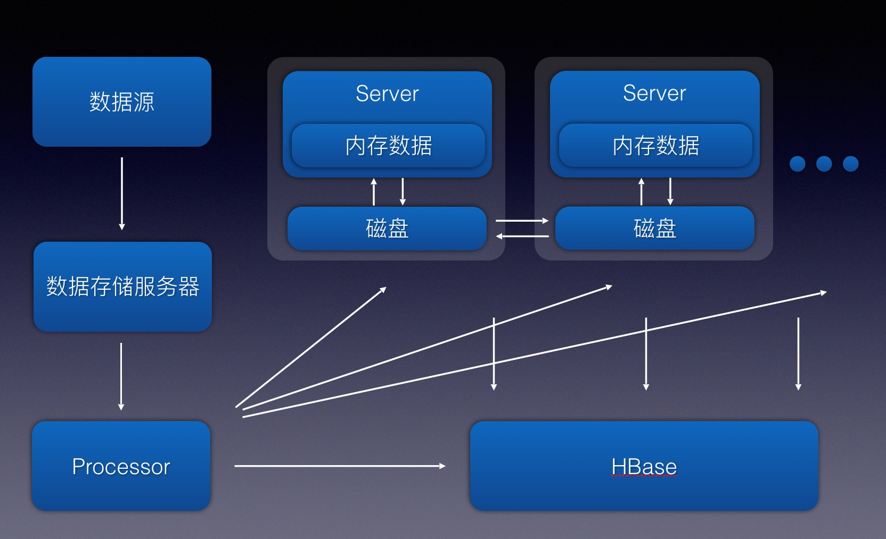

## 什么是基于空间的模型

>***基于空间的模型***(有时也称为云架构模型)旨在减少限制应用伸缩的因素。模型的名字来源于分布式共享内存中的 tuple space (元组空间)概念。伸缩性是通过去除中心数据库的限制，并使用从内存中复制的数据框架来获得的。保存在内存的应用数据被复制给所有运行的进程。进程可以动态的随着请求数量增减而启动或结束，以此来解决伸缩性问题。这样因为没有了中心数据库，数据库瓶颈就此解决，此后可以近乎无限制的扩展了。

## 基于空间的架构实践及思考

### 系统架构简介

最近有接触到一个基于空间的模型的系统架构，对其系统架构设计有一些相关的思考，总结记录下来。文中已将具体业务抹去，以代号替代。

项目采用基于空间的架构，属于计算密集型应用。项目主要提供某报价业务的查询搜索功能，数据源将数据推送到存储服务器，Processor系统定时任务拉取最新文件数据并解析成数据A以及数据规则B插入Hbase库中，然后通过MQ将数据广播推送给所有Server服务器，Server接消息更新数据到本地磁盘和内存中，以提供查询服务，查询时，通过将内存中的数据A和外部数据C等数据相互匹配计算并用规则数据B进行复杂的过滤计算，实时计算出当前结果。项目通过数据源获取的有效数据数据A以及数据规则B的数量达到上亿级，解析入HBase中，并全量加载入堆内存中，保证实时计算的性能和效率。

### 系统架构设计的思考

项目中有很多设计上的问题值得思考和经验总结：

#### 为何使用堆内存

使用HBase或者MySQL：HBase或者MySQL查询速度相比内存缓存，查询速度较慢；QPS方面外部搜索查询量大，且一次外部查询将产生的内部查询量就有上千次，这种场景HBase或者MySQL难以承受。

使用ElasticSearch之类的搜索引擎：系统的查询都是精确查询，并不需要全文检索等模糊查询，所以并不适合使用ElasticSearch之类的搜索引擎功能。

使用Redis等分布式缓存：业务上复杂，虽然是精确查询，但是业务上有各种组合逻辑，需要将外部精确查询拆分成更细维度的精确查询，所以每次查询都需要精确查询出上千条数据和数据规则再去匹配过滤计算。如果使用Redis等分布式缓存，那么缓存结构不好设置，因为单条精确查询数据可能同时出现在各种外部查询结果中。如果按外部查询条件去缓存，那么缓存过于冗余，可能要白白浪费几倍甚至几十倍的存储空间，且带来更新数据等逻辑的复杂性；如果按细维度的精确查询条件去缓存，那么一次外部查询请求将转化成上千次的内部查询，大量的I/O次数会影响系统的响应时间和性能，Redis本身也容易成为系统性能的瓶颈，需要增加redis集群数量。

使用堆内存：堆内内存性能高，无外部I/O。但是对内存及CPU大小要求高，需要额外考虑数据如何加载和更新，数据的一致性，GC停顿，等等额外的系统问题。

根据查询场景，性能，以及各种情况下带来的额外的系统复杂度等各方面的情况，最终选择了将数据放置在堆内存中。

#### 为什么存储选择Hbase

由于外部数据源推送给我们数据和规则时，我们根据数据文档进行的解析逻辑可能存在bug等问题，Hbase可以方便的通过快照的方式将数据恢复到最近时间的正确数据的快照上，然后再用修复完成的正确逻辑解析新的文件数据导入HBase。如果数据导入量过大，甚至需要从新解析全量数据时，可以方便的通过Hfile进行海量数据的导入。

#### 重启过程中Hbase的压力解决

数据主要存储在Hbase数据库中，实际应用中，全量的数据会被加载到堆内存中，相关数据量在亿级，在堆内存中大约30-40G左右，每次发布或者重启时，全部机器将会请求到Hbase上，造成Hbase压力，分析该场景的系统性能瓶颈，我们选择了将数据做本地化备份，每台机器上的数据会在加载和更新时分组写入本地磁盘的各组文件中，每次重启只需要加载本地磁盘中的文件，加载过程通过多线程分组加载每次启动大约3分钟左右。通过引入本地磁盘文件加速了系统重启，减轻了重启造成的中心节点Hbase压力，使得系统便于进行横向扩展。

#### 全量数据更新

一方面数据可能存在解析逻辑上的问题，有时需要重新加载解析后的数据；另一方面由于磁盘数据采用追加的方式，每次加载进内存时让后面的新数据覆盖老数据，但这种方式会导致磁盘文件不断变大，所以需要一个更新本地磁盘文件的机制。

当需要重新加载新数据或者定时重刷磁盘时，首先停掉Processor系统定时任务防止新数据产生，下线第一台机器，清空内存并删除本地磁盘数据，然后从Hbase全量加载数据到内存和本地磁盘，再上线该机器的服务；其他机器分批依次进行操作，先下线，清空内存并删除本地磁盘数据，然后从第一台已经完成数据同步的机器上直接拉取磁盘文件数据到本机磁盘，然后从本地磁盘恢复数据到内存中，最后再上线服务，依次完成操作后，最后重启Processor系统定时任务来获得新推送的数据。

#### 如何保证所有Server中的数据的一致

在增量更新的过程中采用了广播消息MQ的方式，保证了集群中每台服务器内存中的数据的一致性，这里只需要保证数据的最终一致性，并不强求数据的强一致性。CAP中，只需要保证AP，对C不强求。

#### 大内存下的垃圾回收

每个实例由于需要将全量数据加载进堆内存，所以每台物理机配置了百G以上内存，32核处理器，JVM实例配置了100G的堆内存，使用G1垃圾收集器，每次youngGC都控制在了100ms以内，23个GC线程在这100ms内大约处理26G多的Eden区空间，平均每分钟GC发生2-3次，正常业务运转过程无FullGC发生。每周定时重刷磁盘或重刷数据时会主动进行FullGC，GC的时间在60s以上，由于刷新数据过程控制了让系统处于下线状态所以不会造成线上长时间停顿。

## 参考资料:

《软件架构模式》

[软件架构模式-基于空间的架构](http://www.tuicool.com/articles/M73URjr)

