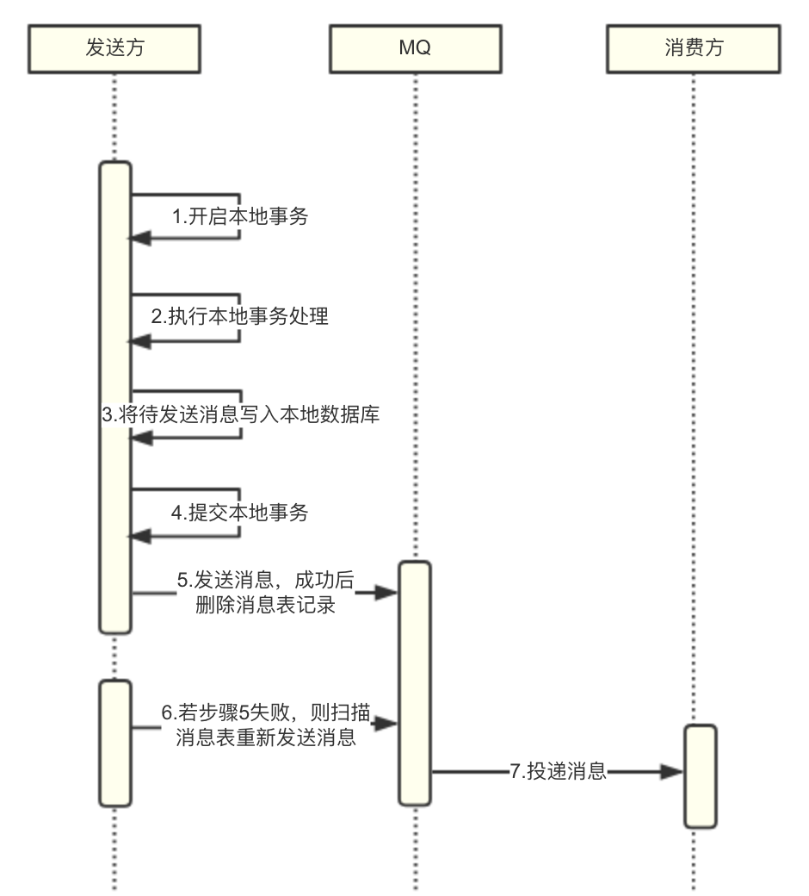
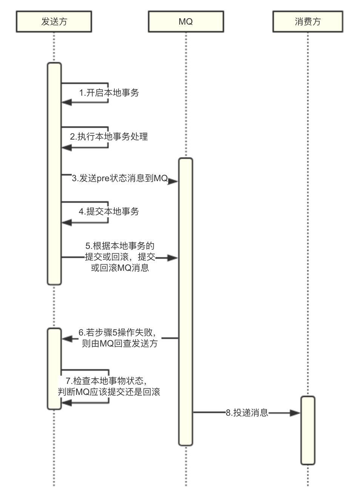

消息队列是日常开发中经常使用的中间件之一，使用得当可以起到很好的解耦、异步、削峰的效果。使用时一般会在完成某一事物的同时发送一条MQ消息来通知其他业务系统进行处理，在一些可靠性要求比较高的场景下我们需要保证本地事物完成那么MQ就必须成功发送，然后由MQ保证消息到达消费方至少一次的投递，消息从MQ到达消费方至少一次投递这个特性市面上常见的MQ组件基本都提供了支持，但是本地事物完成那么MQ就必须成功发送的特性也就是事务消息的特性就较少有MQ组件能够直接支持了。

#### 没有事物消息时，如何保证本地事物完成那么MQ就必须成功发送

1. 重试

	由发起方进行不断重试，直到本地事务和消息发送全部成功并返回给调用方成功状态。

2. 业务上的数据软状态：

	发起业务时，本地事物先将数据更新成一个中间状态代表受理中，本地事物完成后发送MQ消息，消息发送成功再将本地数据更新成完成状态，如果发送MQ失败或者更新到完成状态失败则由后台定时任务不断轮询扫描受理中状态的数据进行重试，最终保证本地事物更新为完成状态且MQ成功发送出去。

没有事务消息时，每次开发一个可靠的消息发送动作时，都需要很多额外的开发成本和机制，不仅增加了业务开发工时，而且增加了系统的复杂性，增大了运维难度。整体来看，上面这些处理机制往往还都是重复性劳动，如果可以抽象成统一的能力由MQ直接提供事务消息的特性，就能带来极大的便捷性。

#### 事务消息实现原理

事务消息的特性存在于消息发送方到MQ之间，下面通过分析消息发送方和MQ之间的交互机制，来分析下常见的事务消息实现原理：

1. 本地事件表

	本地事件表方案基于业务上的数据软状态方案，将消息事务特性相关的业务中间状态设计进行了抽象和解耦，把业务中间状态的设计转移到使用MQ消息表，在进行一定的封装后，使用时无需额外关注消息发送和业务逻辑的事务性处理，使用方便，就像使用普通消息发送功能一样，并且简化了业务逻辑设计。

- 优点：

	1. 消息使用简单，无需设计额外业务逻辑。
	
	2. MQ故障时，不影响本地业务的执行完成，只对消费方接收消息产生更大的延迟。

- 缺点

	1. 引入了额外的消息表，每次发送事务消息都会额外进行多次写库操作，增加了DB压力。
	
	2. 实现复杂，需要进行良好的封装，屏蔽发送方引入消息表带来的复杂性，目前市面上没有成熟的开源框架支持。

2. 二阶段提交 + 本地事物状态回查

	基于二阶段提交，在事务处理过程中先发送一条pre状态消息，待事务提交后再通知MQ进行消息提交或回滚，异常时若出现长时间未提交或回滚，则由MQ回查发送方提供的回查接口来检查事务状态决定该条消息应该被提交或回滚。

- 优点：

	1. DB压力小，不需要额外的消息表，只有异常时才进行回查操作；
	
	2. 阿里的RocketMQ已提供开源版本；

- 缺点

	1. 需要发送方实现一个回查接口，判断该条消息对应的本地事物完成状态；
	
	2. 事务中进行远程调用发送pre消息，需要MQ本身保证足够的可用性和响应时间、并进行合理的超时时间设置；

开发时，需要根据业务的特点和可靠性要求，判断是否需要消息的事物特性，在合理的场景下使用事物消息，防止滥用带来的复杂度的提高和性能的降低。

