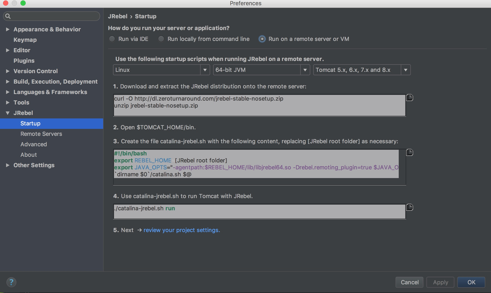
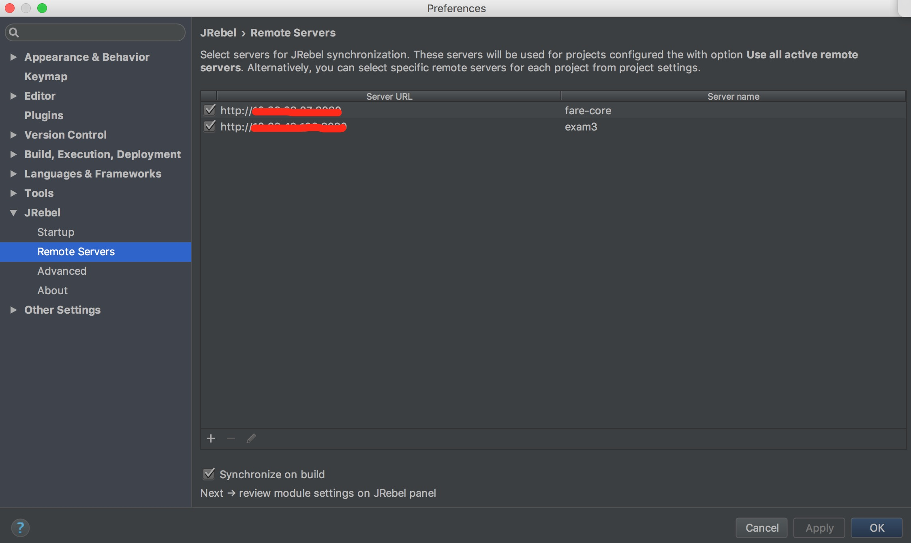

JRebel是一个热部署工具，当在开发环境中对任何一个类或者资源作出修改的时候，它使得应用能在不进行重部署的情况下将变化直接反应在部署好的应用程序上，从而跳过了构建和部署的过程，支持本地热部署和远程热部署。通过Jrebel快速实现热部署，节省了大量重启时间，提高了个人开发效率。

<!--more-->

JRebel支持Eclipse、MyEclipse、IntelliJ IDEA、NetBeans等众多IDE，我们以IntelliJ IDEA为例介绍下相关使用。


### step1：安装

首先在IDEA的 Preferences -> Plugins -> Browse repositories 下搜索 Jrebel for IntelliJ插件并安装，安装后需要重启IDEA。


### step2：激活

在[https://my.jrebel.com/](https://my.jrebel.com/)通过facebook或twitter账号登录关联后可以免费获取给个人开发者提供的激活码，激活IDEA中的Jrebel插件。


### step3：配置

- 运行模式： Preferences -> JRebel -> Startup 节点下面选择运行模式：

	- Run via IDE ：本地模式
	
	- Run on a remote server or VM ：远程模式

		远程模式下需要我们做一些配置：
		
		1. 登录远程服务器下载并解压jrebel agent程序，确保容器启动用户有权限访问该路径	
		```
		curl -O http://dl.zeroturnaround.com/jrebel-stable-nosetup.zip
		```
		```
		unzip jrebel-stable-nosetup.zip
		```
		2. 添加java启动参数，REBEL_HOME代表jrebel agent目录路径
		```
		JAVA_OPTS="-agentpath:$REBEL_HOME/lib/libjrebel64.so -Drebel.remoting_plugin=true"
		```
	



- 同步配置： Preferences -> JRebel -> Startup -> Remote Servers 节点下添加需要部署到的远程服务器上的tomcat访问ip：prot，并勾选synchronize on build使得变异后可以自动进行同步热部署。




### step4：使用

IDEA打开 View > Tool Windows > JRebel 模块，勾选将要远程部署的项目后面的远程部署按钮后会在项目下生成rebel.xml,rebel-remote.xml两个配置文件，需要将这两个配置文件和项目一起打包部署到远程服务器上，远程服务器的项目启动后，当每次对本地代码做修改后，只需要重新本地编译项目即可将修改自动同步到远程服务器启动中的容器上，无需重新打包部署，无需重启应用，实现远程热部署。


### [官方教程](https://manuals.zeroturnaround.com/jrebel/remoteserver/index.html)
