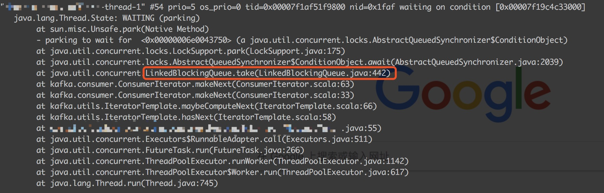
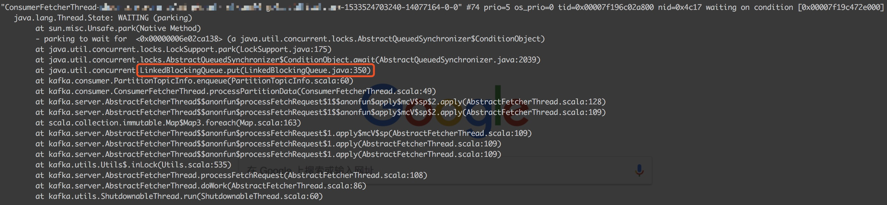
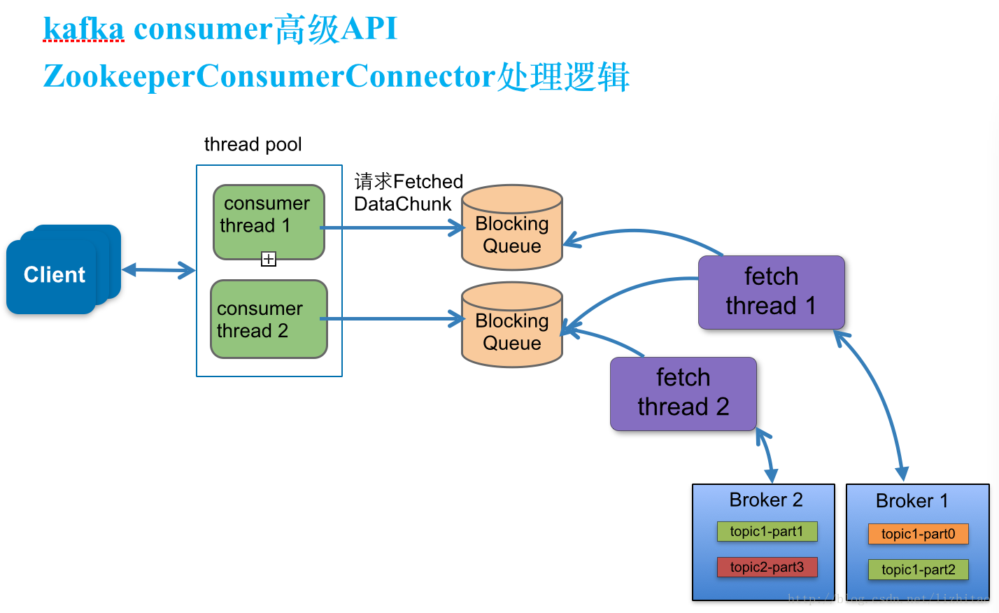

最近线上有个需求希望能停止kafka消费某个topic一段时间，结果导致将该系统消费的所有topic都阻塞掉了。

### 背景介绍

首先介绍下该系统consumer的配置，该系统启动了一个ConsumerConnector，使用1个group同时消费3个topic，每个topic分配了一定数量的消费线程。改造的方案是在消费线程每次调用hasNext方法获取消息前，通过一个动态配置控制线程sleep一段时间。发布上线后推送配置关闭其中1个topic的时候，通过监控发现，其他所有的3个topic全部都停止了消息消费，回滚了配置后，所有topic才又开始继续消费。为什么一个topic的消费线程sleep，会影响所有topic的消息消费呢？

### 问题排查定位过程

根据当时情况想到的几种可能：一个是开关逻辑有bug，原本一个开关控制一个topic的情况变成一个开关控制所有topic是否消费了，通过日志以及jstack线程快照很快排除了这一点，开关逻辑确认没有bug；再就是怀疑kafkaconsumer的client内部是不是有什么内存缓冲队列之类的东西导致阻塞了其他的topic，为了验证这一点，我们获取了当时异常期间的线程快照，以及kafkaclient的源码。

首先来看线程快照中其他topic的消费线程堆栈：



根据线程名称，发现我们创建的消息消费线程停在了hasNext方法上，便排除了开关逻辑bug，更深的堆栈发现消费线程阻塞在了LinkedBlockingQueue的take方法上，说明该队列中已无消息，既然hasNext方法是从一个LinkedBlockingQueue上获取消息，那么也就是说kafka一定是有单独的线程来拉取消息然后put到这个LinkedBlockingQueue的，根据经验，一般第三方组件内线程都会设定特定名字，或者能从堆栈中一些第三方包路径找到第三方组件的涉及的线程堆栈，于是便找到了下面的堆栈：



发现有个ConsumerFetcherThread阻塞在了LinkedBlockingQueue的put方法上。消费线程阻塞在take方法，这里阻塞在put方法，说明这还不是同一个LinkedBlockingQueue。

为了搞清楚这两个LinkedBlockingQueue到底都是做什么的，便需要通过源码来查看了，下载对应版本的kafka的源码，跟踪kafka源码还需要下载scala还有gradle，还有idea的scala插件。在阻塞线程的线程堆栈的指引下，对源码进行跟踪排查：

消费线程阻塞相关代码：

```scala
  def hasNext(): Boolean = {
    if(state == FAILED)
      throw new IllegalStateException("Iterator is in failed state")
    state match {
      case DONE => false
      case READY => true
      case _ => maybeComputeNext()
    }
  }
  def maybeComputeNext(): Boolean = {
    state = FAILED
    nextItem = makeNext()
    if(state == DONE) {
      false
    } else {
      state = READY
      true
    }
  }
```

```scala
  protected def makeNext(): MessageAndMetadata[K, V] = {
    var currentDataChunk: FetchedDataChunk = null
    // if we don't have an iterator, get one
    var localCurrent = current.get()
    if(localCurrent == null || !localCurrent.hasNext) {
      if (consumerTimeoutMs < 0)
        currentDataChunk = channel.take
      else {
        currentDataChunk = channel.poll(consumerTimeoutMs, TimeUnit.MILLISECONDS)
        if (currentDataChunk == null) {
          // reset state to make the iterator re-iterable
          resetState()
          throw new ConsumerTimeoutException
        }
      }
      if(currentDataChunk eq ZookeeperConsumerConnector.shutdownCommand) {
        debug("Received the shutdown command")
        return allDone
      } else {
        currentTopicInfo = currentDataChunk.topicInfo
        val cdcFetchOffset = currentDataChunk.fetchOffset
        val ctiConsumeOffset = currentTopicInfo.getConsumeOffset
        if (ctiConsumeOffset < cdcFetchOffset) {
          error("consumed offset: %d doesn't match fetch offset: %d for %s;\n Consumer may lose data"
            .format(ctiConsumeOffset, cdcFetchOffset, currentTopicInfo))
          currentTopicInfo.resetConsumeOffset(cdcFetchOffset)
        }
        localCurrent = currentDataChunk.messages.iterator

        current.set(localCurrent)
      }
      // if we just updated the current chunk and it is empty that means the fetch size is too small!
      if(currentDataChunk.messages.validBytes == 0)
        throw new MessageSizeTooLargeException("Found a message larger than the maximum fetch size of this consumer on topic " +
                                               "%s partition %d at fetch offset %d. Increase the fetch size, or decrease the maximum message size the broker will allow."
                                               .format(currentDataChunk.topicInfo.topic, currentDataChunk.topicInfo.partitionId, currentDataChunk.fetchOffset))
    }
    var item = localCurrent.next()
    // reject the messages that have already been consumed
    while (item.offset < currentTopicInfo.getConsumeOffset && localCurrent.hasNext) {
      item = localCurrent.next()
    }
    consumedOffset = item.nextOffset

    item.message.ensureValid() // validate checksum of message to ensure it is valid

    new MessageAndMetadata(currentTopicInfo.topic, currentTopicInfo.partitionId, item.message, item.offset, keyDecoder, valueDecoder)
  }
```


makeNext方法会从channel取出一个FetchedDataChunk，放入本地变量current中，每次获取元素再优先从current上获取，一个FetchedDataChunk内部包含了多条消息，这里消费线程阻塞在makeNext方法的channel.take处，这个channel是ConsumerIterator构造方法传入的，找到创建ConsumerIterator的地方

```scala
class KafkaStream[K,V](private val queue: BlockingQueue[FetchedDataChunk],
                        consumerTimeoutMs: Int,
                        private val keyDecoder: Decoder[K],
                        private val valueDecoder: Decoder[V],
                        val clientId: String)
   extends Iterable[MessageAndMetadata[K,V]] with java.lang.Iterable[MessageAndMetadata[K,V]] {

  private val iter: ConsumerIterator[K,V] =
    new ConsumerIterator[K,V](queue, consumerTimeoutMs, keyDecoder, valueDecoder, clientId)

  /**
   *  Create an iterator over messages in the stream.
   */
  def iterator(): ConsumerIterator[K,V] = iter
}
```

这个队列是在创建KafkaStream时传入的，需要看下KafkaStream如何创建，从createMessageStreams方法看起

```scala
  def createMessageStreams[K,V](
        topicCountMap: java.util.Map[String,java.lang.Integer],
        keyDecoder: Decoder[K],
        valueDecoder: Decoder[V])
      : java.util.Map[String,java.util.List[KafkaStream[K,V]]] = {

    if (messageStreamCreated.getAndSet(true))
      throw new MessageStreamsExistException(this.getClass.getSimpleName +
                                   " can create message streams at most once",null)
    val scalaTopicCountMap: Map[String, Int] = {
      import JavaConversions._
      Map.empty[String, Int] ++ (topicCountMap.asInstanceOf[java.util.Map[String, Int]]: mutable.Map[String, Int])
    }
    val scalaReturn = underlying.consume(scalaTopicCountMap, keyDecoder, valueDecoder)
    val ret = new java.util.HashMap[String,java.util.List[KafkaStream[K,V]]]
    for ((topic, streams) <- scalaReturn) {
      var javaStreamList = new java.util.ArrayList[KafkaStream[K,V]]
      for (stream <- streams)
        javaStreamList.add(stream)
      ret.put(topic, javaStreamList)
    }
    ret
  }
```

```scala
  def consume[K, V](topicCountMap: scala.collection.Map[String,Int], keyDecoder: Decoder[K], valueDecoder: Decoder[V])
      : Map[String,List[KafkaStream[K,V]]] = {
    debug("entering consume ")
    if (topicCountMap == null)
      throw new RuntimeException("topicCountMap is null")

    val topicCount = TopicCount.constructTopicCount(consumerIdString, topicCountMap)

    val topicThreadIds = topicCount.getConsumerThreadIdsPerTopic

    // make a list of (queue,stream) pairs, one pair for each threadId
    val queuesAndStreams = topicThreadIds.values.map(threadIdSet =>
      threadIdSet.map(_ => {
        val queue =  new LinkedBlockingQueue[FetchedDataChunk](config.queuedMaxMessages)
        val stream = new KafkaStream[K,V](
          queue, config.consumerTimeoutMs, keyDecoder, valueDecoder, config.clientId)
        (queue, stream)
      })
    ).flatten.toList

    val dirs = new ZKGroupDirs(config.groupId)
    registerConsumerInZK(dirs, consumerIdString, topicCount)
    reinitializeConsumer(topicCount, queuesAndStreams)

    loadBalancerListener.kafkaMessageAndMetadataStreams.asInstanceOf[Map[String, List[KafkaStream[K,V]]]]
  }
```

topicThreadIds的key是topic，value是根据消费线程数量产生的对应大小的集合，根据topicThreadIds创建了queuesAndStreams，queuesAndStreams的ket是topic，value是消费线程对应的KafkaStream集合，一个消费线程对应一个KafkaStream，一个KafkaStream对应一个LinkedBlockingQueue，大小由queued.max.message.chunks参数指定，默认是2，也就是说各个消费线程hasNext方法阻塞逻辑使用的队列是相互隔离的。继续往下看，registerConsumerInZK方法主要是将消费者相关信息注册在zk上，reinitializeConsumer方法初始化具体的consumer。


```scala
  private def reinitializeConsumer[K,V](
      topicCount: TopicCount,
      queuesAndStreams: List[(LinkedBlockingQueue[FetchedDataChunk],KafkaStream[K,V])]) {

    val dirs = new ZKGroupDirs(config.groupId)

    // listener to consumer and partition changes
    if (loadBalancerListener == null) {
      val topicStreamsMap = new mutable.HashMap[String,List[KafkaStream[K,V]]]
      loadBalancerListener = new ZKRebalancerListener(
        config.groupId, consumerIdString, topicStreamsMap.asInstanceOf[scala.collection.mutable.Map[String, List[KafkaStream[_,_]]]])
    }

    // create listener for session expired event if not exist yet
    if (sessionExpirationListener == null)
      sessionExpirationListener = new ZKSessionExpireListener(
        dirs, consumerIdString, topicCount, loadBalancerListener)

    // create listener for topic partition change event if not exist yet
    if (topicPartitionChangeListener == null)
      topicPartitionChangeListener = new ZKTopicPartitionChangeListener(loadBalancerListener)

    val topicStreamsMap = loadBalancerListener.kafkaMessageAndMetadataStreams

    // map of {topic -> Set(thread-1, thread-2, ...)}
    val consumerThreadIdsPerTopic: Map[String, Set[ConsumerThreadId]] =
      topicCount.getConsumerThreadIdsPerTopic

    val allQueuesAndStreams = topicCount match {
      case wildTopicCount: WildcardTopicCount =>
        /*
         * Wild-card consumption streams share the same queues, so we need to
         * duplicate the list for the subsequent zip operation.
         */
        (1 to consumerThreadIdsPerTopic.keySet.size).flatMap(_ => queuesAndStreams).toList
      case statTopicCount: StaticTopicCount =>
        queuesAndStreams
    }

    val topicThreadIds = consumerThreadIdsPerTopic.map {
      case(topic, threadIds) =>
        threadIds.map((topic, _))
    }.flatten

    require(topicThreadIds.size == allQueuesAndStreams.size,
      "Mismatch between thread ID count (%d) and queue count (%d)"
      .format(topicThreadIds.size, allQueuesAndStreams.size))
    val threadQueueStreamPairs = topicThreadIds.zip(allQueuesAndStreams)

    threadQueueStreamPairs.foreach(e => {
      val topicThreadId = e._1
      val q = e._2._1
      topicThreadIdAndQueues.put(topicThreadId, q)
      debug("Adding topicThreadId %s and queue %s to topicThreadIdAndQueues data structure".format(topicThreadId, q.toString))
      newGauge(
        "FetchQueueSize",
        new Gauge[Int] {
          def value = q.size
        },
        Map("clientId" -> config.clientId,
          "topic" -> topicThreadId._1,
          "threadId" -> topicThreadId._2.threadId.toString)
      )
    })

    val groupedByTopic = threadQueueStreamPairs.groupBy(_._1._1)
    groupedByTopic.foreach(e => {
      val topic = e._1
      val streams = e._2.map(_._2._2).toList
      topicStreamsMap += (topic -> streams)
      debug("adding topic %s and %d streams to map.".format(topic, streams.size))
    })

    // listener to consumer and partition changes
    zkClient.subscribeStateChanges(sessionExpirationListener)

    zkClient.subscribeChildChanges(dirs.consumerRegistryDir, loadBalancerListener)

    topicStreamsMap.foreach { topicAndStreams =>
      // register on broker partition path changes
      val topicPath = BrokerTopicsPath + "/" + topicAndStreams._1
      zkClient.subscribeDataChanges(topicPath, topicPartitionChangeListener)
    }

    // explicitly trigger load balancing for this consumer
    loadBalancerListener.syncedRebalance()
  }
```

reinitializeConsumer方法首先创建了一些用于负载均衡超时等相关逻辑的zk监听；然后根据topicThreadIds和queuesAndStreams创建了topicThreadIdAndQueues，topicThreadIdAndQueues的key是topic+线程号组成的key，value是线程对应的KafkaStream里的LinkedBlockingQueue；然后注册了zk监听；最后通过syncedRebalance做第一次的初始化动作

```scala
    def syncedRebalance() {
      rebalanceLock synchronized {
        rebalanceTimer.time {
          if(isShuttingDown.get())  {
            return
          } else {
            for (i <- 0 until config.rebalanceMaxRetries) {
              info("begin rebalancing consumer " + consumerIdString + " try #" + i)
              var done = false
              var cluster: Cluster = null
              try {
                cluster = getCluster(zkClient)
                done = rebalance(cluster)
              } catch {
                case e: Throwable =>
                  /** occasionally, we may hit a ZK exception because the ZK state is changing while we are iterating.
                    * For example, a ZK node can disappear between the time we get all children and the time we try to get
                    * the value of a child. Just let this go since another rebalance will be triggered.
                    **/
                  info("exception during rebalance ", e)
              }
              info("end rebalancing consumer " + consumerIdString + " try #" + i)
              if (done) {
                return
              } else {
                /* Here the cache is at a risk of being stale. To take future rebalancing decisions correctly, we should
                 * clear the cache */
                info("Rebalancing attempt failed. Clearing the cache before the next rebalancing operation is triggered")
              }
              // stop all fetchers and clear all the queues to avoid data duplication
              closeFetchersForQueues(cluster, kafkaMessageAndMetadataStreams, topicThreadIdAndQueues.map(q => q._2))
              Thread.sleep(config.rebalanceBackoffMs)
            }
          }
        }
      }

      throw new ConsumerRebalanceFailedException(consumerIdString + " can't rebalance after " + config.rebalanceMaxRetries +" retries")
    }
```

```scala
    private def rebalance(cluster: Cluster): Boolean = {
      val myTopicThreadIdsMap = TopicCount.constructTopicCount(
        group, consumerIdString, zkClient, config.excludeInternalTopics).getConsumerThreadIdsPerTopic
      val brokers = getAllBrokersInCluster(zkClient)
      if (brokers.size == 0) {
        // This can happen in a rare case when there are no brokers available in the cluster when the consumer is started.
        // We log an warning and register for child changes on brokers/id so that rebalance can be triggered when the brokers
        // are up.
        warn("no brokers found when trying to rebalance.")
        zkClient.subscribeChildChanges(ZkUtils.BrokerIdsPath, loadBalancerListener)
        true
      }
      else {
        /**
         * fetchers must be stopped to avoid data duplication, since if the current
         * rebalancing attempt fails, the partitions that are released could be owned by another consumer.
         * But if we don't stop the fetchers first, this consumer would continue returning data for released
         * partitions in parallel. So, not stopping the fetchers leads to duplicate data.
         */
        closeFetchers(cluster, kafkaMessageAndMetadataStreams, myTopicThreadIdsMap)

        releasePartitionOwnership(topicRegistry)

        val assignmentContext = new AssignmentContext(group, consumerIdString, config.excludeInternalTopics, zkClient)
        val partitionOwnershipDecision = partitionAssignor.assign(assignmentContext)
        val currentTopicRegistry = new Pool[String, Pool[Int, PartitionTopicInfo]](
          valueFactory = Some((topic: String) => new Pool[Int, PartitionTopicInfo]))

        // fetch current offsets for all topic-partitions
        val topicPartitions = partitionOwnershipDecision.keySet.toSeq

        val offsetFetchResponseOpt = fetchOffsets(topicPartitions)

        if (isShuttingDown.get || !offsetFetchResponseOpt.isDefined)
          false
        else {
          val offsetFetchResponse = offsetFetchResponseOpt.get
          topicPartitions.foreach(topicAndPartition => {
            val (topic, partition) = topicAndPartition.asTuple
            val offset = offsetFetchResponse.requestInfo(topicAndPartition).offset
            val threadId = partitionOwnershipDecision(topicAndPartition)
            addPartitionTopicInfo(currentTopicRegistry, partition, topic, offset, threadId)
          })

          /**
           * move the partition ownership here, since that can be used to indicate a truly successful rebalancing attempt
           * A rebalancing attempt is completed successfully only after the fetchers have been started correctly
           */
          if(reflectPartitionOwnershipDecision(partitionOwnershipDecision)) {
            allTopicsOwnedPartitionsCount = partitionOwnershipDecision.size

            partitionOwnershipDecision.view.groupBy { case(topicPartition, consumerThreadId) => topicPartition.topic }
                                      .foreach { case (topic, partitionThreadPairs) =>
              newGauge("OwnedPartitionsCount",
                new Gauge[Int] {
                  def value() = partitionThreadPairs.size
                },
                ownedPartitionsCountMetricTags(topic))
            }

            topicRegistry = currentTopicRegistry
            updateFetcher(cluster)
            true
          } else {
            false
          }
        }
      }
    }
```

主要关注currentTopicRegistry的初始化相关逻辑，topicPartitions是从zk上获取到了当前机器分配到的所有partition分区，通过topicPartitions来创建currentTopicRegistry，currentTopicRegistry的key是topic，value是个map，key是partition，value是PartitionTopicInfo，PartitionTopicInfo包含了topic，partition，消费线程对应的LinkedBlockingQueue，还有一些offset等信息。看核心的updateFetcher方法

```scala
    private def updateFetcher(cluster: Cluster) {
      // update partitions for fetcher
      var allPartitionInfos : List[PartitionTopicInfo] = Nil
      for (partitionInfos <- topicRegistry.values)
        for (partition <- partitionInfos.values)
          allPartitionInfos ::= partition
      info("Consumer " + consumerIdString + " selected partitions : " +
        allPartitionInfos.sortWith((s,t) => s.partitionId < t.partitionId).map(_.toString).mkString(","))

      fetcher match {
        case Some(f) =>
          f.startConnections(allPartitionInfos, cluster)
        case None =>
      }
    }
    
```

根据TopicRegistry创建allPartitionInfos，allPartitionInfos是所有PartitionTopicInfo的列表，然后开始连接逻辑

```scala
  def startConnections(topicInfos: Iterable[PartitionTopicInfo], cluster: Cluster) {
    leaderFinderThread = new LeaderFinderThread(consumerIdString + "-leader-finder-thread")
    leaderFinderThread.start()

    inLock(lock) {
      partitionMap = topicInfos.map(tpi => (TopicAndPartition(tpi.topic, tpi.partitionId), tpi)).toMap
      this.cluster = cluster
      noLeaderPartitionSet ++= topicInfos.map(tpi => TopicAndPartition(tpi.topic, tpi.partitionId))
      cond.signalAll()
    }
  }
```

创建LeaderFinderThread线程用于开启连接，然后将之前的allPartitionInfos转化成partitionMap，partitionMap的key是topic+partitionId，value是PartitionTopicInfo，这个partitionMap在后面有用处，看下LeaderFinderThread的逻辑

```scala
    override def doWork() {
      val leaderForPartitionsMap = new HashMap[TopicAndPartition, Broker]
      lock.lock()
      try {
        while (noLeaderPartitionSet.isEmpty) {
          trace("No partition for leader election.")
          cond.await()
        }

        trace("Partitions without leader %s".format(noLeaderPartitionSet))
        val brokers = getAllBrokersInCluster(zkClient)
        val topicsMetadata = ClientUtils.fetchTopicMetadata(noLeaderPartitionSet.map(m => m.topic).toSet,
                                                            brokers,
                                                            config.clientId,
                                                            config.socketTimeoutMs,
                                                            correlationId.getAndIncrement).topicsMetadata
        if(logger.isDebugEnabled) topicsMetadata.foreach(topicMetadata => debug(topicMetadata.toString()))
        topicsMetadata.foreach { tmd =>
          val topic = tmd.topic
          tmd.partitionsMetadata.foreach { pmd =>
            val topicAndPartition = TopicAndPartition(topic, pmd.partitionId)
            if(pmd.leader.isDefined && noLeaderPartitionSet.contains(topicAndPartition)) {
              val leaderBroker = pmd.leader.get
              leaderForPartitionsMap.put(topicAndPartition, leaderBroker)
              noLeaderPartitionSet -= topicAndPartition
            }
          }
        }
      } catch {
        case t: Throwable => {
            if (!isRunning.get())
              throw t /* If this thread is stopped, propagate this exception to kill the thread. */
            else
              warn("Failed to find leader for %s".format(noLeaderPartitionSet), t)
          }
      } finally {
        lock.unlock()
      }

      try {
        addFetcherForPartitions(leaderForPartitionsMap.map{
          case (topicAndPartition, broker) =>
            topicAndPartition -> BrokerAndInitialOffset(broker, partitionMap(topicAndPartition).getFetchOffset())}
        )
      } catch {
        case t: Throwable => {
          if (!isRunning.get())
            throw t /* If this thread is stopped, propagate this exception to kill the thread. */
          else {
            warn("Failed to add leader for partitions %s; will retry".format(leaderForPartitionsMap.keySet.mkString(",")), t)
            lock.lock()
            noLeaderPartitionSet ++= leaderForPartitionsMap.keySet
            lock.unlock()
          }
        }
      }

      shutdownIdleFetcherThreads()
      Thread.sleep(config.refreshLeaderBackoffMs)
    }
  }
```

通过ClientUtils.fetchTopicMetadata方法获取kafka相关元信息数据，主要看addFetcherForPartitions方法

```scala
  def addFetcherForPartitions(partitionAndOffsets: Map[TopicAndPartition, BrokerAndInitialOffset]) {
    mapLock synchronized {
      val partitionsPerFetcher = partitionAndOffsets.groupBy{ case(topicAndPartition, brokerAndInitialOffset) =>
        BrokerAndFetcherId(brokerAndInitialOffset.broker, getFetcherId(topicAndPartition.topic, topicAndPartition.partition))}
      for ((brokerAndFetcherId, partitionAndOffsets) <- partitionsPerFetcher) {
        var fetcherThread: AbstractFetcherThread = null
        fetcherThreadMap.get(brokerAndFetcherId) match {
          case Some(f) => fetcherThread = f
          case None =>
            fetcherThread = createFetcherThread(brokerAndFetcherId.fetcherId, brokerAndFetcherId.broker)
            fetcherThreadMap.put(brokerAndFetcherId, fetcherThread)
            fetcherThread.start
        }

        fetcherThreadMap(brokerAndFetcherId).addPartitions(partitionAndOffsets.map { case (topicAndPartition, brokerAndInitOffset) =>
          topicAndPartition -> brokerAndInitOffset.initOffset
        })
      }
    }

    info("Added fetcher for partitions %s".format(partitionAndOffsets.map{ case (topicAndPartition, brokerAndInitialOffset) =>
      "[" + topicAndPartition + ", initOffset " + brokerAndInitialOffset.initOffset + " to broker " + brokerAndInitialOffset.broker + "] "}))
  }
```

BrokerAndFetcherId由broker和一个拉取线程号组成，拉取线程数量通过num.consumer.fetchers参数控制，默认为1，即一个broker有1个拉取线程，相当于默认kafka会创建broker数量个拉取线程，用于从broker处拉取消息，创建拉取线程见createFetcherThread

```scala
  override def createFetcherThread(fetcherId: Int, sourceBroker: Broker): AbstractFetcherThread = {
    new ConsumerFetcherThread(
      "ConsumerFetcherThread-%s-%d-%d".format(consumerIdString, fetcherId, sourceBroker.id),
      config, sourceBroker, partitionMap, this)
  }
```

可以看到线程名字是ConsumerFetcherThread，之前看到线程堆栈的就是这里的线程阻塞在了put方法上，接下来根据线程堆栈的信息往下看

```scala
  override def doWork() {
    inLock(partitionMapLock) {
      if (partitionMap.isEmpty)
        partitionMapCond.await(200L, TimeUnit.MILLISECONDS)
      partitionMap.foreach {
        case((topicAndPartition, offset)) =>
          fetchRequestBuilder.addFetch(topicAndPartition.topic, topicAndPartition.partition,
                           offset, fetchSize)
      }
    }

    val fetchRequest = fetchRequestBuilder.build()
    if (!fetchRequest.requestInfo.isEmpty)
      processFetchRequest(fetchRequest)
  }
```

partitionMap的key是topic+partitionId，value是PartitionTopicInfo，这里将所有的topic，partition还有offset和拉取消息数量，传入fetchRequestBuilder，创建了一个FetchRequest

```scala
  private def processFetchRequest(fetchRequest: FetchRequest) {
    val partitionsWithError = new mutable.HashSet[TopicAndPartition]
    var response: FetchResponse = null
    try {
      trace("Issuing to broker %d of fetch request %s".format(sourceBroker.id, fetchRequest))
      response = simpleConsumer.fetch(fetchRequest)
    } catch {
      case t: Throwable =>
        if (isRunning.get) {
          warn("Error in fetch %s. Possible cause: %s".format(fetchRequest, t.toString))
          partitionMapLock synchronized {
            partitionsWithError ++= partitionMap.keys
          }
        }
    }
    fetcherStats.requestRate.mark()

    if (response != null) {
      // process fetched data
      inLock(partitionMapLock) {
        response.data.foreach {
          case(topicAndPartition, partitionData) =>
            val (topic, partitionId) = topicAndPartition.asTuple
            val currentOffset = partitionMap.get(topicAndPartition)
            // we append to the log if the current offset is defined and it is the same as the offset requested during fetch
            if (currentOffset.isDefined && fetchRequest.requestInfo(topicAndPartition).offset == currentOffset.get) {
              partitionData.error match {
                case ErrorMapping.NoError =>
                  try {
                    val messages = partitionData.messages.asInstanceOf[ByteBufferMessageSet]
                    val validBytes = messages.validBytes
                    val newOffset = messages.shallowIterator.toSeq.lastOption match {
                      case Some(m: MessageAndOffset) => m.nextOffset
                      case None => currentOffset.get
                    }
                    partitionMap.put(topicAndPartition, newOffset)
                    fetcherLagStats.getFetcherLagStats(topic, partitionId).lag = partitionData.hw - newOffset
                    fetcherStats.byteRate.mark(validBytes)
                    // Once we hand off the partition data to the subclass, we can't mess with it any more in this thread
                    processPartitionData(topicAndPartition, currentOffset.get, partitionData)
                  } catch {
                    case ime: InvalidMessageException =>
                      // we log the error and continue. This ensures two things
                      // 1. If there is a corrupt message in a topic partition, it does not bring the fetcher thread down and cause other topic partition to also lag
                      // 2. If the message is corrupt due to a transient state in the log (truncation, partial writes can cause this), we simply continue and
                      //    should get fixed in the subsequent fetches
                      logger.error("Found invalid messages during fetch for partition [" + topic + "," + partitionId + "] offset " + currentOffset.get + " error " + ime.getMessage)
                    case e: Throwable =>
                      throw new KafkaException("error processing data for partition [%s,%d] offset %d"
                                               .format(topic, partitionId, currentOffset.get), e)
                  }
                case ErrorMapping.OffsetOutOfRangeCode =>
                  try {
                    val newOffset = handleOffsetOutOfRange(topicAndPartition)
                    partitionMap.put(topicAndPartition, newOffset)
                    error("Current offset %d for partition [%s,%d] out of range; reset offset to %d"
                      .format(currentOffset.get, topic, partitionId, newOffset))
                  } catch {
                    case e: Throwable =>
                      error("Error getting offset for partition [%s,%d] to broker %d".format(topic, partitionId, sourceBroker.id), e)
                      partitionsWithError += topicAndPartition
                  }
                case _ =>
                  if (isRunning.get) {
                    error("Error for partition [%s,%d] to broker %d:%s".format(topic, partitionId, sourceBroker.id,
                      ErrorMapping.exceptionFor(partitionData.error).getClass))
                    partitionsWithError += topicAndPartition
                  }
              }
            }
        }
      }
    }
```

通过simpleConsumer.fetch(fetchRequest)方法向当前这一台broker拉取一批消息，一次请求会拉取当前consumer所需要的所有topic所有partition下的一组消息，response.data的key是topic+partition，value是对应的一组消息，看processPartitionData方法

```scala
  def processPartitionData(topicAndPartition: TopicAndPartition, fetchOffset: Long, partitionData: FetchResponsePartitionData) {
    val pti = partitionMap(topicAndPartition)
    if (pti.getFetchOffset != fetchOffset)
      throw new RuntimeException("Offset doesn't match for partition [%s,%d] pti offset: %d fetch offset: %d"
                                .format(topicAndPartition.topic, topicAndPartition.partition, pti.getFetchOffset, fetchOffset))
    pti.enqueue(partitionData.messages.asInstanceOf[ByteBufferMessageSet])
  }
```

从partitionMap根据topicAndPartition获取PartitionTopicInfo

```scala
  def enqueue(messages: ByteBufferMessageSet) {
    val size = messages.validBytes
    if(size > 0) {
      val next = messages.shallowIterator.toSeq.last.nextOffset
      trace("Updating fetch offset = " + fetchedOffset.get + " to " + next)
      chunkQueue.put(new FetchedDataChunk(messages, this, fetchedOffset.get))
      fetchedOffset.set(next)
      debug("updated fetch offset of (%s) to %d".format(this, next))
      consumerTopicStats.getConsumerTopicStats(topic).byteRate.mark(size)
      consumerTopicStats.getConsumerAllTopicStats().byteRate.mark(size)
    } else if(messages.sizeInBytes > 0) {
      chunkQueue.put(new FetchedDataChunk(messages, this, fetchedOffset.get))
    }
  }
```

调用PartitionTopicInfo.enqueue方法将这个topicAndPartition下的一组消息添加到chunkQueue这个队列中，这个队列就是创建KafkaStream时创建的LinkedBlockingQueue了。

### kafka线程模型

根据对线程堆栈以及源码的分析，了解了kafka的线程模型：



* 消息消费侧：kafka每个消费线程会处理一个topic的部分partition，对应着一个kafkaStream，每个kafkaStream对应一个LinkedBlockingQueue缓存消息，每次消费线程消费消息时会从对应队列中获取消息；

* 消息拉取侧：kafka会根据broker数量和num.consumer.fetchers参数创建若干消息拉取线程，用于连接broker并拉取消息，然后填充到各消费线程对应的LinkedBlockingQueue上。

两侧的线程通过LinkedBlockingQueue进行连接。


所以建议不要将处理时间太长的业务，直接放在kafka消费线程上去处理，容易阻塞其他topic，可以投递到后端业务处理线程池去处理消息，或者可以将处理时间太长的业务单独使用一个ConsumerConnector，从而在topic维度完全隔离资源。


### 结论

kafka的每个消息拉取线程每次会拉取所有topic的消息，put到一个队列中，当我们sleep一个topic的消费线程时，该topic对应的LinkedBlockingQueue队列中的数据得不到消费线程take，很快就满了，消息拉取线程拉取到消息向各个topic对应的LinkedBlockingQueue添加消息的时候，当向该停止消费的topic的LinkedBlockingQueue进行put的时候发现队列满了就会阻塞住，影响了向其他topic对应的LinkedBlockingQueue进行put了，所以其他topic也获取不到消息了。最终所有的拉取线程全部都阻塞在停止消费的这个topic对应队列的put方法上了。


### 解决

一个topic使用一个ConsumerConnector，那么就在消息拉取线程上做到了topic维度的完全隔离，就可以使用在消费线程sleep这种停止消费方案了。


