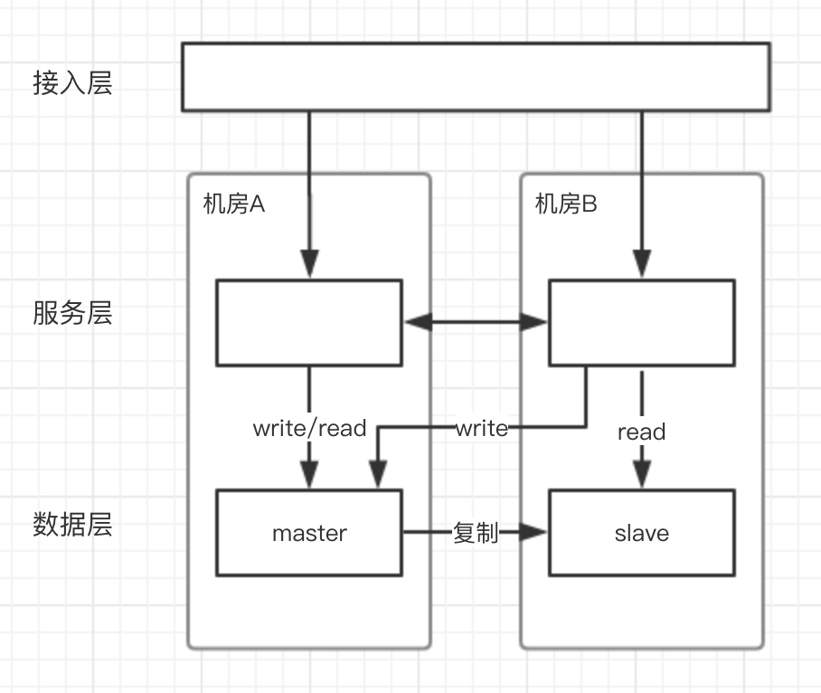
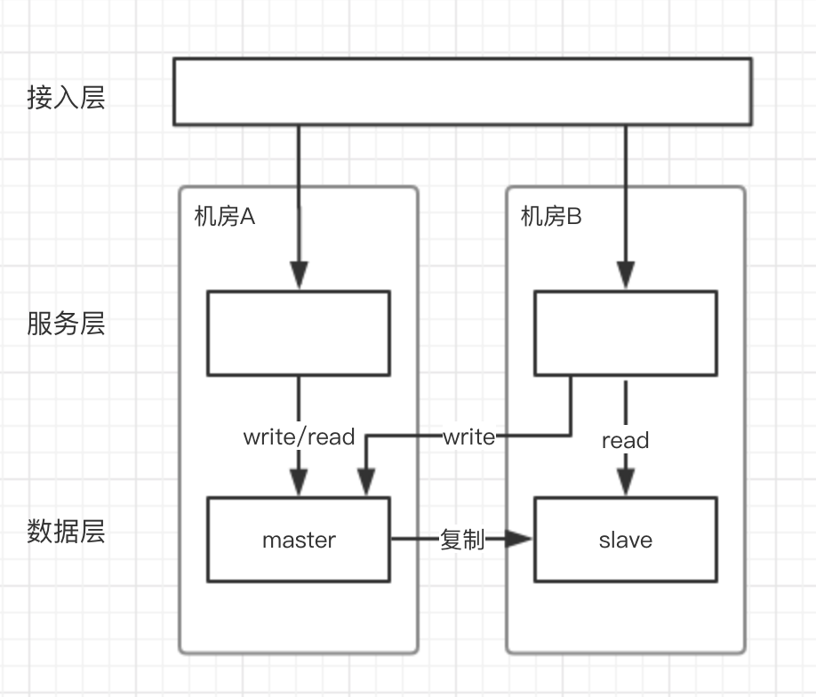
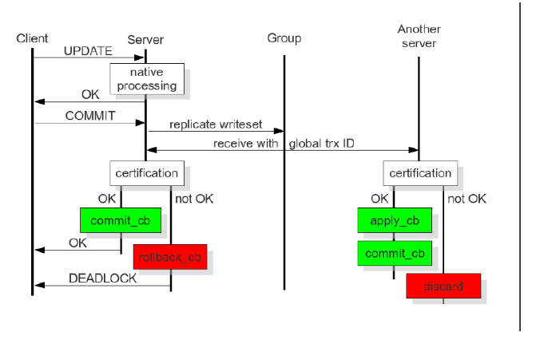
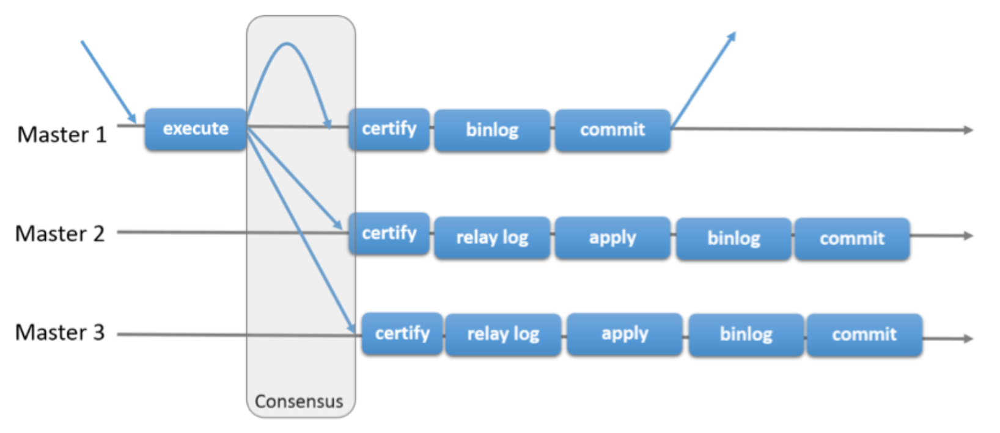

## 为什么要做多活

多活架构主要是为了提升系统的容灾能力，提高系统的可用性，保障业务持续可用。比如单机房的网络故障、地震火灾等不可抗因素，都有可能造成整个机房瘫痪，对业务的可用性造成严重影响。多活架构还可以解决单机房容量问题，提高系统的扩展能力。

## 要不要做多活

随着业务的高速发展，规模越来越大，技术上的投入也越来越高，每次故障造成的损失和影响更是会加速增长，初期故障损失和影响小于技术投入，随着高速发展当故障造成的损失和影响高于技术上的投入时，就需要加大技术上的投入使用更加高可用的技术架构来避免故障，提高系统容灾能力，来减少故障对业务造成的影响，提高系统的可用性，多活架构就是其中最重要的一种。

一般来说，容灾能力的两个关键技术指标是RTO和RPO：

- RTO，Recovery Time Objective，恢复时间目标。表示能容忍的从故障发生到系统恢复正常运转的时间，这个时间越短，容灾要求越高。

- RPO，Recovery Point Objective，数据恢复点目标。表示能容忍故障造成过去多长时间的数据丢失，RPO为0表示不允许数据丢失。

## 多活架构方案

### 两地三中心

主流的灾备技术是两地三中心，两地三中心架构下，一般在同城距离较近的地方有两个数据中心，用户随机访问这两个数据中心，两个数据中心的数据会做同步复制，因为要做同步复制，所以这两个机房距离必须很近，网络延时低，在异地还有一个数据中心，数据异步复制，正常情况下不对外服务，做冷备份。

这种架构下有明显缺点：

1. 冷备需要对全站做备份，故障发生时才能进行切换，这种情况下，冷备机房非故障时完全处于浪费状态，资源利用率低，成本高。

2. 发生故障时，因为服务冷备，切流量过去后不能保证冷备服务能完全正常工作，整个功能是不是都正常，也不能确定切换过程到底要多久，而且因为数据是异步复制，数据的丢失情况也难以预期，所以真的故障时也难以决策是否要切。

3. 单机房资源瓶颈仍然无法解决。

所以实践时往往会先退化为同城多活，先保障具备机房级别容灾能力。

### 同城多活

选择同城做多活主要是因为物理距离带来的网络延时问题，一般北京到上海的网络延迟一般是30ms，一般一次业务请求，后台系统会发生数十次甚至上百次系统调用，每次调用都有30ms的延迟情况下，响应时间无法满足业务需求，同城(或距离很近)可以保障机房之间的网络延时低、可控，各模块之间的调用不会存在过大的网络延时，公司内各系统模块可以自行进行多活架构设计；数据复制也可以更容易做到强一致。

同城双活在发展过程往往会经历以下几个阶段：

1. 两个机房各承担一部分流量，入口流量完全随机，内部RPC调用也会随机选择一个机房进行调度，数据单点写到主机房数据库，然后同步到从机房数据库，从机房数据只读。

	* 优势：

		1. 服务双活，数据同城灾备，机房级别容灾。

		2. 突破了单机房容量瓶颈。

	* 问题：

		1. 跨机房调用频繁（内部RPC，写数据都会跨机房），虽然同城网络延时低，但是积少成多，也是一笔很大的开销。

	

2. 两个机房各承担一部分流量，入口流量完全随机，内部RPC调用闭环在同机房，相当于两个机房镜像部署了两个独立集群，数据仍然是单点写到主机房数据库，然后同步到从机房数据库，从机房数据只读。

	* 优势：

		1. 服务双活，数据同城灾备，机房级别容灾。

		2. 突破了单机房容量瓶颈。

		3. 跨机房调用频繁问题得到缓解。

		4. 流量可以在入口进行控制，可以灵活的进行流量调度，基于此还可以实现服务蓝绿发布，提高系统的故障应对能力，提高了系统稳定性。

	* 问题：

		1. 写数据仍然会进行跨机房，跨机房问题没有完全解决。

	

### 单元化异地多活

单元化是指应用层和数据层按照相同的分片维度进行流量划分，把整个请求链路收敛在一组服务器中，从应用层到数据层组成一个封闭的单元。单元可以作为一个相对独立的整体来挪动，甚至可以把部分单元部署到异地去。单元化的核心思想就是单元内高内聚，单元间低耦合，跨单元调用无法避免，但应该尽量限定在少数的服务层调用，把整体耗时控制在可接受的范围内，包括对直接用户体验和对整体吞吐量的影响。

单元化首先要考虑的问题是如何进行单元化分片，一般来说可以根据用户的UID进行流量和数据的分片，比如可以使用UID的后两位将流量和数据分成100个片，多个分片组成一个单元。使用UID分片时，比如转账操作，会同时操作两个UID下的账户，这种情况不避免的需要进行跨单元调用，这时尽可能通过一定的设计将跨单元的操作进行异步化处理，避免延时问题对用户体验产生直接影响。还有一种情况像是淘宝这类的交易业务，还存在商家和商品等信息，如果使用买家UID进行分片，就意味着非买家维度的信息需要做一定的妥协，一般会将这些全量数据进行全局复制，复制到所有机房内，当买家对非买家维度数据访问时，可以接受“最终一致”的就直接读买家单元内非买家的非实时数据，不能接受“最终一致”的则需要跨单元访问写单元，比如交易减库存，也就是数据集中写写单元，然后复制到所有单元，由每个单元进行本地读，最终达到买家的所有操作在买家所在的单元内尽可能的读写封闭。

在实施过程中，可以先在同城多机房或同机房内多个逻辑机房中进行单元化改造，改造完成后再根据实际情况将单元挪动到异地，进行异地多活构建。这样做可以防止单元化改造没有彻底完成的情况下，走向异地会带来严重的远程网络延时问题，进而导致服务超时，在同城的话即使没有改造好，也能保证延时是可控的。

单元化架构的优势：

1. 异地多活，具备城市级故障容灾能力。每个单元都分配有一定的真实流量进行业务处理，每个单元都是活的，流量可以灵活的在机房间进行切换调度。单个单元故障后，其他单元可以随时接管故障单元的流量和数据。极大提高了服务可用性，保证了业务的连续性，减少故障发生的时候对于用户的打扰、对于业务的中断；即使无法切换流量也可以将故障减小到只影响部分用户，减小故障影响面。

2. 解决单机房容量问题。核心服务可以分别部署在多个数据中心中，避免单个机房服务器遇到资源瓶颈，单个单元基本只需要使用(1+1)/N数量的机器资源（N代表单元数，加一是为了在机房间流量切换时预留足够资源）。

3. 解决跨机房服务调用和数据库读写问题，减少跨机房网络延时。绝大部分的服务间调用和所有数据库读写操作都在本单元内完成，只有少数场景产生跨机房调用，一般要保证单次用户完整的请求链路上不超过2-3次跨机房处理。

4. 解决DB连接数瓶颈问题。传统关系型数据库的连接数是有限的，因为集群中每个应用节点都会与所有数据库节点保持连接，当应用数量达到一定规模，单台数据库连接数将会达到瓶颈，此时，应用也将因此无法再进行横向扩容。而单元化架构下，每个单元内的应用节点都只会连接本单元内的数据库，极大的节省了数据库连接资源，提高了服务横向扩展能力。

5. 提供极高的服务扩展能力。单元化架构下，可以按单元来对服务进行横向扩展，几乎可以无限扩容。

6. 蓝绿发布。流量可以在入口进行灵活的流量调度，基于此可以实现蓝绿发布，减小发布引起的故障影响面，将发布引起的故障处理时间极大缩短。

## 多活的技术点

多活架构中除了整体架构方案，还有很多细节技术点，比如`流量管控`以及`数据同步`的具体方案

### 流量管控

流量管控主要涉及两方面，外部调用的流量和内部调用的流量。

首先，需要有一个全局的流量管控中心，各个应用需要从流量管控中心同步分片规则，流量调整时也需要将规则迅速同步到分布式系统中的各个需要的节点上，在一次请求的整个链路调用过程中，都需要包含分片数据，比如UID，然后计算本次请求需要调用哪个单元的服务。

还需要一个全局服务注册中心，不同单元的注册中心之间互相同步数据，最终所有服务消费者都知道每个单元的服务提供者有哪些，RPC框架就可以根据需要选择调用目标。

#### 外部调用的流量

外部调用的流量指用户发起的流量，在调用时，一般会先经过DNS解析得到反向代理层ip地址，反向代理层处理请求，然后再请求到网关层，然后到服务层，最后是数据层。DNS解析得到反向代理层ip地址的时候，这个时候一般无法得知本次请求应该访问哪个单元的反向代理层，所以请求有可能进入到不属于该请求的单元，这时流量就已经进入了内部服务器，当反向代理层或网关层识别出请求所属单元后，再将请求转发到对应的单元时，这个时候就会产生一次额外的跨机房访问。可以进行一定的优化，比如在PC端，如果知道用户所属单元，可以直接让用户访问对应单元的域名；在移动端时，服务端可以将流量调度规则下发到端上或者端上定时从服务端拉取流量调度规则，端上再根据UID和流量调度规则计算出该用户应该访问的单元，然后直接访问对应单元的ip或者对应单元的域名。反向代理层可以根据请求的cookie等标识，将请求转发到对应的网关层。网关层基本一定可以根据请求信息识别出请求所属的单元，然后调用请求所属单元上的服务，并在cookie中添加单元标记。最后的数据层，作为请求数据的最后一道防线，保证请求一定写入到正确单元的数据库中。

#### 内部调用的流量

内部系统调用一般主要是指RPC调用，在RPC调用的全链路过程中，必须要带上分片数据，比如UID，然后根据流量管控中心同步过来的分片规则，调用到指定的单元上。一些全局数据的修改，比如库存扣减功能，需要在服务接口打标记，明确调度到特定的写单元。

还有一些公司内部的组件，比如消息队列和定时任务，也需要支持单元化的调度，尽量让各自单元只处理各自单元的调用。

### 数据同步

数据是系统中最核心的部分，在多活架构中，为了达到容灾备份的效果，数据往往需要在多个数据中心之间进行同步，同步数据那就涉及到数据一致性的问题了，不同的业务场景下对数据一致性的要求是不同的，对应的具体同步方案也不同，有些业务场景可以接受同步数据时数据不一致导致的少量数据丢失，比如报价缓存类业务，这类业务在多活架构下遇到机房故障时往往可以快速恢复业务；有些业务则对同步数据时的数据一致性要求极高，比如资金类业务，交易类业务，如果无法做到数据的强一致，那么在故障发生时就存在数据丢失的风险，这种情况下的这类业务即使在多活架构下遇到机房故障，是否进行机房容灾切换还是等待机房故障恢复也是难以决策的，往往会因此不敢进行机房切换，真的切换也需要考虑好数据丢失带来的各种风险和问题，并提前针对这种情况做好针对性的预案，所以这类业务往往会考虑使用一些强一致的数据同步手段保证数据一定不丢。

以下是一些常见的数据同步方案：

#### Mysql异步复制

MySQL异步复制是最常见的主从复制方案，指数据可以从一个MySQL数据库主节点复制到一个或多个从节点。

##### MySQL主从复制的基本过程：

1. Slave上面的IO线程连接上Master，并请求从指定日志文件的指定位置(或者从最开始的日志)之后的日志内容。

2. Master接收到来自Slave的IO线程的请求后，通过负责复制的IO线程根据请求信息读取指定日志指定位置之后的日志信息，返回给Slave端的IO线程。返回信息中除了日志所包含的信息之外，还包括本次返回的信息在Master端的Binary Log文件的名称以及在Binary Log中的位置。

3. Slave的IO线程接收到信息后，将接收到的日志内容依次写入到Slave端的Relay Log文件(mysql-relay-bin.xxxxxx)的最末端，并将读取到的Master端的bin-log的文件名和位置记录到master-info文件中，以便在下一次读取的时候能够清楚的告诉Master需要从哪个bin-log的哪个位置开始进行日志同步。

4. Slave 的 SQL 线程检测到 Relay Log 中新增加了内容后，会马上解析该 Log 文件中的内容成为在 Master 端真实执行时候的那些可执行的 Query 语句，并在自身执行这些 Query。这样，实际上就是在 Master 端和 Slave 端执行了同样的 Query，所以两端的数据是完全一样的。

##### 优点：

1. 架构比较简单，常见，运维起来也比较简单。

2. 性能高，由于是异步复制，主节点写入时无需关注数据同步操作。

3. 从库可以提供一定的读的能力，进行架构上的读写分离。

4. 主库宕机后，从库仍保存有数据，防止数据大量丢失，若业务对主从同步产生的数据丢失可以接受，那么可以将从库升级为主库继续提供服务。

##### 缺点：

1. 异步复制导致主从之间会产生延迟，数据一致性无法保证，主库宕机后，数据可能丢失。RPO>0

2. 网络抖动时，主从复制延迟会加大，延迟导致的数据丢失情况会更加严重。

3. 从库只有一个sqlThread，复制性能不高，主库写压力大时，主从复制延迟会加大，可以通过基于GTID的组提交并行复制技术提高主从复制的并发能力以提高复制速度，MySQL5.7的并行复制建立在组提交的基础上，所有在主库上能够完成prepared的语句表示没有数据冲突，就可以在slave节点并行复制。

#### Mysql半同步

半同步复制（Semi-synchronous Replication）：相比异步复制，半同步复制牺牲了一定的性能，提升了主备之间数据的一致性（有一些情况还是会出现主备数据不一致）。

MySQL半同步复制的实现是建立在MySQL异步复制的基础上的。MySQL支持两种略有不同的半同步复制：AFTER_SYNC和AFTER_COMMIT。rpl_semi_sync_master_wait_point参数控制半同步模式下主库返回给客户端事务成功的时间点。

* AFTER_COMMIT过程：

	1. 写master binlog并commit  
	2. 同步binlog到slave并commit
	3. slave返回acknowledgment给master
	4. master接收到slave acknowledgment
	5. master返回结果给client

	Master commit之后再将日志复制到slave。所有已经复制到slave的事务在master上一定commit了。所有master上commit的事务不一定复制到slave，比如，master commit之后，还没来得及将日志复制到slave就宕机了，这时无法保证数据的一致性。

* AFTER_SYNC过程：

	1. 写master binglog  
	2. 同步主binlog到slave  
	3. slave返回acknowledgment给master
	4. master接收到acknowledgment并commit
	5. master返回结果给client

	日志复制到slave之后，master再commit。所有在master上commit的事务都已经复制到了slave。所有已经复制到slave的事务在master不一定commit了，比如，master将日志复制到slave之后，master在commit之前宕机了，那么slave有可能比master执行了更多事物。

##### 优点：

1. 从库可以提供一定的读的能力，进行架构上的读写分离。

2. AFTER_SYNC模式下，可以保证数据不丢，主库宕机时从库可以升级为主库继续提供服务。

##### 缺点：

1. 开启半同步复制时，Master在返回之前会等待Slave的响应或超时，当Slave超时时，半同步复制退化成异步复制。

2. 当Master宕机时，数据一致性无法保证，依然存在从节点多执行或从节点少执行的情况，重启时可能需要人工干预。

3. 网络质量要求高，每次事务处理都需要实时进行远程数据同步，对性能有一定影响。

#### Mysql PXC（Percona XtraDB Cluster）

Percona XtraDB Cluster是MySQL高可用性和可扩展性的解决方案，Percona XtraDB Cluster提供的特性如下：

1. 同步复制，事务要么在所有节点提交或不提交。

2. 多主复制，可以在任意节点进行写操作。

3. 在从服务器上并行应用事件，真正意义上的并行复制。

4. 节点自动配置。

5. 数据一致性，不再是异步复制。

PXC是基于引擎层的同步复制，而不是异步复制，所以数据一致性更高。同时，基于引擎层，是物理复制，而不是发日志，所以没有sql thread应用过程，所以几乎没有延迟。

##### 工作原理

	
PXC是基于认证的复制方式进行数据复制。首先客户端先发起一个事务，当客户端提交一个commit命令，在事务提交之前，所有对数据库的操作都会被写入write-set中，包括主键，然后数据库会将这个write-set发给所有其他节点，write-set将在每个节点（包括生成write-set的节点）上使用主键进行认证尝试。如果认证失败，节点会丢弃这个write-set，同时集群会回滚到之前的事务点；如果认证成功，commit正常提交，事务会应用到其他节点上。Galera Cluster基于认证的复制主要依赖于全局事务序号，复制期间，Galera Cluster会为每一个事务分配一个全局事务序号。当某个事务到达commit阶段时，节点会检查待提交事务的序号与上一次成功提交事务的序号，检查区间所有事务是否与新事务存在主键冲突，如果检查到冲突，认证就会失败。所有节点以相同的顺序接受事务，所有节点对事务是否提交做一致性决定。事务提交成功之后，首先生成此事务的节点会通知应用程序事务已正确提交。

##### 优点：

1. 实现mysql数据库集群架构的高可用性和数据的强一致性，多活架构下，主库宕机情况下可以保证数据0丢失，RPO=0。

2. 物理复制改善了传统意义上的主从复制延迟问题，性能高，基本上达到了实时同步。

##### 缺点：

1. 性能低，任何更新事务都需要全局验证通过，才会在每个节点库上执行。集群性能受限于性能最差的节点，也就是经常说的短板效应。

2. 网络质量要求高，异地多活场景下，需要跨机房进行数据实时同步，网络抖动对性能和稳定性造成的影响严重。

3. 没有表级别的锁定，执行DDL语句操作会把整个集群锁住，而且也kill不了（建议使用Osc操作，即pt-online-scheme-change）

#### MySQL Group Replication

MySQL官方推荐的一款高可用集群方案MySQL Group Replication，简称：MGR(组复制)。它是官方推出的一种基于Paxos协议的状态机复制，彻底解决了基于传统的异步复制和半同步复制中数据一致性问题无法保证的情况。

##### 工作原理

MGR通过分布式一致性协议Paxos在Group中原子广播事务产生的Binlog并在远端节点进行回放的方式来达到数据复制目的的，由至少3个或更多个节点共同组成一个数据库集群，事务的提交必须经过半数以上节点同意方可提交，每个事务将按照通过Paxos的先后顺序进行认证，通过认证后再写入Relaylog，最后按顺序进行并行回放。MGR允许部分节点故障，只要保证半数以上节点存活，就不影响对外提供数据库服务，是一个真正可用的高可用数据库集群技术。

##### 优点：

1. 保证了数据的强一致性，允许有延迟，它在校验完事务是否冲突后把当前事物广播到各个节点并确定各个节点收到事务后即进入下一个事物的冲突检测，此时每个节点只是拿到了所有事务的执行序列，保证了事务最终顺序执行。多活架构下，主库宕机情况下可以保证数据0丢失，RPO=0。

2. 通过binlog实现节点同步。这一点对DBA很友好，意味着我们可以很轻易的找回熟悉的主从的感觉。

##### 缺点：

1. 性能低，需要至少半数以上节点同意后方可提交事物，相较PXC来说短板效应不明显。

2. 网络质量要求高，异地多活场景下，需要跨机房进行数据实时同步，网络抖动对性能和稳定性造成的影响严重，不过由于只需要保证半数以上节点同意，所以对部分节点的网络抖动有一定容忍，提高了稳定性。

#### OceanBase

OceanBase利用Paxos协议在底层实现了多副本数据一致性，具有RPO=0、低RTO（通常在30s以下）、故障时自动切换的优势。基于此，支付宝的会员ID系统采用“三地五中心”部署方式，建立了城市级故障自动容灾能力。

##### 优点：

1. 保证数据强一致性，故障时数据零丢失。RPO=0。

2. 基于Paxos协议，只要超过半数的节点存活，就可以在故障时自动切换。低RTO（通常在30s以下）。

3. 性能高，OceanBase采用和传统数据库一样的WAL（Write-Ahead Logging）方案，通过多数派先持久化事务日志的方式，保证提交事务不丢失。基于LSM-Tree的架构，增删改的数据其实都是在内存里完成，将更新暂存在内存中，定期再将内存增量批量合并到持久化存储上。

##### 缺点：

1. 一致性读写性能降低，非一致性读性能不变。性能的降低主要是网络延时导致的，因为数据需要在多机房之间进行同步，三地五中心部署下，两个距离较近的城市中各有两个机房，较远城市中有一个机房，一般只在距离较近的两个城市中的四个机房进行写操作，数据需要在本城市的另外一个机房，以及较近城市中的其中一个机房完成同步即可提交，所以对网络抖动具备一定容忍能力，提高了稳定性。

#### 其他数据同步方案

强一致：阿里的X-DB（强一致）；Oracle Data Guard的最大保护模式；DB2 HADR中采用Sync模式；共享存储。

非强一致：阿里云的DTS；饿了吗的DRC；otter。

#### 自定义DB-Failover方案

在系统设计上，我们往往追求系统的高可用性，但是当真的遇到数据不一致的情况下，比如机房故障，往往为了要保证数据一致性，选择暂停业务，待数据达到一致后再启动业务，因为数据不一致性带来的影响，往往恢复起来十分困难，即使有对账、核对等手段。为了保证数据同步时的一致性问题，除了通过数据库本身及相关组件提供的数据同步方案之外，还可以通过业务上的一定改造来达到这个目的。

* 流水型业务数据的DB-Failover解决方案：

	流水型业务数据比如订单数据，特点是同一用户的每个订单之间没有强关联性。

	业务正常状态下，进行数据流水读写的时候，只有主库提供服务，主库和备库之间进行正常的数据同步，在备用机房额外增加一组和主库相同结构的Failover库，Failover库不进行数据同步，没有任何历史数据，只在故障期间使用；当故障发生时，将所有数据读写迁移至Failover库，这样保证了所有新的交易流水能够正常处理，历史交易由于数据一致性的问题将暂时不提供服务；当故障恢复后，将读写迁移回主库，并将Failover库上的数据同步回主库，然后提供正常服务。基于此方案，在保证数据一致性的前提下提高了业务的可用性。

* 账户型业务数据的DB-Failover解决方案：

	账户型业务数据比如用户账户余额，特点是属于业务上的共享数据，每一笔交易都有可能与之关联。

	业务正常状态下，在更新账户的同时，通过事物消息将账户更新后的快照同步更新到另外一个机房的缓存中，同时额外增加一组和主库相同结构的Failover库，Failover库不进行数据同步，没有任何历史数据，只在故障期间使用；当故障发生时，先从事物消息中间件中拉取所有预提交状态的消息（因为这部分消息无法确定事物最终是提交还是回滚状态）或未消费完成消息，将这部分用户作为黑名单，后续故障期间的交易不对这部分用户提供服务，然后将业务的读写迁移至Failover库，在Failover库上进行操作前，先从缓存中读取账户快照，缓存中有快照则直接使用缓存中的快照，缓存中没有则读从库获取账户快照，缓存没有说明该账户最近一段时间无操作或在黑名单中，先读缓存再读从库是因为缓存+黑名单的数据一定覆盖了主从延迟丢失的数据，然后将得到的账户快照数据写入Failover库，该用户账户就可以正常在Failover库上进行账户业务操作了；待故障恢复后，再将Failover库的数据同步回主库。

* 通用数据的DB-Failover解决方案

	业务正常状态下，每次请求预先将操作日志记录到备机房，当故障发生时，任何操作前先查询操作日志库，如果在故障发生前一段时间（取决于数据库最大同步延迟）有过操作记录，则不对该部分黑名单执行业务操作，只处理新增数据以及最近无操作的数据，操作直接在从库执行，这个从库将升级为新的主库，待故障恢复后，由dba将原主库未同步的数据重新同步至新主库，当同步追平后黑名单自然解除。核心思路即WAL(Write-Ahead Logging)，故障时通过WAL中的数据对问题数据进行隔离。

各种自定义DB-Failover方案的核心思路就是通过业务层去发现可能存在状态不一致的数据，并对其进行拦截，避免在脏数据上继续进行操作，待故障恢复后，重新同步至一致性状态。

## 学习资料

[从“挖光缆”到“剪网线”|蚂蚁金服异地多活单元化架构下的微服务体系](https://mp.weixin.qq.com/s/0FhXlRGGgtAojXYRrhWcUQ)

[素描单元化](https://mp.weixin.qq.com/s/jfbHvEMSZtgXis3AtSOZyw)

[支付宝架构师眼里的高可用与容灾架构演进
](https://mp.weixin.qq.com/s/j3LI89MW_xk9ufbQ9DThoA)

[分布式系统数据层设计模式](https://mp.weixin.qq.com/s/_CBoYbOoVDkFDoEgC0I68Q)

[花呗-亿级金融业务架构演进](https://myslide.cn/slides/15667?vertical=1)

[阿里异地多活与同城双活的架构演进](https://mp.weixin.qq.com/s/VPkQhJLl_ULwklP1sqF79g)

[专访阿里巴巴毕玄：异地多活数据中心项目的来龙去脉](https://www.infoq.cn/article/interview-alibaba-bixuan)

[绝对干货:解密阿里巴巴“异地多活”技术](https://g.pconline.com.cn/x/721/7215376.html)

[数据库的异地多活分析和方案](https://mp.weixin.qq.com/s/wwUNgcFUUyyXBduQtIOp5g)

[数据库灾备解决方案](https://help.aliyun.com/document_detail/69079.html?spm=a2c4g.11186623.6.542.6685214fNl0PzF#h2-url-8)

[一个理论，三个原则，多个步骤 | 阿里游戏异地多活设计之道](https://mp.weixin.qq.com/s/4oNOkoQFk2LhzwStJ_KoFA)

[在游戏运维实战中摸索前行的“异地双活”架构](https://mp.weixin.qq.com/s/0X6PlpsHU1e0a9PPZhhqQA)

[从传统银行到互联网，异地多活难不难](https://mp.weixin.qq.com/s/Za70G4awqFbx-5pFkejuXA)

[为什么要做多活？饿了么多活技术架构及运维挑战](https://mp.weixin.qq.com/s/0k1iuAlVoaBAjcwyB4Z_sA)

[饿了么异地多活技术实现（一）总体介绍](https://zhuanlan.zhihu.com/p/32009822?utm_source=wechat_session&utm_medium=social&s_r=0)

[饿了么异地多活技术实现（二）API-Router的设计与实现](https://zhuanlan.zhihu.com/p/32587960?utm_source=wechat_session&utm_medium=social&s_r=0)

[饿了么异地多活技术实现（三）GZS&DAL](https://zhuanlan.zhihu.com/p/33430869?utm_source=wechat_session&utm_medium=social&s_r=0)

[饿了么异地多活技术实现（四）- 实时双向复制工具（DRC）](https://zhuanlan.zhihu.com/p/34958596?utm_source=wechat_session&utm_medium=social&s_r=0)

[饿了么MySQL异地多活的数据双向复制经验谈](https://www.ctolib.com/topics-121228.html)

[MT异地多活](https://www.jianshu.com/p/0d2c83272502)

[阿里和微博的异地多活方案](https://blog.csdn.net/u013793650/article/details/49358507)

[分布式系统 - 关于异地多活的一点笔记](http://afghl.github.io/2018/02/11/distributed-system-multi-datacenter-1.html)

[数据一致性-分区可用性-性能——多副本强同步数据库系统实现之我见](http://hedengcheng.com/?p=892#_Toc415239467)

[MySQL半同步复制](https://www.jianshu.com/p/45cb4f425d9a)

[MySQL 5.7半同步复制技术](https://www.jianshu.com/p/5ef1565738ab)

[MySQL · 源码分析 · MySQL 半同步复制数据一致性分析](http://mysql.taobao.org/monthly/2017/04/01/)

[MySQL高可用——PXC简介](http://www.mamicode.com/info-detail-2389110.html)

[Percona XtraDB Cluster(PXC)原理](https://www.cnblogs.com/2woods/p/9427785.html)

[Galera Cluster原理](https://segmentfault.com/a/1190000013652043)

[美团点评数据库高可用架构的演进与设想](https://mp.weixin.qq.com/s/GXGSDxukbIAM5W-YSX0pDg?utm_medium=hao.caibaojian.com&utm_source=hao.caibaojian.com)

[MySQL Group Replication调研剖析](https://blog.51cto.com/wangwei007/1893703)

[MySQL · 引擎特性 · Group Replication内核解析](http://mysql.taobao.org/monthly/2017/08/01/)

[世界领先！一文详解蚂蚁金服自研数据库OceanBase的高可用及容灾方案](https://mp.weixin.qq.com/s/4zmwSJsEi4G7EiS9FefqtA)

[如何基于OceanBase构建应用和数据库的异地多活](https://mp.weixin.qq.com/s/-3T8mYOUKUgqAG_M-XOArw)

[100%自主知识产权！蚂蚁金服自研数据库OceanBase的设计与实践哲学](https://mp.weixin.qq.com/s/BwIumLDirVgiu9n11_HSNQ)

[支付宝何以支撑双十一4200万次/秒的数据库请求峰值](https://mp.weixin.qq.com/s/F944TaR8y3M71SmMqb0Iew)

[城市级故障自动无损容灾的“新常态”方案](https://mp.weixin.qq.com/s?__biz=MzI5OTUxMDk1Mw==&mid=2247483804&idx=1&sn=3b9dadf59d97e61f5e3598c9aa0009cd&scene=21#wechat_redirect)

[基于Raft分布式一致性协议实现的局限及其对数据库的风险](https://mp.weixin.qq.com/s?__biz=MzI5OTUxMDk1Mw==&mid=2247483809&idx=1&sn=ff5a99b4073f88b34ec32fa37ad9f4fc&scene=21#wechat_redirect)

[演讲实录|黄东旭：分布式数据库模式与反模式](https://pingcap.com/blog-cn/talk-tidb-pattern/)

